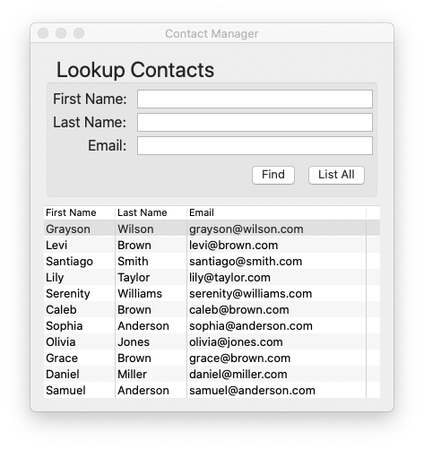

# [](https://rubygems.org/gems/glimmer) Glimmer 1.0.9 - DSL Framework
[](http://badge.fury.io/rb/glimmer)
[](https://github.com/AndyObtiva/glimmer/actions?query=workflow%3Arspec)
[](https://coveralls.io/github/AndyObtiva/glimmer?branch=master)
[](https://codeclimate.com/github/AndyObtiva/glimmer/maintainability)
[](https://gitter.im/AndyObtiva/glimmer?utm_source=badge&utm_medium=badge&utm_campaign=pr-badge&utm_content=badge)

**[Contributors Wanted! (Submit a Glimmer App Sample to Get Started)](#contributing)**

**(The Original Glimmer Library Since 2007. Beware of Imitators!)**

[**Glimmer**](https://rubygems.org/gems/glimmer) started out as a [GUI Library](https://github.com/AndyObtiva/glimmer-dsl-swt) and grew into a full-fledged [DSL Framework](#dsl-engine) with support for multiple GUI DSLs. Glimmer's namesake is referring to the Glimmer of Ruby in Graphical User Interfaces (contrary to popular myth perpetrated by [Charles Nutter](http://blog.headius.com/2007/11/tab-sweep.html), Glimmer has nothing to do with the ill-fated Whitney Houston movie, which does not in fact share the same name)

[<br />
Featured in JRuby Cookbook](http://shop.oreilly.com/product/9780596519650.do) and [Chalmers/Gothenburg University Software Engineering Master's Lecture Material](http://www.cse.chalmers.se/~bergert/slides/guest_lecture_DSLs.pdf)

[**Glimmer**](https://rubygems.org/gems/glimmer) is a DSL (Domain-Specific Language) Framework that consists of two things:
- [DSL Engine](#dsl-engine): enables building internal DSLs embedded in Ruby (e.g. for GUI, XML, or CSS).
- [Data-Binding Library](#data-binding-library): enables synchronizing GUI with Model Attributes bidirectionally.

[**Glimmer**](https://rubygems.org/gems/glimmer) is ***the cream of the crop*** when it comes to building DSLs in Ruby:
- Supports building the tersest most concise domain specific language syntax in Ruby.
- Maximum readability and maintainability.
- No extra unnecessary block variables when not needed.
- DSL Blocks are true Ruby closures that can conveniently leverage variables from the outside and utilize standard Ruby code in and around. Just code in Ruby as usual and be happy! No surprising restrictions or strange uses of `instance_exec`/`eval`.
- DSL syntax is limited to classes that mixin the `Glimmer` module, so the rest of the code is fully safe from namespace pollution.
- Multiple DSLs may be [mixed](#multi-dsl-support) together safely to achieve maximum expressability, composability, and productivity.
- DSLs are fully configurable, so you may activate and deactivate DSLs as per your current needs only.

[**Glimmer**](https://rubygems.org/gems/glimmer) supports the following DSLs:
- [glimmer-dsl-swt](https://github.com/AndyObtiva/glimmer-dsl-swt): Glimmer DSL for SWT (JRuby Desktop Development GUI Framework)
- [glimmer-dsl-opal](https://github.com/AndyObtiva/glimmer-dsl-opal): Glimmer DSL for Opal (Pure Ruby Web GUI and Auto-Webifier of Desktop Apps)
- [glimmer-dsl-xml](https://github.com/AndyObtiva/glimmer-dsl-xml): Glimmer DSL for XML (& HTML)
- [glimmer-dsl-css](https://github.com/AndyObtiva/glimmer-dsl-css): Glimmer DSL for CSS
- [glimmer-dsl-tk](https://github.com/AndyObtiva/glimmer-dsl-tk): Glimmer DSL for Tk (Ruby Desktop Development GUI Library)

[Glimmer and/or Glimmer DSLs receive two updates per month](https://rubygems.org/gems/glimmer-dsl-swt/versions). You can trust [Glimmer](https://rubygems.org/gems/glimmer) with your Ruby development needs.

## Table of Contents

- [Glimmer 1.0.9](#-glimmer-109---dsl-framework)
  - [Official DSLs](#official-dsls)
    - [Glimmer DSL for SWT (JRuby Desktop Development GUI Framework)](#glimmer-dsl-for-swt-jruby-desktop-development-gui-framework)
    - [Glimmer DSL for Opal (Pure Ruby Web GUI and Auto-Webifier of Desktop Apps)](#glimmer-dsl-for-opal-pure-ruby-web-gui-and-auto-webifier-of-desktop-apps)
    - [Glimmer DSL for XML (& HTML)](#glimmer-dsl-for-xml--html)
    - [Glimmer DSL for CSS](#glimmer-dsl-for-css)
    - [Glimmer DSL for Tk (Ruby Desktop Development GUI Library)](#glimmer-dsl-for-tk-ruby-desktop-development-gui-library)
  - [DSL Engine](#dsl-engine)
    - [Multi-DSL Support](#multi-dsl-support)
  - [Data-Binding Library](#data-binding-library)
  - [Glimmer Process](#glimmer-process)
  - [Resources](#resources)
  - [Help](#help)
    - [Issues](#issues)
    - [Chat](#chat)
  - [Feature Suggestions](#feature-suggestions)
  - [Change Log](#change-log)
  - [Contributing](#contributing)
  - [Contributors](#contributors)
  - [Hire Me](#hire-me)
  - [License](#license)

## Official DSLs

Here, we showcase official Glimmer DSLs; that is [gems starting with the `glimmer-dsl-` prefix](https://rubygems.org/search?query=glimmer-dsl-).

(you can skip ahead if you prefer to learn more about the Glimmer [DSL Engine](#dsl-engine) or [Data-Binding Library](#data-binding-library) first)

### Glimmer DSL for SWT (JRuby Desktop Development GUI Framework)

[Glimmer DSL for SWT](https://github.com/AndyObtiva/glimmer-dsl-swt) is a native-GUI cross-platform desktop development library written in [JRuby](https://www.jruby.org/), an OS-threaded faster version of [Ruby](https://www.ruby-lang.org/en/). [Glimmer](https://rubygems.org/gems/glimmer)'s main innovation is a declarative [Ruby DSL](https://github.com/AndyObtiva/glimmer-dsl-swt#glimmer-dsl-syntax) that enables productive and efficient authoring of desktop application user-interfaces while relying on the robust [Eclipse SWT library](https://www.eclipse.org/swt/). [Glimmer DSL for SWT](https://github.com/AndyObtiva/glimmer-dsl-swt) additionally innovates by having built-in [data-binding](https://github.com/AndyObtiva/glimmer-dsl-swt#data-binding) support, which greatly facilitates synchronizing the GUI with domain models, thus achieving true decoupling of object oriented components and enabling developers to solve business problems (test-first) without worrying about GUI concerns, or alternatively drive development GUI-first, and then write clean business models (test-first) afterwards. To get started quickly, [Glimmer DSL for SWT](https://github.com/AndyObtiva/glimmer-dsl-swt) offers [scaffolding](https://github.com/AndyObtiva/glimmer-dsl-swt#scaffolding) options for [Apps](https://github.com/AndyObtiva/glimmer-dsl-swt#in-production), [Gems](https://github.com/AndyObtiva/glimmer-dsl-swt#custom-shell-gem), and [Custom Widgets](https://github.com/AndyObtiva/glimmer-dsl-swt#custom-widgets). [Glimmer DSL for SWT](https://github.com/AndyObtiva/glimmer-dsl-swt) also includes native-executable [packaging](https://github.com/AndyObtiva/glimmer-dsl-swt#packaging--distribution) support, sorely lacking in other libraries, thus enabling the delivery of desktop apps written in [Ruby](https://www.ruby-lang.org/en/) as truly native DMG/PKG/APP files on the [Mac](https://www.apple.com/ca/macos) + [App Store](https://developer.apple.com/macos/distribution/) and MSI/EXE files on [Windows](https://www.microsoft.com/en-ca/windows).

To get started, visit the [Glimmer DSL for SWT project page](https://github.com/AndyObtiva/glimmer-dsl-swt#pre-requisites) for instructions on installing the [glimmer-dsl-swt gem](https://rubygems.org/gems/glimmer-dsl-swt).

#### Glimmer DSL for SWT Samples

##### Hello, World!

Glimmer GUI code (from [samples/hello/hello_world.rb](https://github.com/AndyObtiva/glimmer-dsl-swt/blob/master/samples/hello/hello_world.rb)):
```ruby
include Glimmer

shell {
  text "Glimmer"
  label {
    text "Hello, World!"
  }
}.open
```

Glimmer app:


##### Tic Tac Toe

Glimmer GUI code (from [samples/elaborate/tic_tac_toe.rb](https://github.com/AndyObtiva/glimmer-dsl-swt/blob/master/samples/elaborate/tic_tac_toe.rb)):

```ruby
# ...
    @shell = shell {
      text "Tic-Tac-Toe"
      minimum_size 150, 178
      composite {
        grid_layout 3, true
        (1..3).each { |row|
          (1..3).each { |column|
            button {
              layout_data :fill, :fill, true, true
              text        bind(@tic_tac_toe_board[row, column], :sign)
              enabled     bind(@tic_tac_toe_board[row, column], :empty)
              font        style: :bold, height: 20
              on_widget_selected {
                @tic_tac_toe_board.mark(row, column)
              }
            }
          }
        }
      }
    }
# ...
```

Glimmer app:


##### Contact Manager

Glimmer GUI code (from [samples/elaborate/contact_manager.rb](https://github.com/AndyObtiva/glimmer-dsl-swt/blob/master/samples/elaborate/contact_manager.rb)):

```ruby
# ...
    shell {
      text "Contact Manager"
      composite {
        group {
          grid_layout(2, false) {
            margin_width 0
            margin_height 0
          }
          layout_data :fill, :center, true, false
          text 'Lookup Contacts'
          font height: 24
          
          label {
            layout_data :right, :center, false, false
            text "First &Name: "
            font height: 16
          }
          text {
            layout_data :fill, :center, true, false
            text bind(@contact_manager_presenter, :first_name)
            on_key_pressed {|key_event|
              @contact_manager_presenter.find if key_event.keyCode == swt(:cr)
            }
          }
          
          label {
            layout_data :right, :center, false, false
            text "&Last Name: "
            font height: 16
          }
          text {
            layout_data :fill, :center, true, false
            text bind(@contact_manager_presenter, :last_name)
            on_key_pressed {|key_event|
              @contact_manager_presenter.find if key_event.keyCode == swt(:cr)
            }
          }
          
          label {
            layout_data :right, :center, false, false
            text "&Email: "
            font height: 16
          }
          text {
            layout_data :fill, :center, true, false
            text bind(@contact_manager_presenter, :email)
            on_key_pressed {|key_event|
              @contact_manager_presenter.find if key_event.keyCode == swt(:cr)
            }
          }
          
          composite {
            row_layout {
              margin_width 0
              margin_height 0
            }
            layout_data(:right, :center, false, false) {
              horizontal_span 2
            }
            
            button {
              text "&Find"
              on_widget_selected { @contact_manager_presenter.find }
              on_key_pressed {|key_event|
                @contact_manager_presenter.find if key_event.keyCode == swt(:cr)
              }
            }
            
            button {
              text "&List All"
              on_widget_selected { @contact_manager_presenter.list }
              on_key_pressed {|key_event|
                @contact_manager_presenter.list if key_event.keyCode == swt(:cr)
              }
            }
          }
        }

        table(:multi) { |table_proxy|
          layout_data {
            horizontal_alignment :fill
            vertical_alignment :fill
            grab_excess_horizontal_space true
            grab_excess_vertical_space true
            height_hint 200
          }
          table_column {
            text "First Name"
            width 80
          }
          table_column {
            text "Last Name"
            width 80
          }
          table_column {
            text "Email"
            width 200
          }
          items bind(@contact_manager_presenter, :results),
          column_properties(:first_name, :last_name, :email)
          on_mouse_up { |event|
            table_proxy.edit_table_item(event.table_item, event.column_index)
          }
        }
      }
    }.open
# ...
```

Glimmer App:



#### Production Desktop Apps Built with Glimmer DSL for SWT

[Are We There Yet?](https://github.com/AndyObtiva/are-we-there-yet) - Small Project Tracking App

[](https://github.com/AndyObtiva/are-we-there-yet)

[Math Bowling](https://github.com/AndyObtiva/MathBowling) - Elementary Level Math Game Featuring Bowling Rules

[](https://github.com/AndyObtiva/MathBowling)

### Glimmer DSL for Opal (Pure Ruby Web GUI and Auto-Webifier of Desktop Apps)

[Glimmer DSL for Opal](https://github.com/AndyObtiva/glimmer-dsl-opal) is an experimental proof-of-concept web GUI adapter for [Glimmer](https://github.com/AndyObtiva/glimmer) desktop apps (i.e. apps built with [Glimmer DSL for SWT](https://github.com/AndyObtiva/glimmer-dsl-swt)). It webifies them via [Rails](https://rubyonrails.org/), allowing Ruby desktop apps to run on the web via [Opal Ruby](https://opalrb.com/) without changing a line of code. Apps may then be custom-styled for the web with standard CSS.

Glimmer DSL for Opal webifier successfully reuses the entire [Glimmer](https://github.com/AndyObtiva/glimmer) core DSL engine in [Opal Ruby](https://opalrb.com/) inside a web browser, and as such inherits the full range of powerful Glimmer desktop [data-binding](https://github.com/AndyObtiva/glimmer#data-binding) capabilities for the web.

To get started, visit the [Glimmer DSL for Opal project page](https://github.com/AndyObtiva/glimmer-dsl-opal) for instructions on installing the [glimmer-dsl-opal gem](https://rubygems.org/gems/glimmer-dsl-opal).

#### Glimmer DSL for Opal Samples

##### Hello, Computed!

Add the following require statement to `app/assets/javascripts/application.rb`


```ruby
require 'samples/hello/hello_computed'
```

Or add the Glimmer code directly if you prefer to play around with it:

```ruby
class HelloComputed
  class Contact
    attr_accessor :first_name, :last_name, :year_of_birth
  
    def initialize(attribute_map)
      @first_name = attribute_map[:first_name]
      @last_name = attribute_map[:last_name]
      @year_of_birth = attribute_map[:year_of_birth]
    end
  
    def name
      "#{last_name}, #{first_name}"
    end
  
    def age
      Time.now.year - year_of_birth.to_i
    rescue
      0
    end
  end
end

class HelloComputed
  include Glimmer

  def initialize
    @contact = Contact.new(
      first_name: 'Barry',
      last_name: 'McKibbin',
      year_of_birth: 1985
    )
  end

  def launch
    shell {
      text 'Hello, Computed!'
      composite {
        grid_layout {
          num_columns 2
          make_columns_equal_width true
          horizontal_spacing 20
          vertical_spacing 10
        }
        label {text 'First &Name: '}
        text {
          text bind(@contact, :first_name)
          layout_data {
            horizontal_alignment :fill
            grab_excess_horizontal_space true
          }
        }
        label {text '&Last Name: '}
        text {
          text bind(@contact, :last_name)
          layout_data {
            horizontal_alignment :fill
            grab_excess_horizontal_space true
          }
        }
        label {text '&Year of Birth: '}
        text {
          text bind(@contact, :year_of_birth)
          layout_data {
            horizontal_alignment :fill
            grab_excess_horizontal_space true
          }
        }
        label {text 'Name: '}
        label {
          text bind(@contact, :name, computed_by: [:first_name, :last_name])
          layout_data {
            horizontal_alignment :fill
            grab_excess_horizontal_space true
          }
        }
        label {text 'Age: '}
        label {
          text bind(@contact, :age, on_write: :to_i, computed_by: [:year_of_birth])
          layout_data {
            horizontal_alignment :fill
            grab_excess_horizontal_space true
          }
        }
      }
    }.open
  end
end

HelloComputed.new.launch
```
Glimmer app on the desktop (using [`glimmer-dsl-swt`](https://github.com/AndyObtiva/glimmer-dsl-swt) gem):


Glimmer app on the web (using `glimmer-dsl-opal` gem):

Start the Rails server:
```
rails s
```

Visit `http://localhost:3000`

You should see "Hello, Computed!"


##### Glimmer Calculator

Add the [glimmer-cs-calculator](https://github.com/AndyObtiva/glimmer-cs-calculator) gem to `Gemfile` (without requiring):

```
gem 'glimmer-cs-calculator', require: false
```

Add the following require statement to `app/assets/javascripts/application.rb`

```ruby
require 'glimmer-cs-calculator/launch'
```

Sample GUI code (relies on custom widgets `command_button`, `operation_button`, and `number_button`):

```ruby
shell {
  minimum_size (OS.mac? ? 320 : (OS.windows? ? 390 : 520)), 240
  image File.join(APP_ROOT, 'package', 'windows', "Glimmer Calculator.ico") if OS.windows?
  text "Glimmer - Calculator"
  grid_layout 4, true
  # Setting styled_text to multi in order for alignment options to activate
  styled_text(:multi, :wrap, :border) {
    text bind(@presenter, :result)
    alignment swt(:right)
    right_margin 5
    font height: 40
    layout_data(:fill, :fill, true, true) {
      horizontal_span 4
    }
    editable false
    caret nil
  }
  command_button('AC')
  operation_button('÷')
  operation_button('×')
  operation_button('−')
  (7..9).each { |number|
    number_button(number)
  }
  operation_button('+', font: @button_font_big, vertical_span: 2)
  (4..6).each { |number|
    number_button(number)
  }
  (1..3).each { |number|
    number_button(number)
  }
  command_button('=', font: @button_font_big, vertical_span: 2)
  number_button(0, horizontal_span: 2)
  operation_button('.')
}
```

Glimmer app on the desktop (using the [`glimmer-dsl-swt`](https://github.com/AndyObtiva/glimmer-dsl-swt) gem):


Glimmer app on the web (using `glimmer-dsl-opal` gem):

Start the Rails server:
```
rails s
```

Visit `http://localhost:3000`
(or visit: http://glimmer-cs-calculator-server.herokuapp.com)

You should see "Glimmer Calculator"

[](http://glimmer-cs-calculator-server.herokuapp.com)

Here is an Apple Calculator CSS themed version (with [CSS only](https://github.com/AndyObtiva/glimmer-cs-calculator/blob/master/server/glimmer-cs-calculator-server/app/assets/stylesheets/welcomes_apple.scss), no app code changes):

Visit http://glimmer-cs-calculator-server.herokuapp.com/welcomes/apple

You should see "Apple Calculator Theme"

[](http://glimmer-cs-calculator-server.herokuapp.com/welcomes/apple)

### Glimmer DSL for XML (& HTML)

[Glimmer DSL for XML](https://github.com/AndyObtiva/glimmer-dsl-xml) provides Ruby syntax for building XML (eXtensible Markup Language) documents.

Within the context of desktop development, Glimmer DSL for XML is useful in providing XML data for the [SWT Browser widget](https://github.com/AndyObtiva/glimmer/tree/master#browser-widget).

#### XML DSL

Simply start with `html` keyword and add HTML inside its block using Glimmer DSL syntax.
Once done, you may call `to_s`, `to_xml`, or `to_html` to get the formatted HTML output.

Here are all the Glimmer XML DSL top-level keywords:
- `html`
- `tag`: enables custom tag creation for exceptional cases by passing tag name as '_name' attribute
- `name_space`: enables namespacing html tags

Element properties are typically passed as a key/value hash (e.g. `section(id: 'main', class: 'accordion')`) . However, for properties like "selected" or "checked", you must leave value `nil` or otherwise pass in front of the hash (e.g. `input(:checked, type: 'checkbox')` )

Example (basic HTML):

```ruby
@xml = html {
  head {
    meta(name: "viewport", content: "width=device-width, initial-scale=2.0")
  }
  body {
    h1 { "Hello, World!" }
  }
}
puts @xml
```

Output:

```
<html><head><meta name="viewport" content="width=device-width, initial-scale=2.0" /></head><body><h1>Hello, World!</h1></body></html>
```

### Glimmer DSL for CSS

[Glimmer DSL for CSS](https://github.com/AndyObtiva/glimmer-dsl-css) provides Ruby syntax for building CSS (Cascading Style Sheets).

Within the context of [Glimmer](https://github.com/AndyObtiva/glimmer) app development, Glimmer DSL for CSS is useful in providing CSS for the [SWT Browser widget](https://github.com/AndyObtiva/glimmer/tree/master#browser-widget).

#### CSS DSL

Simply start with `css` keyword and add stylesheet rule sets inside its block using Glimmer DSL syntax.
Once done, you may call `to_s` or `to_css` to get the formatted CSS output.

`css` is the only top-level keyword in the Glimmer CSS DSL

Selectors may be specified by `s` keyword or HTML element keyword directly (e.g. `body`)
Rule property values may be specified by `pv` keyword or underscored property name directly (e.g. `font_size`)

Example:

```ruby
@css = css {
  body {
    font_size '1.1em'
    pv 'background', 'white'
  }
  
  s('body > h1') {
    background_color :red
    pv 'font-size', '2em'
  }
}
puts @css
```

Output:

```
body{font-size:1.1em;background:white}body > h1{background-color:red;font-size:2em}
```

### Glimmer DSL for Tk (Ruby Desktop Development GUI Library)

[Tcl/Tk](https://www.tcl.tk/) has evolved into a practical desktop GUI toolkit due to gaining truely native looking widgets on Mac, Windows, and Linux in [Tk version 8.5](https://www.tcl.tk/software/tcltk/8.5.html#:~:text=Highlights%20of%20Tk%208.5&text=Font%20rendering%3A%20Now%20uses%20anti,and%20window%20layout%2C%20and%20more.).

Additionally, [Ruby](https://www.ruby-lang.org/en/) 3.0 Ractor (formerly known as [Guilds](https://olivierlacan.com/posts/concurrency-in-ruby-3-with-guilds/)) supports truly parallel multi-threading, making both [MRI](https://github.com/ruby/ruby) and [Tk](https://www.tcl.tk/) finally viable for support in [Glimmer](https://github.com/AndyObtiva/glimmer) (Ruby Desktop Development GUI Library) as an alternative to [JRuby on SWT](https://github.com/AndyObtiva/glimmer-dsl-swt).

The trade-off is that while [SWT](https://www.eclipse.org/swt/) provides a plethora of high quality reusable widgets for the Enterprise (such as [Nebula](https://www.eclipse.org/nebula/)), [Tk](https://www.tcl.tk/) enables very fast app startup time via [MRI Ruby](https://www.ruby-lang.org/en/).

[Glimmer DSL for Tk](https://github.com/AndyObtiva/glimmer-dsl-tk) aims to provide a DSL similar to the [Glimmer DSL for SWT](https://github.com/AndyObtiva/glimmer-dsl-swt) to enable more productive desktop development in Ruby with:
- Declarative DSL syntax that visually maps to the GUI widget hierarchy
- Convention over configuration via smart defaults and automation of low-level details
- Requiring the least amount of syntax possible to build GUI
- Bidirectional Data-Binding to declaratively wire and automatically synchronize GUI with Business Models
- Custom Widget support
- Scaffolding for new custom widgets, apps, and gems
- Native-Executable packaging on Mac, Windows, and Linux

To get started, visit the [Glimmer DSL for Tk project page](https://github.com/AndyObtiva/glimmer-dsl-tk#pre-requisites) for instructions on installing the [glimmer-dsl-tk gem](https://rubygems.org/gems/glimmer-dsl-tk).

#### Glimmer DSL for Tk Samples

##### Hello, World!

Glimmer code (from [samples/hello/hello_world.rb](https://github.com/AndyObtiva/glimmer-dsl-tk/blob/master/samples/hello/hello_world.rb)):

```ruby
include Glimmer

root {
  label {
    text 'Hello, World!'
  }
}.open
```

Run (with the [glimmer-dsl-tk](https://rubygems.org/gems/glimmer-dsl-tk) gem installed):

```
ruby -r glimmer-dsl-tk -e "require '../samples/hello/hello_world.rb'"
```

Glimmer app:


##### Hello, Tab!

Glimmer code (from [samples/hello/hello_tab.rb](https://github.com/AndyObtiva/glimmer-dsl-tk/blob/master/samples/hello/hello_tab.rb)):

```ruby
include Glimmer

root {
  title 'Hello, Tab!'
   
  notebook {
    frame(text: 'English') {
      label {
        text 'Hello, World!'
      }
    }
     
    frame(text: 'French') {
      label {
        text 'Bonjour, Univers!'
      }
    }
  }
}.open
```

Run (with the [glimmer-dsl-tk](https://rubygems.org/gems/glimmer-dsl-tk) gem installed):

```
ruby -r glimmer-dsl-tk -e "require '../samples/hello/hello_tab.rb'"
```

Glimmer app:


##### Hello, Combo!

Glimmer code (from [samples/hello/hello_combo.rb](https://github.com/AndyObtiva/glimmer-dsl-tk/blob/master/samples/hello/hello_combo.rb)):

```ruby
# ... more code precedes
root {
  title 'Hello, Combo!'
  
  combobox { |proxy|
    state 'readonly'
    text bind(person, :country)
  }
  
  button { |proxy|
    text "Reset Selection"
    command {
      person.reset_country
    }
  }
}.open
# ... more code follows
```

Run (with the [glimmer-dsl-tk](https://rubygems.org/gems/glimmer-dsl-tk) gem installed):

```
ruby -r glimmer-dsl-tk -e "require '../samples/hello/hello_combo.rb'"
```

Glimmer app:


## DSL Engine

Glimmer is fundamentally a DSL Engine that can support any number of DSLs like the official Glimmer DSLs (gems starting with the `glimmer-dsl-` prefix like `glimmer-dsl-swt`) or any DSLs for that matter.

Glimmer DSL syntax consists mainly of:
- **keywords** (e.g. `table` for a table widget)
- **style/args** (e.g. :multi as in `table(:multi)` for a multi-line selection table widget)
- **content** (e.g. `{ table_column { text 'Name'} }` as in `table(:multi) { table_column { text 'Name'} }` for a multi-line selection table widget with a table column having header text property `'Name'` as content)

The Glimmer DSL Engine's architecture is based on the following Design Patterns and Data Structures:
- **Interpreter Design Pattern**: to define interpretable expressions of DSL keywords
- **Chain of Responsibility Design Pattern / Queue Data Structure**: to chain expression handlers in order of importance for processing DSL keywords
- **Adapter Design Pattern**: to adapt expressions into handlers in a chain of responsibility
- **Stack Data Structure**: to handle processing parent/child nesting of DSL keyword expressions in the correct order

Glimmer's use of the **Interpreter Design Pattern** in processing DSLs is also known as the **Virtual Machine Architectural Style**. After all, DSL expressions are virtual machine opcodes that process nested keywords stored in a stack. I built Glimmer's original DSL back in 2007 without knowing the **Virtual Machine Architectural Style** (except perhaps as an esoteric technology powering Java), but stumbled upon it anyways through following the Gang of Four Design Patterns mentioned above, chiefly the **Interpreter Design Pattern**.

Every keyword in a Glimmer DSL is represented by a DSL expression that is processed by an `Expression` subclass selected from a chain of expressions (interpreters) pre-configured in a DSL chain of responsibility via `Glimmer::DSL::Engine.add_dynamic_expressions(DSLNameModule, expression_names_array)`.

Expressions are either:
- **Static** (subclass of `StaticExpression`, which is a subclass of `Expression`): if they represent a single pre-identified keyword (e.g. `color` or `display`)
- **Dynamic** (subclass of `Expression`): if they represent keywords calculated on the fly during processing (e.g. an SWT widget like `label` or a random XML element called `folder` representing `<folder></folder>`)

Optionally, expressions can be parent expressions that contain other expressions, and must include the `ParentExpression` mixin module as such.

Additionally, every expression that serves as a top-level entry point into the DSL must mixin `TopLevelExpression`

Static expressions are optimized in performance since they pre-define methods on the `Glimmer` module matching the static keywords they represent (e.g. `color` causes creating a `Glimmer#color` method for processing `color` expressions) and completely bypass as a result the Glimmer DSL Engine Chain of Responsibility. That said, they must be avoided if the same keyword might occur multiple times, but with different requirements for arguments, block, and parenthood type.

Every `Expression` sublcass must specify two methods at least:
- `can_interpret?(parent, keyword, *args, &block)`: to quickly test if the keyword and arg/block/parent combination qualifies for interpretation by the current `Expression` or to otherwise delegate to the next expression in the chain of responsibility.
- `interpret(parent, keyword, *args, &block)`: to go ahead and interpret a DSL expression that qualified for interpretation

`StaticExpression` sublcasses may skip the `can_interpret?` method since they include a default implementation for it that matches the name of the keyword from the class name by convention. For example, a `color` keyword would have a `ColorExpression` class, so `color` is inferred automatically from class name and used in deciding whether the class can handle a `color` keyword or not.

`ParentExpression` subclasses can optionally override this extra method, which is included by default and simply invokes the parent's passed block to process its children:
- `add_content(parent, &block)`

For example, some parent widgets use their block for other reasons or process their children at very specific times, so they may override that method and disable it, or otherwise call `super` and do additional work.

Example of a dynamic expression:

```ruby
module Glimmer
  module DSL
    module SWT
      class WidgetExpression < Expression
        include ParentExpression

        EXCLUDED_KEYWORDS = %w[shell display tab_item]

        def can_interpret?(parent, keyword, *args, &block)
          !EXCLUDED_KEYWORDS.include?(keyword) and
            parent.respond_to?(:swt_widget) and
            Glimmer::SWT::WidgetProxy.widget_exists?(keyword)
        end

        def interpret(parent, keyword, *args, &block)
          Glimmer::SWT::WidgetProxy.create(keyword, parent, args)
        end

        def add_content(parent, &block)
          super
          parent.post_add_content
        end

      end
    end
  end
end
```

Example of a static expression (does not need `can_interpret?`):

```ruby
module Glimmer
  module DSL
    module Opal
      class ColorExpression < StaticExpression
        include TopLevelExpression
  
        def interpret(parent, keyword, *args, &block)
          Glimmer::SWT::ColorProxy.new(*args)
        end
      end
    end
  end
end
```

DSL expressions go into the `glimmer/dsl/{dsl_name}` namespace directory.

Also, every DSL requires a `glimmer/dsl/{dsl_name}/dsl.rb` file, which configures the DSL into Glimmer via a call to:
```ruby
Glimmer::DSL::Engine.add_dynamic_expressions(DSLNameModule, expression_names_array)
```

Expression names are underscored verions of `Expression` subclass names minus the `_expression` suffix.

For example, here is an SWT DSL configuration:

```ruby
require 'glimmer/launcher'
require Glimmer::Launcher.swt_jar_file
require 'glimmer/dsl/engine'
Dir[File.expand_path('../*_expression.rb', __FILE__)].each {|f| require f}

module Glimmer
  module DSL
    module SWT
      Engine.add_dynamic_expressions(
        SWT,
        %w[
          layout
          widget_listener
          combo_selection_data_binding
          checkbox_group_selection_data_binding
          radio_group_selection_data_binding
          list_selection_data_binding
          tree_items_data_binding
          table_items_data_binding
          data_binding
          cursor
          font
          image
          property
          block_property
          widget
          custom_widget
        ]
      )
    end
  end
end
```

In summary, these are the files needed to author a Glimmer DSL:
- `glimmer/dsl/[dsl_name]/dsl.rb`: requires and adds all dynamic expressions to [dsl_name] Glimmer DSL
- `glimmer/dsl/[dsl_name]/[expresion_name]_expresion.rb`: needed for every [expresion_name] expression, whether dynamic or static

### Multi-DSL Support

The Glimmer [DSL Engine](#dsl-engine) allows mixing DSLs, which comes in handy when doing things like rendering a desktop GUI DSL `browser` widget additionally leveraging the HTML DSL and CSS DSL for its content.

DSLs are activated by top-level keywords (expressions denoted as `TopLevelExpression`). For example, the `html` keyword activates the [Glimmer DSL for XML](https://github.com/AndyObtiva/glimmer-dsl-xml) and the `css` keyword activates the [Glimmer DSL for CSS](https://github.com/AndyObtiva/glimmer-dsl-css). Glimmer automatically recognizes top-level keywords in each DSL and activates the DSL accordingly. Once done processing a nested DSL top-level keyword, Glimmer switches back to the prior DSL automatically.

By default, all loaded DSLs (required glimmer DSL gems) are enabled.

For example, this shows "Hello, World!" inside a [Glimmer DSL for SWT](https://github.com/AndyObtiva/glimmer-dsl-swt) desktop app `browser` widget using `html` and `css` from [Glimmer DSL for XML](https://github.com/AndyObtiva/glimmer-dsl-xml) and [Glimmer DSL for CSS](https://github.com/AndyObtiva/glimmer-dsl-css):

```ruby
require 'glimmer-dsl-swt'
require 'glimmer-dsl-xml'
require 'glimmer-dsl-css'

include Glimmer

shell {
  minimum_size 130, 130
  @browser = browser {
    text html {
      head {
        meta(name: "viewport", content: "width=device-width, initial-scale=2.0")
        style {
          css {
            h1 {
              background 'yellow'
            }
          }
        }
      }
      body {
        h1 { "Hello, World!" }
      }
    }
  }
}.open
```

**API methods to enable/disable DSLs:**

`Glimmer::DSL::Engine.disable_dsl(dsl)`: disables a particular DSL

Example: `Glimmer::DSL::Engine.disable_dsl(:swt)`

`Glimmer::DSL::Engine.enable_dsl(dsl)`: enables a particular DSL

Example: `Glimmer::DSL::Engine.disable_dsl(:swt)`

`Glimmer::DSL::Engine.enabled_dsls=(dsls)`: enables only the specified DSLs, disabling all other loaded DSLs

Example: `Glimmer::DSL::Engine.enabled_dsls = [:xml, :css]`

## Data-Binding Library

Data-Binding enables binding GUI properties (like text and color) to Model attributes (like name and age).

It relies on the Observer Design Pattern and MVP (Model-View-Presenter) Architectural Pattern (a variation on MVC)

These are the main classes concerning data-binding:
- `Observer`: Provides general observer support including unique registration and deregistration for cleanup and prevention of memory leaks. Main methods concerned are: `call`, `register` (alias: `observe`), and `unregister` (alias: `unobserve` or `deregister`)
- `Observable`: General super-module for all observables. Main methods concerned are: `add_observer` and `remove_observer`
- `ObservableModel`: Mixin module for any observable model with observable attributes. In addition to `Observable` methods, it has a `notify_observers` method to be called when changes occur. It automatically enhances all attribute setters (ending with `=`) to notify observers on changes. Also, it automatically handles observing array attributes using `ObservableArray` appropriately so they would notify observers upon array mutation changes.
- `ObservableArray`: Mixin module for any observable array collection that automatically handles notifying observers upon performing array mutation operations (e.g. `push` or `delete`)
- `ModelBinding`: a higher-level abstraction that relies on all the other observer/observable classes to support basic data-binding, nested data-binding, and computed data-binding

## Glimmer Process

[Glimmer Process](PROCESS.md) is the lightweight software development process used for building Glimmer libraries and Glimmer apps, which goes beyond Agile, rendering all Agile processes obsolete. [Glimmer Process](PROCESS.md) is simply made up of 7 guidelines to pick and choose as necessary until software development needs are satisfied.

Learn more by reading the [GPG](PROCESS.md) (Glimmer Process Guidelines)

## Resources

* [Code Master Blog](http://andymaleh.blogspot.com/search/label/Glimmer)
* [JRuby Cookbook by Justin Edelson & Henry Liu](http://shop.oreilly.com/product/9780596519650.do)
* [MountainWest RubyConf 2011 Video](https://confreaks.tv/videos/mwrc2011-whatever-happened-to-desktop-development-in-ruby)
* [RubyConf 2008 Video](https://confreaks.tv/videos/rubyconf2008-desktop-development-with-glimmer)
* [InfoQ Article](http://www.infoq.com/news/2008/02/glimmer-jruby-swt)
* [DZone Tutorial](https://dzone.com/articles/an-introduction-glimmer)

## Help

### Issues

You may submit [issues](https://github.com/AndyObtiva/glimmer/issues) on [GitHub](https://github.com/AndyObtiva/glimmer/issues).

[Click here to submit an issue.](https://github.com/AndyObtiva/glimmer/issues)

### Chat

If you need live help, try to [](https://gitter.im/AndyObtiva/glimmer?utm_source=badge&utm_medium=badge&utm_campaign=pr-badge&utm_content=badge)

## Feature Suggestions

These features have been suggested. You might see them in a future version of Glimmer. You are welcome to contribute more feature suggestions.

[glimmer-dsl-swt/TODO.md](https://github.com/AndyObtiva/glimmer-dsl-swt/blob/master/TODO.md)

Glimmer DSL Engine specific tasks are at:

[TODO.md](TODO.md)

## Change Log

[glimmer-dsl-swt/CHANGELOG.md](https://github.com/AndyObtiva/glimmer-dsl-swt/blob/master/CHANGELOG.md)

[CHANGELOG.md](CHANGELOG.md)

## Contributing

**Contributors Wanted!**

If you would like to contribute to Glimmer, please study up on Glimmer and [SWT](https://github.com/AndyObtiva/glimmer-dsl-swt#swt-reference), run all Glimmer [samples](https://github.com/AndyObtiva/glimmer-dsl-swt#samples), and build a small sample app (perhaps from [this TODO list](https://github.com/AndyObtiva/glimmer-dsl-swt/blob/master/TODO.md#samples)) to add to [glimmer-dsl-swt](https://github.com/AndyObtiva/glimmer-dsl-swt) Hello or Elaborate samples via a Pull Request. Once done, contact me on [Chat](#chat).

You may apply for contributing to any of these Glimmer DSL gems whether you prefer to focus on the desktop or web:
- [glimmer-dsl-swt](https://github.com/AndyObtiva/glimmer-dsl-swt): Glimmer DSL for SWT (JRuby Desktop Development GUI Framework)
- [glimmer-dsl-tk](https://github.com/AndyObtiva/glimmer-dsl-tk): Glimmer DSL for Tk (Ruby Desktop Development GUI Library)
- [glimmer-dsl-opal](https://github.com/AndyObtiva/glimmer-dsl-opal): Glimmer DSL for Opal (Web GUI Adapter for Desktop Apps)
- [glimmer-dsl-xml](https://github.com/AndyObtiva/glimmer-dsl-xml): Glimmer DSL for XML (& HTML)
- [glimmer-dsl-css](https://github.com/AndyObtiva/glimmer-dsl-css): Glimmer DSL for CSS

[CONTRIBUTING.md](CONTRIBUTING.md)

## Contributors

* [Andy Maleh](https://github.com/AndyObtiva) (Founder)
* [Dennis Theisen](https://github.com/Soleone) (Contributor)

[Click here to view contributor commits.](https://github.com/AndyObtiva/glimmer/graphs/contributors)

## Hire Me

If your company would like to invest fulltime in further development of the Glimmer open-source project, [hire me](https://www.linkedin.com/in/andymaleh/).

## License

[MIT](LICENSE.txt)

Copyright (c) 2007-2021 - Andy Maleh.

--

Glimmer logo was made by <a href="https://www.flaticon.com/authors/freepik" title="Freepik">Freepik</a> from <a href="https://www.flaticon.com/" title="Flaticon"> www.flaticon.com</a>
