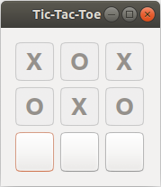
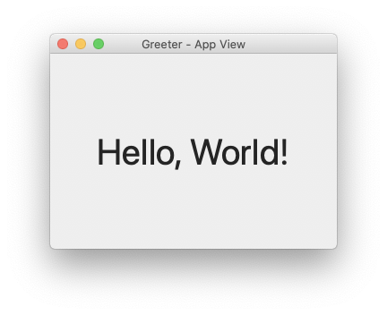
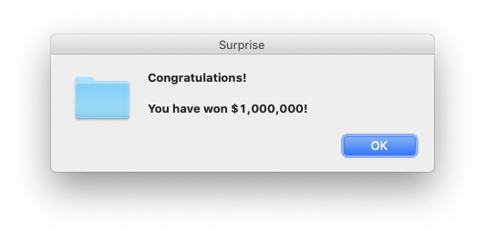
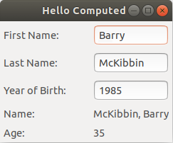
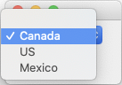
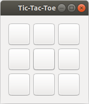
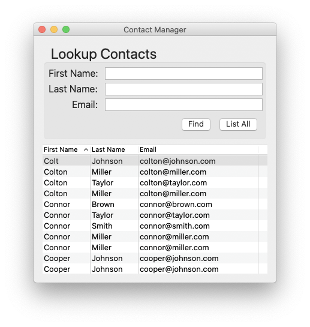

# [](https://rubygems.org/gems/glimmer) Glimmer (Ruby Desktop Development GUI Library)
[](http://badge.fury.io/rb/glimmer)
[](https://travis-ci.com/github/AndyObtiva/glimmer) 
[](https://coveralls.io/github/AndyObtiva/glimmer?branch=master)
[](https://codeclimate.com/github/AndyObtiva/glimmer/maintainability)
[](https://gitter.im/AndyObtiva/glimmer?utm_source=badge&utm_medium=badge&utm_campaign=pr-badge&utm_content=badge)

**[Contributors Wanted! (Submit a Glimmer App Sample to Get Started)](#contributing)**

(The Original Glimmer Library Since 2007. Beware of Imitators!)

[**Glimmer**](https://rubygems.org/gems/glimmer) is a native-GUI cross-platform desktop development library written in [JRuby](https://www.jruby.org/), an OS-threaded faster version of [Ruby](https://www.ruby-lang.org/en/). [Glimmer](https://rubygems.org/gems/glimmer)'s main innovation is a declarative [Ruby DSL](#glimmer-dsl-syntax) that enables productive and efficient authoring of desktop application user-interfaces while relying on the robust [Eclipse SWT library](https://www.eclipse.org/swt/). [Glimmer](https://rubygems.org/gems/glimmer) additionally innovates by having built-in [data-binding](#data-binding) support, which greatly facilitates synchronizing the GUI with domain models, thus achieving true decoupling of object oriented components and enabling developers to solve business problems (test-first) without worrying about GUI concerns. To get started quickly, [Glimmer](https://rubygems.org/gems/glimmer) offers [scaffolding](#scaffolding) options for [Apps](#in-production), [Gems](#custom-shell-gem), and [Custom Widgets](#custom-widgets). [Glimmer](https://rubygems.org/gems/glimmer) also includes native-executable [packaging](#packaging--distribution) support, sorely lacking in other libraries, thus enabling the delivery of desktop apps written in [Ruby](https://www.ruby-lang.org/en/) as truly native DMG/PKG/APP files on the [Mac](https://www.apple.com/ca/macos) + [App Store](https://developer.apple.com/macos/distribution/) and MSI/EXE files on [Windows](https://www.microsoft.com/en-ca/windows). Unlike libraries like TK, [Glimmer](https://rubygems.org/gems/glimmer) does not require recompilation of [Ruby](https://www.ruby-lang.org/en/). [Glimmer](https://rubygems.org/gems/glimmer) runs native GUI out of the box on every platform thanks to the [JVM](https://java.com/en/download/faq/whatis_java.xml), [JRuby](https://www.jruby.org/), and the [Eclipse SWT library](https://www.eclipse.org/swt/).

NOTE: Glimmer is in beta mode. Please help make better by [contributing](#contributing), adopting for small or low risk projects, and providing feedback. While a lot of hard work has gone into it, it is by no means polished, and definitely has bugs waiting to be reported. The more feedback and issues you report the better.

[<br /> 
Featured in<br />JRuby Cookbook](http://shop.oreilly.com/product/9780596519650.do)

Glimmer DSL gems:
- [glimmer-dsl-swt](https://github.com/AndyObtiva/glimmer-dsl-swt): Glimmer DSL for SWT (Desktop GUI)
- [glimmer-dsl-opal](https://github.com/AndyObtiva/glimmer-dsl-opal): Glimmer DSL for Opal (Web GUI Adapter for Desktop Apps)
- [glimmer-dsl-xml](https://github.com/AndyObtiva/glimmer-dsl-xml): Glimmer DSL for XML (& HTML)
- [glimmer-dsl-css](https://github.com/AndyObtiva/glimmer-dsl-css): Glimmer DSL for CSS

## Examples

### Hello, World!

Glimmer code (from [samples/hello/hello_world.rb](https://github.com/AndyObtiva/glimmer-dsl-swt/blob/master/samples/hello/hello_world.rb)):
```ruby
include Glimmer

shell {
  text "Glimmer"
  label {
    text "Hello, World!"
  }
}.open
```

Run:
```
glimmer samples/hello/hello_world.rb
```

Glimmer app:


### Tic Tac Toe

Glimmer code (from [samples/elaborate/tic_tac_toe.rb](https://github.com/AndyObtiva/glimmer-dsl-swt/blob/master/samples/elaborate/tic_tac_toe.rb)):

```ruby
# ...
    @shell = shell {
      text "Tic-Tac-Toe"
      composite {
        grid_layout 3, true
        (1..3).each { |row|
          (1..3).each { |column|
            button {
              layout_data :fill, :fill, true, true
              text        bind(@tic_tac_toe_board[row, column], :sign)
              enabled     bind(@tic_tac_toe_board[row, column], :empty)
              on_widget_selected {
                @tic_tac_toe_board.mark(row, column)
              }
            }
          }
        }
      }
    }
# ...
```

Run:

```
glimmer samples/elaborate/tic_tac_toe.rb
```

Glimmer app:



### Contact Manager

Glimmer code (from [samples/elaborate/contact_manager.rb](https://github.com/AndyObtiva/glimmer-dsl-swt/blob/master/samples/elaborate/contact_manager.rb)):

```ruby
# ...
    shell {
      text "Contact Manager"
      composite {
        composite {
          grid_layout 2, false
          label {text "First &Name: "}
          text {
            text bind(@contact_manager_presenter, :first_name)
            on_key_pressed {|key_event|
              @contact_manager_presenter.find if key_event.keyCode == swt(:cr)
            }
          }
          label {text "&Last Name: "}
          text {
            text bind(@contact_manager_presenter, :last_name)
            on_key_pressed {|key_event|
              @contact_manager_presenter.find if key_event.keyCode == swt(:cr)
            }
          }
          label {text "&Email: "}
          text {
            text bind(@contact_manager_presenter, :email)
            on_key_pressed {|key_event|
              @contact_manager_presenter.find if key_event.keyCode == swt(:cr)
            }
          }
          composite {
            grid_layout 2, false
            button {
              text "&Find"
              on_widget_selected {
                @contact_manager_presenter.find
              }
            }
            button {
              text "&List All"
              on_widget_selected {
                @contact_manager_presenter.list
              }
            }
          }
        }

        table(:multi) { |table_proxy|
          layout_data {
            horizontal_alignment :fill
            vertical_alignment :fill
            grab_excess_horizontal_space true
            grab_excess_vertical_space true
            height_hint 200
          }
          table_column {
            text "First Name"
            width 80
          }
          table_column {
            text "Last Name"
            width 80
          }
          table_column {
            text "Email"
            width 200
          }
          items bind(@contact_manager_presenter, :results),
                column_properties(:first_name, :last_name, :email)
          on_mouse_up { |event|
            table_proxy.edit_table_item(event.table_item, event.column_index)
          }
        }
      }
    }.open
# ...
```

Run:

```
glimmer samples/elaborate/contact_manager.rb
```

Glimmer App:


## Table of contents

- [Glimmer (Ruby Desktop Development GUI Library)](#-glimmer-ruby-desktop-development-gui-library)
  - [Examples](#examples)
    - [Hello, World!](#hello-world)
    - [Tic Tac Toe](#tic-tac-toe)
  - [Background](#background)
  - [Platform Support](#platform-support)
  - [Pre-requisites](#pre-requisites)
  - [Setup](#setup)
    - [Option 1: Direct Install](#option-1-direct-install)
    - [Option 2: Bundler](#option-2-bundler)
  - [Glimmer Command](#glimmer-command)
    - [Basic Usage](#basic-usage)
    - [Advanced Usage](#advanced-usage)
    - [Scaffolding](#scaffolding)
      - [App](#app)
      - [Custom Shell](#custom-shell)
      - [Custom Widget](#custom-widget)
      - [Custom Shell Gem](#custom-shell-gem)
      - [Custom Widget Gem](#custom-widget-gem)
    - [Gem Listing](#gem-listing)
      - [Listing Custom Shell Gems](#listing-custom-shell-gems)
      - [Listing Custom Widget Gems](#listing-custom-widget-gems)
      - [Listing DSL Gems](#listing-dsl-gems)
    - [Packaging](#packaging)
    - [Raw JRuby Command](#raw-jruby-command)
      - [Mac Support](#mac-support)
  - [Girb (Glimmer irb) Command](#girb-glimmer-irb-command)
  - [Glimmer GUI DSL Syntax](#glimmer-gui-dsl-syntax)
    - [Widgets](#widgets)
      - [Display](#display)
      - [SWT Proxies](#swt-proxies)
      - [Dialog](#dialog)
      - [Menus](#menus)
      - [ScrolledComposite](#scrolledcomposite)
    - [Widget Styles](#widget-styles)
      - [Explicit SWT Style Bit](#explicit-swt-style-bit)
      - [Negative SWT Style Bits](#negative-swt-style-bits)
      - [Extra SWT Styles](#extra-swt-styles)
    - [Widget Properties](#widget-properties)
      - [Colors](#colors)
      - [Fonts](#fonts)
    - [Layouts](#layouts)
    - [Layout Data](#layout-data)
    - [Data-Binding](#data-binding)
      - [General Examples](#general-examples)
      - [Combo](#combo)
      - [List](#list)
      - [Table](#table)
      - [Tree](#tree)
    - [Observer](#observer)
      - [Observing Widgets](#observing-widgets)
      - [Observing Models](#observing-models)
    - [Custom Widgets](#custom-widgets)
      - [Simple Example](#simple-example)
      - [Lifecycle Hook Example](#lifecycle-hook-example)
      - [Custom Widget API](#custom-widget-api)
      - [Content/Options Example](#contentoptions-example)
      - [Custom Widget Lifecycle Hooks](#custom-widget-lifecycle-hooks)
      - [Gotcha](#gotcha)
      - [Final Notes](#final-notes)
    - [Custom Shells](#custom-shells)
    - [Drag and Drop](#drag-and-drop)
    - [Miscellaneous](#miscellaneous)
      - [Multi-DSL Support](#multi-dsl-support)
      - [Application Menu Items (About/Preferences)](#application-menu-items-aboutpreferences)
      - [App Name and Version](#app-name-and-version)
      - [Video Widget](#video-widget)
      - [Browser Widget](#browser-widget)
  - [Glimmer Configuration](#glimmer-configuration)
    - [logger](#logger)
    - [import_swt_packages](#importswtpackages)
    - [loop_max_count](#loopmaxcount)
  - [Glimmer Style Guide](#glimmer-style-guide)
  - [SWT Reference](#swt-reference)
  - [Samples](#samples)
    - [Hello Samples](#hello-samples)
      - [Hello, World! Sample](#hello-world-sample)
      - [Hello, Tab!](#hello-tab)
      - [Hello, Combo!](#hello-combo)
      - [Hello, List Single Selection!](#hello-list-single-selection)
      - [Hello, List Multi Selection!](#hello-list-multi-selection)
      - [Hello, Computed!](#hello-computed)
      - [Hello, Message Box!](#hello-message-box)
      - [Hello, Browser!](#hello-browser)
      - [Hello, Drag and Drop!](#hello-drag-and-drop)
      - [Hello, Menu Bar!](#hello-menu-bar)
      - [Hello, Pop Up Context Menu!](#hello-pop-up-context-menu)
    - [Elaborate Samples](#elaborate-samples)
      - [Login](#login)
      - [Tic Tac Toe Sample](#tic-tac-toe-sample)
      - [Contact Manager](#contact-manager-sample)
    - [External Samples](#external-samples)
      - [Glimmer Calculator](#glimmer-calculator)
      - [Gladiator](#gladiator)
      - [Timer](#timer)
  - [In Production](#in-production)
    - [Math Bowling](#math-bowling)
    - [Are We There Yet?](#are-we-there-yet)
    - [Garderie Rainbow Daily Agenda](#garderie-rainbow-daily-agenda)
  - [Packaging & Distribution](#packaging--distribution)
    - [Packaging Defaults](#packaging-defaults)
    - [Packaging Configuration](#packaging-configuration)
    - [javapackager Extra Arguments](#javapackager-extra-arguments)
    - [Mac Application Distribution](#mac-application-distribution)
    - [Self Signed Certificate](#self-signed-certificate)
    - [Gotchas](#gotchas)
  - [App Updates](#app-updates)    
  - [Resources](#resources)
  - [Help](#help)
    - [Issues](#issues)
    - [Chat](#chat)
  - [Feature Suggestions](#feature-suggestions)
  - [Change Log](#change-log)
  - [Contributing](#contributing)
  - [Contributors](#contributors)
  - [Hire Me](#hire-me)
  - [License](#license)

## Background

Ruby is a dynamically-typed object-oriented language, which provides great productivity gains due to its powerful expressive syntax and dynamic nature. While it is proven by the Ruby on Rails framework for web development, it currently lacks a robust platform-independent framework for building desktop applications. Given that Java libraries can now be utilized in Ruby code through JRuby, Eclipse technologies, such as SWT, JFace, and RCP can help fill the gap of desktop application development with Ruby.

## Platform Support

Glimmer runs on the following platforms:
- Mac
- Windows
- Linux

Glimmer's GUI has the native look and feel of each operating system it runs on since it uses SWT behind the scenes, which leverages the following native libraries:
- Win32 on Windows
- Cocoa on Mac
- GTK on Linux

More info about the SWT GUI on various platforms can be found on the Eclipse WIKI and SWT FAQ:

https://wiki.eclipse.org/SWT/Devel/Gtk/Dev_guide#Win32.2FCocoa.2FGTK
https://www.eclipse.org/swt/faq.php

## Pre-requisites

- SWT 4.16 (comes included in Glimmer gem)
- JRuby 9.2.13.0 (supporting Ruby 2.5.x syntax) (get via [RVM](http://rvm.io) on Mac and Linux or find at [https://www.jruby.org/download](https://www.jruby.org/download) for Windows)
- JDK 8 (find at https://www.oracle.com/java/technologies/javase/javase-jdk8-downloads.html)

To obtain JRuby through [RVM](http://rvm.io), you may run:

```bash
rvm install jruby-9.2.13.0
```

Glimmer might still work on other versions of Java, JRuby and SWT, but there are no guarantees, so it is best to stick to the pre-requisites outlined above.

## Setup

Please follow these instructions to make the `glimmer` command available on your system via the [`glimmer-dsl-swt`](https://github.com/AndyObtiva/glimmer-dsl-swt) gem.

If you intend to learn the basics of Glimmer but are not ready to build a Glimmer app yet, pick Option 1 ([Direct Install](#option-1-direct-install)).

If you intend to build a Glimmer app from scratch with [scaffolding](#scaffolding), pick Option 1 ([Direct Install](#option-1-direct-install)) as well.

Otherwise, Option 2 ([Bundler](#option-2-bundler)) can be followed in rare cases where you want to build an app without [scaffolding](#scaffolding).

### Option 1: Direct Install 
(Use for [Scaffolding](#scaffolding))

Run this command to install directly:
```
jgem install glimmer-dsl-swt -v 0.6.1
```

`jgem` is JRuby's version of `gem` command. 
RVM allows running `gem` as an alias.
Otherwise, you may also run `jruby -S gem install ...`

If you are new to Glimmer and would like to continue learning the basics, you may continue to the [Glimmer Command](https://github.com/AndyObtiva/glimmer#glimmer-command) section.

Otherwise, if you are ready to build a Glimmer app on the Mac, you can jump to the [Glimmer Scaffolding](https://github.com/AndyObtiva/glimmer#scaffolding) section next.

Note: if you're using activerecord or activesupport, keep in mind that Glimmer unhooks ActiveSupport::Dependencies as it does not rely on it.

### Option 2: Bundler 
(Use for Manual App Creation)

Add the following to `Gemfile`:
```
gem 'glimmer-dsl-swt', '~> 0.6.1'
```

And, then run:
```
jruby -S bundle install
```

Note: if you're using activerecord or activesupport, keep in mind that Glimmer unhooks ActiveSupport::Dependencies as it does not rely on it.

You may learn more about other Glimmer related gems ([`glimmer-dsl-opal`](https://github.com/AndyObtiva/glimmer-dsl-opal), [`glimmer-dsl-xml`](https://github.com/AndyObtiva/glimmer-dsl-xml), and [`glimmer-dsl-css`](https://github.com/AndyObtiva/glimmer-dsl-css)) at [Multi-DSL Support](#multi-dsl-support)

## Glimmer Command

The `glimmer` command allows you to run, scaffold, package, and list Glimmer applications/gems.

If you are new to Glimmer, you may read the Basic Usage section and skip the rest until you have gone through [Girb (Glimmer irb) Command](#girb-glimmer-irb-command), [Glimmer GUI DSL Syntax](#glimmer-gui-dsl-syntax), and [Samples](#samples).

### Basic Usage

```
glimmer application.rb
```

Runs a Glimmer application using JRuby, automatically preloading
the glimmer ruby gem and SWT jar dependency.

Example:
```
glimmer samples/hello/hello_world.rb
```
This runs the Glimmer "Hello, World!" sample.

If you cloned this project locally, you may run `bin/glimmer` instead.

Example:
```
bin/glimmer samples/hello/hello_world.rb
```

### Advanced Usage

Below are the full usage instructions that come up when running `glimmer` without args.

```
Usage: glimmer [--quiet] [--debug] [--log-level=VALUE] [[ENV_VAR=VALUE]...] [[-jruby-option]...] (application.rb or task[task_args]) [[application2.rb]...]

Runs Glimmer applications/tasks.

Either a single task or one or more applications may be specified.

When a task is specified, it runs via rake. Some tasks take arguments in square brackets.

Available tasks are below (you may also lookup by adding `require 'glimmer/rake_task'` in Rakefile and running rake -T):
glimmer list:gems:customshell[query]               # List Glimmer custom shell gems available at rubygems.org (query is optional) [alt: list:gems:cs]
glimmer list:gems:customwidget[query]              # List Glimmer custom widget gems available at rubygems.org (query is optional) [alt: list:gems:cw]
glimmer list:gems:dsl[query]                       # List Glimmer DSL gems available at rubygems.org (query is optional)
glimmer package[type]                              # Package app for distribution (generating config, jar, and native files) (type is optional)
glimmer package:clean                              # Clean by removing "dist" and "packages" directories
glimmer package:config                             # Generate JAR config file
glimmer package:jar                                # Generate JAR file
glimmer package:lock_jars                          # Lock JARs
glimmer package:native[type]                       # Generate Native files (DMG/PKG/APP on the Mac, MSI/EXE/IMAGE on Windows, RPM/DEB on Linux) (type is optional)
glimmer scaffold[app_name]                         # Scaffold Glimmer application directory structure to build a new app
glimmer scaffold:customshell[name,namespace]       # Scaffold Glimmer::UI::CustomShell subclass (full window view) under app/views (namespace is optional) [alt: scaffold:cs]
glimmer scaffold:customwidget[name,namespace]      # Scaffold Glimmer::UI::CustomWidget subclass (part of a view) under app/views (namespace is optional) [alt: scaffold:cw]
glimmer scaffold:gem:customshell[name,namespace]   # Scaffold Glimmer::UI::CustomShell subclass (full window view) under its own Ruby gem + app project (namespace is required) [alt: scaffold:gem:cs]
glimmer scaffold:gem:customwidget[name,namespace]  # Scaffold Glimmer::UI::CustomWidget subclass (part of a view) under its own Ruby gem project (namespace is required) [alt: scaffold:gem:cw]

When applications are specified, they are run using JRuby, 
automatically preloading the glimmer Ruby gem and SWT jar dependency.

Optionally, extra Glimmer options, JRuby options and environment variables may be passed in.

Glimmer options:
- "--quiet"           : Does not announce file path of Glimmer application being launched
- "--debug"           : Displays extra debugging information, passes "--debug" to JRuby, and enables debug logging
- "--log-level=VALUE" : Sets Glimmer's Ruby logger level ("ERROR" / "WARN" / "INFO" / "DEBUG"; default is none)

Example: glimmer samples/hello_world.rb

This runs the Glimmer application samples/hello_world.rb
```

Example (Glimmer/JRuby option specified):
```
glimmer --debug samples/hello/hello_world.rb
```

Runs Glimmer application with JRuby debug option to enable JRuby debugging.

Example (Multiple apps):
```
glimmer samples/hello/hello_world.rb samples/hello_tab.rb
```

Launches samples/hello/hello_world.rb and samples/hello_tab.rb at the same time, each in a separate JRuby thread.

### Scaffolding

Glimmer borrows from Rails the idea of Scaffolding, that is generating a structure for your app files that
helps you get started just like true building scaffolding helps construction workers, civil engineers, and architects.

Glimmer scaffolding goes beyond just scaffolding the app files that Rails does. It also packages it and launches it, 
getting you to a running and delivered state of an advanced "Hello, World!" Glimmer application right off the bat.

This should greatly facilitate building a new Glimmer app by helping you be productive and focus on app details while 
letting Glimmer scaffolding take care of initial app file structure concerns, such as adding:
- Main application class that includes Glimmer
- Main application view that houses main window content, menu, about dialog, and preferences dialog
- View and Model directories
- Rakefile including Glimmer tasks
- Version
- License
- Icon
- Bin file for starting application

NOTE: Scaffolding supports Mac and Windows packaging at the moment. 

#### App

Before you start, make sure you are in a JRuby environment with Glimmer gem installed as per "Direct Install" pre-requisites. 

To scaffold a Glimmer app from scratch, run the following command:

```
glimmer scaffold[AppName]
```

This will generate an advanced "Hello, World!" app, package it as a Mac native file (DMG/PKG/APP), and launch it all in one fell swoop.

Suppose you run:

```
glimmer scaffold[CarMaker]
```

You should see output like the following:

```
Created CarMaker/.ruby-version
Created CarMaker/.ruby-gemset
Created CarMaker/VERSION
Created CarMaker/LICENSE.txt
Created CarMaker/Gemfile
Created CarMaker/Rakefile
Created CarMaker/app/car_maker.rb
Created CarMaker/app/views/car_maker/app_view.rb
Created CarMaker/package/macosx/Car Maker.icns
Created CarMaker/bin/car_maker
...
```

Eventually, it will launch an advanced "Hello, World!" app window having the title of your application.



It also comes with a boilerplate Preferences dialog.


Here is a Windows scaffolded app called Greeter:


Here is the Windows version of the boilerplate Preferences dialog.


#### Custom Shell

To scaffold a Glimmer custom shell (full window view) for an existing Glimmer app, run the following command:

```
glimmer scaffold:customshell[name]
```

Or the following alternative abbreviation:

```
glimmer scaffold:cs[name]
```

#### Custom Widget

To scaffold a Glimmer custom widget (part of a view) for an existing Glimmer app, run the following command:

```
glimmer scaffold:customwidget[name]
```

Or the following alternative abbreviation:

```
glimmer scaffold:cw[name]
```

#### Custom Shell Gem

Custom shell gems are self-contained Glimmer apps as well as reusable custom shells. 
They have everything scaffolded Glimmer apps come with in addition to gem content like a [jeweler](https://github.com/technicalpickles/jeweler) Rakefile that can build gemspec and release gems. 
Unlike scaffolded Glimmer apps, custom shell gem content lives under the `lib` directory (not `app`).
They can be packaged as both a native executable (e.g. Mac DMG/PKG/APP) and a Ruby gem.
Of course, you can just build a Ruby gem and disregard native executable packaging if you do not need it.

To scaffold a Glimmer custom shell gem (full window view distributed as a Ruby gem), run the following command:

```
glimmer scaffold:gem:customshell[name,namespace]
```

Or the following alternative abbreviation:

```
glimmer scaffold:gem:cs[name,namespace]
```

It is important to specify a namespace to avoid having your gem clash with existing gems.

The Ruby gem name will follow the convention "glimmer-cs-customwidgetname-namespace" (the 'cs' is for Custom Shell).

Only official Glimmer gems created by the Glimmer project committers will have no namespace (e.g. [glimmer-cs-gladiator](https://rubygems.org/gems/glimmer-cs-gladiator) Ruby gem)

Examples: 

- [glimmer-cs-gladiator](https://github.com/AndyObtiva/glimmer-cs-gladiator): Gladiator (Glimmer Editor)
- [glimmer-cs-calculator](https://github.com/AndyObtiva/glimmer-cs-calculator): Glimmer Calculator

#### Custom Widget Gem

To scaffold a Glimmer custom widget gem (part of a view distributed as a Ruby gem), run the following command:

```
glimmer scaffold:gem:customwidget[name,namespace]
```

Or the following alternative abbreviation:

```
glimmer scaffold:gem:cw[name,namespace]
```


It is important to specify a namespace to avoid having your gem clash with existing gems.

The Ruby gem name will follow the convention "glimmer-cw-customwidgetname-namespace" (the 'cw' is for Custom Widget)

Only official Glimmer gems created by the Glimmer project committers will have no namespace (e.g. [glimmer-cw-video](https://rubygems.org/gems/glimmer-cw-video) Ruby gem)

Examples: 

- [glimmer-cw-video](https://github.com/AndyObtiva/glimmer-cw-video): Video Widget
- [glimmer-cw-cdatetime-nebula](https://github.com/AndyObtiva/glimmer-cw-cdatetime-nebula): Nebula CDateTime Widget

### Gem Listing

The `glimmer` command comes with tasks for listing Glimmer related gems to make it easy to find Glimmer Custom Shells, Custom Widgets, and DSLs published by others in the Glimmer community on [rubygems.org](http://www.rubygems.org).

#### Listing Custom Shell Gems

The following command lists available Glimmer [Custom Shell Gems](#custom-shell-gem) (prefixed with "glimmer-cs-" by scaffolding convention) created by the the Glimmer community and published on [rubygems.org](http://www.rubygems.org):

```
glimmer list:gems:customshell[query]
```

Or the following alternative abbreviation:

```
glimmer list:gems:cs[query]
```

Example:

```
glimmer list:gems:cs
```

Output:

```

  Glimmer Custom Shell Gems at rubygems.org:
                                                                                                                 
     Name               Gem            Version     Author                        Description                     
                                                                                                                 
  Calculator   glimmer-cs-calculator   1.0.2     Andy Maleh   Calculator - Glimmer Custom Shell                   
  Gladiator    glimmer-cs-gladiator    0.2.4     Andy Maleh   Gladiator (Glimmer Editor) - Glimmer Custom Shell   
  Timer        glimmer-cs-timer        1.0.0     Andy Maleh   Timer - Glimmer Custom Shell               
                                                                                                                 
```

#### Listing Custom Widget Gems

The following command lists available Glimmer [Custom Widget Gems](#custom-widget-gem) (prefixed with "glimmer-cw-" by scaffolding convention) created by the the Glimmer community and published on [rubygems.org](http://www.rubygems.org):

```
glimmer list:gems:customwidget[query]
```

Or the following alternative abbreviation:

```
glimmer list:gems:cw[query]
```

Example:

Check if there is a custom video widget for Glimmer.

```
glimmer list:gems:cw[video]
```

Output:

```

  Glimmer Custom Widget Gems matching [video] at rubygems.org:
                                                                                   
  Name          Gem          Version     Author              Description           
                                                                                   
  Video   glimmer-cw-video   0.1.3     Andy Maleh   Glimmer Custom Widget - Video  
                                                                                   
```

#### Listing DSL Gems

The following command lists available Glimmer [DSL Gems](#multi-dsl-support) (prefixed with "glimmer-dsl-" by convention) created by the the Glimmer community and published on [rubygems.org](http://www.rubygems.org):

```
glimmer list:gems:dsl[query]
```

Example:

```
glimmer list:gems:dsl
```

Output:

```

  Glimmer DSL Gems at rubygems.org:
                                                                         
  Name         Gem          Version    Author          Description       
                                                                         
  Css    glimmer-dsl-css    0.2.0     AndyMaleh   Glimmer DSL for CSS    
  Opal   glimmer-dsl-opal   0.1.0     AndyMaleh   Glimmer DSL for Opal   
  Swt    glimmer-dsl-swt    0.6.1     AndyMaleh   Glimmer DSL for SWT    
  Xml    glimmer-dsl-xml    0.2.0     AndyMaleh   Glimmer DSL for XML    
                                                                         
```

### Packaging

Glimmer packaging tasks are detailed under [Packaging & Distribution](#packaging--distribution).

### Raw JRuby Command

If there is a need to run Glimmer directly via the `jruby` command, you
may run the following:

```
jruby -J-classpath "path_to/swt.jar" -r glimmer -S application.rb
```

The `-J-classpath` option specifies the `swt.jar` file path, which can be a
manually downloaded version of SWT, or otherwise the one included in the gem. You can lookup the one included in the gem by running `jgem which glimmer` to find the gem path and then look through the `vendor` directory.

The `-r` option preloads (requires) the `glimmer` library in Ruby.

The `-S` option specifies a script to run.

#### Mac Support

The Mac is well supported with the `glimmer` command. The advice below is not needed if you are using it.

However, if there is a reason to use the raw `jruby` command directly instead of the `glimmer` command, you need to pass an extra option (`-J-XstartOnFirstThread`) to JRuby on the Mac (Glimmer automatically passes it for you when using the `glimmer` command).

Example:
```
jruby -J-XstartOnFirstThread -J-classpath "path_to/swt.jar" -r glimmer -S application.rb
```

## Girb (Glimmer irb) Command

With `glimmer-dsl-swt` installed, you may want to run `girb` instead of standard `irb` to have SWT preloaded and the Glimmer library required and included for quick Glimmer coding/testing.

```
girb
```

If you cloned [glimmer-dsl-swt](https://github.com/AndyObtiva/glimmer-dsl-swt) project locally, you may run `bin/girb` instead.

```
bin/girb
```

Watch out for hands-on examples in this README indicated by "you may copy/paste in [`girb`](#girb-glimmer-irb-command)"

Keep in mind that all samples live under [https://github.com/AndyObtiva/glimmer-dsl-swt](https://github.com/AndyObtiva/glimmer-dsl-swt)

## Glimmer GUI DSL Syntax

Glimmer is mainly a GUI DSL with a lightweight visual syntax that makes it easy to visualize the nesting of widgets in the GUI hierarchy tree.

The GUI DSL intentionally avoids overly verbose syntax, requiring as little declarative code as possible to describe what GUI to render, how to style it, and what properties to data-bind to the Models.

As such, it breaks off from Ruby's convention of using `do end` for multi-line blocks, opting instead for the lightweight and visual `{ }` curly brace blocks everywhere inside the GUI DSL. More details about Glimmer's syntax conventions may be found in the [Glimmer Style Guide](#glimmer-style-guide)

Glimmer DSL syntax consists mainly of:
- keywords (e.g. `table` for a table widget)
- style/args (e.g. :multi as in `table(:multi)` for a multi-line selection table widget)
- content (e.g. `{ table_column { text 'Name'} }` as in `table(:multi) { table_column { text 'name'} }` for a multi-line selection table widget with a table column having header text property `'Name'` as content)

Glimmer keywords may be static or dynamic.

Static keywords are pre-identified keywords in the Glimmer DSL, such as `shell`, `display`, `message_box`, `async_exec`, `sync_exec`, and `bind`.

Dynamic keywords are dynamically figured out from currently imported (aka required/loaded) SWT widgets, custom widgets, and widget properties. Examples are: `label`, `combo`, and `list` for widgets and `enabled`, `text`, and `selection` for properties.

The only reason to distinguish between the two types of Glimmer DSL keywords is to realize that importing new Glimmer [custom widgets](#custom-widgets) and Java SWT custom widget libraries automatically expands Glimmer's DSL vocabulary via new dynamic keywords.

For example, if a project adds this custom Java SWT library:

https://www.eclipse.org/nebula/widgets/cdatetime/cdatetime.php?page=operation

Glimmer will automatically support using the keyword `c_date_time`

You will learn more about widgets next.

### Widgets

Glimmer GUIs (user interfaces) are modeled with widgets, which are wrappers around the SWT library widgets found here:

https://www.eclipse.org/swt/widgets/

This screenshot taken from the link above should give a glimpse of how SWT widgets look and feel:

[](https://www.eclipse.org/swt/widgets/)

In Glimmer DSL, widgets are declared with lowercase underscored names mirroring their SWT names minus the package name. For example, here are some Glimmer widgets and their SWT counterparts:

- `shell` instantiates `org.eclipse.swt.widgets.Shell`
- `text` instantiates `org.eclipse.swt.widgets.Text`
- `button` instantiates `org.eclipse.swt.widgets.Button`
- `label` instantiates `org.eclipse.swt.widgets.Label`
- `composite` instantiates `org.eclipse.swt.widgets.Composite`
- `tab_folder` instantiates `org.eclipse.swt.widgets.TabFolder`
- `tab_item` instantiates `org.eclipse.swt.widgets.TabItem`
- `table` instantiates `org.eclipse.swt.widgets.Table`
- `table_column` instantiates `org.eclipse.swt.widgets.TableColumn`
- `tree` instantiates `org.eclipse.swt.widgets.Tree`
- `combo` instantiates `org.eclipse.swt.widgets.Combo`
- `list` instantiates `org.eclipse.swt.widgets.List`

Every **widget** is sufficiently declared by name, but may optionally be accompanied with:
- SWT **style**/***arguments*** wrapped by parenthesis according to [Glimmer Style Guide](#glimmer-style-guide) (see [next section](#widget-styles) for details).
- Ruby block containing **content**, which may be **properties** (e.g. `enabled false`) or nested **widgets** (e.g. `table_column` nested inside `table`)

For example, if we were to revisit `samples/hello/hello_world.rb` above (you may copy/paste in [`girb`](#girb-glimmer-irb-command)):

```ruby
shell {
  text "Glimmer"
  label {
    text "Hello, World!"
  }
}.open
```

Note that `shell` instantiates the outer shell **widget**, in other words, the window that houses all of the desktop graphical user interface.

`shell` is then followed by a ***block*** that contains

```ruby
# ...
  text "Glimmer" # text property of shell
  label { # label widget declaration as content of shell
    text "Hello, World!" # text property of label
  }
# ...
```

The first line declares a **property** called `text`, which sets the title of the shell (window) to `"Glimmer"`. **Properties** always have ***arguments*** (not wrapped by parenthesis according to [Glimmer Style Guide](#glimmer-style-guide)), such as the text `"Glimmer"` in this case, and do **NOT** have a ***block*** (this distinguishes them from **widget** declarations).

The second line declares the `label` **widget**, which is followed by a Ruby **content** ***block*** that contains its `text` **property** with value `"Hello, World!"`

The **widget** ***block*** may optionally receive an argument representing the widget proxy object that the block content is for. This is useful in rare cases when the content code needs to refer to parent widget during declaration. You may leave that argument out most of the time and only add when absolutely needed.

Example:

```ruby
shell {|shell_proxy|
  #...
}
```

Remember that The `shell` widget is always the outermost widget containing all others in a Glimmer desktop windowed application.

After it is declared, a `shell` must be opened with the `#open` method, which can be called on the block directly as in the example above, or by capturing `shell` in a `@shell` variable (shown in example below), and calling `#open` on it independently (recommended in actual apps)

```ruby
@shell = shell {
  # properties and content
  # ...
}
@shell.open
```

It is centered upon initial display and has a minimum width of 130 (can be re-centered when needed with `@shell.center` method after capturing `shell` in a `@shell` variable as per samples)

Check out the [samples](samples) directory for more examples.

Example from [hello_tab.rb](samples/hello/hello_tab.rb) sample (you may copy/paste in [`girb`](#girb-glimmer-irb-command)):


```ruby
shell {
  text "Hello, Tab!"
  tab_folder {
    tab_item {
      text "English"
      label {
        text "Hello, World!"
      }
    }
    tab_item {
      text "French"
      label {
        text "Bonjour Univers!"
      }
    }
  }
}.open
```

If you are new to Glimmer, you have learned enough to start running some [samples](#samples). Go ahead and run all Glimmer [samples](#samples), and come back to read the rest in any order you like since this material is more organized like a reference.

#### Display

SWT Display is a singleton in Glimmer. It is used in SWT to represent your display device, allowing you to manage GUI globally 
and access available monitors. 
It is automatically instantiated upon first instantiation of a `shell` widget. 
Alternatively, for advanced use cases, it can be created explicitly with Glimmer `display` keyword. When a `shell` is later declared, it
automatically uses the display created earlier without having to explicitly hook it.

```ruby
@display = display {
  cursor_location 300, 300
  on_swt_keydown {
    # ...
  }
  # ...
}
@shell = shell { # uses display created above
}
```
The benefit of instantiating an SWT Display explicitly is to set [Properties](#widget-properties) or [Observers](#observer). 
Although SWT Display is not technically a widget, it has similar APIs in SWT and similar DSL support in Glimmer.

#### SWT Proxies

Glimmer follows Proxy Design Pattern by having Ruby proxy wrappers for all SWT objects:
- `Glimmer::SWT:WidgetProxy` wraps all descendants of `org.eclipse.swt.widgets.Widget` except the ones that have their own wrappers.
- `Glimmer::SWT::ShellProxy` wraps `org.eclipse.swt.widgets.Shell`
- `Glimmer::SWT:TabItemProxy` wraps `org.eclipse.swt.widget.TabItem` (also adds a composite to enable adding content under tab items directly in Glimmer)
- `Glimmer::SWT:LayoutProxy` wraps all descendants of `org.eclipse.swt.widget.Layout`
- `Glimmer::SWT:LayoutDataProxy` wraps all layout data objects
- `Glimmer::SWT:DisplayProxy` wraps `org.eclipse.swt.widget.Display` (manages displaying GUI)
- `Glimmer::SWT:ColorProxy` wraps `org.eclipse.swt.graphics.Color`
- `Glimmer::SWT:FontProxy` wraps `org.eclipse.swt.graphics.Font`
- `Glimmer::SWT::WidgetListenerProxy` wraps all widget listeners

These proxy objects have an API and provide some convenience methods, some of which are mentioned below.

##### `#content { ... }`

Glimmer allows re-opening any widget and adding properties or extra content after it has been constructed already by using the `#content` method.

Example (you may copy/paste in [`girb`](#girb-glimmer-irb-command)):

```ruby
@shell = shell {
  text "Application"
  row_layout
  @label1 = label {
    text "Hello,"
  }
}
@shell.content {
  minimum_size 130, 130
  label {
    text "World!"
  }
}
@label1.content {
  foreground :red
}
@shell.open
```

##### `message_box`

The Glimmer DSL `message_box` keyword is similar to `shell`, but renders a modal dialog with a title `text` property and main body `message` property. It may also be opened via the `#open` method.

Example (you may copy/paste in [`girb`](#girb-glimmer-irb-command)):

```ruby
include Glimmer

@shell = shell {
  text 'Hello, Message Box!'
  button {
    text 'Please Click To Win a Surprise'
    on_widget_selected {
      message_box(@shell) {
        text 'Surprise'
        message "Congratulations!\n\nYou have won $1,000,000!"
      }.open
    }
  }
}
@shell.open
```



It is also possible to use `message_box` even before instantiating the first `shell` ([Glimmer](https://rubygems.org/gems/glimmer) builds a throwaway `shell` parent automatically for it):

Example (you may copy/paste in [`girb`](#girb-glimmer-irb-command)):

```ruby
include Glimmer

message_box {
  text 'Greeting'
  message "Hello, World!"
}.open
```

##### `#swt_widget`

Glimmer widget objects come with an instance method `#swt_widget` that returns the actual SWT `Widget` object wrapped by the Glimmer widget object. It is useful in cases you'd like to do some custom SWT programming outside of Glimmer.

##### Shell widget proxy methods

Shell widget proxy has extra methods specific to SWT Shell:
- `#open`: Opens the shell, making it visible and active, and starting the SWT Event Loop (you may learn more about it here: https://help.eclipse.org/2019-12/nftopic/org.eclipse.platform.doc.isv/reference/api/org/eclipse/swt/widgets/Display.html). If shell was already open, but hidden, it makes the shell visible.
- `#show`: Alias for `#open`
- `#hide`: Hides a shell setting "visible" property to false
- `#close`: Closes the shell
- `#center`: Centers the shell within monitor it is in
- `#start_event_loop`: (happens as part of `#open`) Starts SWT Event Loop (you may learn more about it here: https://help.eclipse.org/2019-12/nftopic/org.eclipse.platform.doc.isv/reference/api/org/eclipse/swt/widgets/Display.html). This method is not needed except in rare circumstances where there is a need to start the SWT Event Loop before opening the shell.
- `#visible?`: Returns whether a shell is visible
- `#opened_before?`: Returns whether a shell has been opened at least once before (additionally implying the SWT Event Loop has been started already)
- `#visible=`: Setting to true opens/shows shell. Setting to false hides the shell.
- `#pack`: Packs contained widgets using SWT's `Shell#pack` method
- `#pack_same_size`: Packs contained widgets without changing shell's size when widget sizes change

##### Shell Icon

To set the shell icon, simply set the `image` property under the `shell` widget. This shows up in the operating system toolbar and app-switcher (e.g. CMD+TAB) (and application window top-left corner in Windows)

Example:

```ruby
shell {
  # ...
  image 'path/to/image.png'
  # ...
}
```

###### Shell Icon Tip for Packaging on Windows

When setting shell icon for a [packaged](#packaging--distribution) app, which has a JAR file at its core, you can reference the `ico` file that ships with the app by going one level up (e.g. `'../AppName.ico'`)

#### Dialog

Dialog is a variation on Shell. It is basically a shell that is modal (blocks what's behind it) and belongs to another shell. It only has a close button.

Glimmer facilitates building dialogs by using the `dialog` keyword, which automatically adds the SWT.DIALOG_TRIM and SWT.APPLICATION_MODAL [widget styles](#widget-styles) needed for a dialog.

#### Menus

Glimmer DSL provides support for SWT Menu and MenuItem widgets.

There are 2 main types of menus in SWT:
- Menu Bar (shows up on top)
- Pop Up Context Menu (shows up when right-clicking a widget)

Underneath both types, there can be a 3rd menu type called Drop Down.

Glimmer provides special support for Drop Down menus as it automatically instantiates associated Cascade menu items and wires together with proper parenting, swt styles, and calling setMenu.

The ampersand symbol indicates the keyboard shortcut key for the menu item (e.g. '&Help' can be triggered on Windows by hitting ALT+H)

Example of a Menu Bar (you may copy/paste in [`girb`](#girb-glimmer-irb-command)):

```ruby
shell { |shell_proxy|
  text 'Hello, Menu Bar!'
  grid_layout
  label(:center) {
    font height: 16
    text 'Check Out The File Menu and History Menu in The Menu Bar Above!'
  }
  menu_bar {
    menu {
      text '&File'
      menu_item {
        text 'E&xit'
      }
      menu_item(0) {
        text '&New'
        on_widget_selected {
          message_box(shell_proxy) {
            text 'New File'
            message 'New File Contents'
          }.open
        }
      }
      menu(1) {
        text '&Options'
        menu_item(:radio) {
          text 'Option 1'
        }
        menu_item(:separator)
        menu_item(:check) {
          text 'Option 3'
        }
      }
    }
    menu {
      text '&History'
      menu {
        text '&Recent'
        menu_item {
          text 'File 1'
          on_widget_selected {
            message_box(shell_proxy) {
              text 'File 1'
              message 'File 1 Contents'
            }.open
          }
        }
        menu_item {
          text 'File 2'
          on_widget_selected {
            message_box(shell_proxy) {
              text 'File 2'
              message 'File 2 Contents'
            }.open
          }
        }
      }
    }
  }
}.open
```

Example of a Pop Up Context Menu (you may copy/paste in [`girb`](#girb-glimmer-irb-command)):

```ruby
shell { |shell_proxy|
  text 'Hello, Pop Up Context Menu!'
  grid_layout
  label {
    font height: 16
    text 'Right-Click To Pop Up a Context Menu'
    menu {
      menu {
        text '&History'
        menu {
          text '&Recent'
          menu_item {
            text 'File 1'
            on_widget_selected {
              message_box(shell_proxy) {
                text 'File 1'
                message 'File 1 Contents'
              }.open
            }
          }
          menu_item {
            text 'File 2'
            on_widget_selected {
              message_box(shell_proxy) {
                text 'File 2'
                message 'File 2 Contents'
              }.open
            }
          }
        }
      }
    }
  }
}.open
```

#### ScrolledComposite

Glimmer provides smart defaults for the `scrolled_composite` widget by:
- Automatically setting the nested widget as its content (meaning use can just like a plain old `composite` to add scrolling)
- Automatically setting the :h_scroll and :v_scroll SWT styles (can be set manually if only one of either :h_scroll or :v_scroll is desired )
- Automatically setting the expand horizontal and expand vertical SWT properties to `true`

### Widget Styles

SWT widgets receive `SWT` styles in their constructor as per this guide:

https://wiki.eclipse.org/SWT_Widget_Style_Bits

Glimmer DSL facilitates that by passing symbols representing `SWT` constants as widget method arguments (i.e. inside widget `()` parentheses according to [Glimmer Style Guide](#glimmer-style-guide). See example below) in lower case version (e.g. `SWT::MULTI` becomes `:multi`).

These styles customize widget look, feel, and behavior.

Example:

```ruby
# ...
list(:multi) { # SWT styles go inside ()
  # ...
}
# ...
```
Passing `:multi` to `list` widget enables list element multi-selection.

```ruby
# ...
composite(:border) { # SWT styles go inside ()
  # ...
}
# ...
```
Passing `:border` to `composite` widget ensures it has a border.

When you need to pass in **multiple SWT styles**, simply separate by commas.

Example:

```ruby
# ...
text(:center, :border) { # Multiple SWT styles separated by comma
  # ...
}
# ...
```

Glimmer ships with SWT style **smart defaults** so you wouldn't have to set them yourself most of the time (albeit you can always override them):

- `text(:border)`
- `table(:border, :virtual, :full_selection)`
- `tree(:border, :virtual, :v_scroll, :h_scroll)`
- `spinner(:border)`
- `list(:border, :v_scroll)`
- `button(:push)`

You may check out all available `SWT` styles here:

https://help.eclipse.org/2019-12/nftopic/org.eclipse.platform.doc.isv/reference/api/org/eclipse/swt/SWT.html

#### Explicit SWT Style Bit

When building a widget-related SWT object manually (e.g. `GridData.new(...)`), you are expected to use `SWT::CONSTANT` directly or BIT-OR a few SWT constants together like `SWT::BORDER | SWT::V_SCROLL`.

Glimmer facilitates that with `swt` keyword by allowing you to pass multiple styles as an argument array of symbols instead of dealing with BIT-OR. 
Example: 

```ruby
style = swt(:border, :v_scroll)
```

#### Negative SWT Style Bits

In rare occasions, you might need to apply & with a negative (not) style bit to negate it from another style bit that includes it. 
Glimmer facilitates that by declaring the negative style bit via postfixing a symbol with `!`.

Example:

```ruby
style = swt(:shell_trim, :max!) # creates a shell trim style without the maximize button (negated)
```

#### Extra SWT Styles 

##### Non-resizable Window

SWT Shell widget by default is resizable. To make it non-resizable, one must pass a complicated style bit concoction like `swt(:shell_trim, :resize!, :max!)`.

Glimmer makes this easier by alternatively offering a `:no_resize` extra SWT style, added for convenience. 
This makes declaring a non-resizable window as easy as:

```ruby
shell(:no_resize) {
  # ...
}
```

### Widget Properties

Widget properties such as text value, enablement, visibility, and layout details are set within the widget block using methods matching SWT widget property names in lower snakecase. You may refer to SWT widget guide for details on available widget properties:

https://help.eclipse.org/2019-12/topic/org.eclipse.platform.doc.isv/guide/swt_widgets_controls.htm?cp=2_0_7_0_0


Code examples:

```ruby
# ...
label {
  text "Hello, World!" # SWT properties go inside {} block
}
# ...
```

In the above example, the `label` widget `text` property was set to "Hello, World!".

```ruby
# ...
button {
  enabled bind(@tic_tac_toe_board.box(row, column), :empty)
}
# ...
```

In the above example, the `text` widget `enabled` property was data-bound to `#empty` method on `@tic_tac_toe_board.box(row, column)` (learn more about data-binding below)

#### Color

Colors make up a subset of widget properties. SWT accepts color objects created with RGB (Red Green Blue) or RGBA (Red Green Blue Alpha). Glimmer supports constructing color objects using the `rgb` and `rgba` DSL keywords.

Example:

```ruby
# ...
label {
  background rgb(144, 240, 244)
  foreground rgba(38, 92, 232, 255)
}
# ...
```

SWT also supports standard colors available as constants under the `SWT` namespace with the `COLOR_` prefix (e.g. `SWT::COLOR_BLUE`)

Glimmer supports constructing colors for these constants as lowercase Ruby symbols (with or without `color_` prefix) passed to `color` DSL keyword

Example:

```ruby
# ...
label {
  background color(:black)
  foreground color(:yellow)
}
label {
  background color(:color_white)
  foreground color(:color_red)
}
# ...
```

You may check out all available standard colors in `SWT` over here (having `COLOR_` prefix):

https://help.eclipse.org/2019-12/nftopic/org.eclipse.platform.doc.isv/reference/api/org/eclipse/swt/SWT.html


##### `#swt_color`

Glimmer color objects come with an instance method `#swt_color` that returns the actual SWT `Color` object wrapped by the Glimmer color object. It is useful in cases you'd like to do some custom SWT programming outside of Glimmer.

Example:

```ruby
color(:black).swt_color # returns SWT Color object
```

#### Font

Fonts are represented in Glimmer as a hash of name, height, and style keys.

The style can be one (or more) of 3 values: `:normal`, `:bold`, and `:italic`

Example:

```ruby
# ...
label {
  font name: 'Arial', height: 36, style: :normal
}
# ...
```

Keys are optional, so some of them may be left off.
When passing multiple styles, they are included in an array.

Example:

```ruby
# ...
label {
  font style: [:bold, :italic]
}
# ...
```

You may simply use the standalone `font` keyword without nesting in a parent if there is a need to build a Font object to use in manual SWT programming outside of widget font property setting.

Example:

```ruby
@font = font(name: 'Arial', height: 36, style: :normal)
```

### Cursor

SWT widget `cursor` property represents the mouse cursor you see on the screen when you hover over that widget.

The `Display` class provides a way to obtain standard system cursors matching of the SWT style constants starting with prefix `CURSOR_` (e.g. `SWT::CURSOR_HELP` shows a question mark mouse cursor)

Glimmer provides an easier way to obtain and set `cursor` property on a widget by simply mentioning the SWT style constant as an abbreviated symbol excluding the "CURSOR_" suffix.

Example:

```ruby
shell {
  minimum_size 128, 128                        
  cursor :appstarting
}
```

This sets the shell `cursor` to that of `SWT::CURSOR_APPSTARTING`

### Layout

Glimmer lays widgets out visually using SWT layouts, which can only be set on composite widget and subclasses.

The most common SWT layouts are:
- `FillLayout`: lays widgets out in equal proportion horizontally or vertically with spacing/margin options. This is the ***default*** layout for ***shell*** (with `:horizontal` option) in Glimmer.
- `RowLayout`: lays widgets out horizontally or vertically in varying proportions with advanced spacing/margin/justify options
- `GridLayout`: lays widgets out in a grid with advanced spacing/margin/alignment/indentation options. This is the **default** layout for **composite** in Glimmer. It is important to master.

In Glimmer DSL, just like widgets, layouts can be specified with lowercase underscored names followed by a block containing properties, also lowercase underscored names (e.g. `RowLayout` is `row_layout`).

Example:

```ruby
# ...
composite {
  row_layout {
    wrap true
    pack false
    justify true
    type :vertical
    margin_left 1
    margin_top 2
    margin_right 3
    margin_bottom 4
    spacing 5
  }
  # ... widgets follow
}
# ...
```

If you data-bind any layout properties, when they change, the shell containing their widget re-packs its children (calls `#pack` method automatically) to ensure proper relayout of all widgets.

Alternatively, a layout may be constructed by following the SWT API for the layout object. For example, a `RowLayout` can be constructed by passing it an SWT style constant (Glimmer automatically accepts symbols (e.g. `:horizontal`) for SWT style arguments like `SWT::HORIZONTAL`.)

```ruby
# ...
composite {
  row_layout :horizontal
  # ... widgets follow
}
# ...
```

Here is a more sophisticated example taken from [hello_computed.rb](samples/hello/hello_computed.rb) sample:



```ruby
shell {
  text 'Hello, Computed!'
  composite {
    grid_layout {
      num_columns 2
      make_columns_equal_width true
      horizontal_spacing 20
      vertical_spacing 10
    }
    label {text 'First &Name: '}
    text {
      text bind(@contact, :first_name)
      layout_data {
        horizontal_alignment :fill
        grab_excess_horizontal_space true
      }
    }
    label {text '&Last Name: '}
    text {
      text bind(@contact, :last_name)
      layout_data {
        horizontal_alignment :fill
        grab_excess_horizontal_space true
      }
    }
    label {text '&Year of Birth: '}
    text {
      text bind(@contact, :year_of_birth)
      layout_data {
        horizontal_alignment :fill
        grab_excess_horizontal_space true
      }
    }
    label {text 'Name: '}
    label {
      text bind(@contact, :name, computed_by: [:first_name, :last_name])
      layout_data {
        horizontal_alignment :fill
        grab_excess_horizontal_space true
      }
    }
    label {text 'Age: '}
    label {
      text bind(@contact, :age, on_write: :to_i, computed_by: [:year_of_birth])
      layout_data {
        horizontal_alignment :fill
        grab_excess_horizontal_space true
      }
    }
  }
}.open
```

Check out the samples directory for more advanced examples of layouts in Glimmer.

**Defaults**:

Glimmer composites always come with `grid_layout` by default, but you can still specify explicitly if you'd like to set specific properties on it.

Glimmer shell always comes with `fill_layout` having `:horizontal` type.

This is a great guide for learning more about SWT layouts:

https://www.eclipse.org/articles/Article-Understanding-Layouts/Understanding-Layouts.htm

Also, for a reference, check the SWT API:

https://help.eclipse.org/2019-12/nftopic/org.eclipse.platform.doc.isv/reference/api/index.html

### Layout Data

Layouts organize widgets following common rules for all widgets directly under a composite. But, what if a specific widget needs its own rules. That's where layout data comes into play.

By convention, SWT layouts expect widgets to set layout data with a class matching their class name with the word "Data" replacing "Layout":
- `GridLayout` on a composite demands `GridData` on contained widgets
- `RowLayout` on a composite demands `RowData` on contained widgets

Not all layouts support layout data to further customize widget layouts. For example, `FillLayout` supports no layout data.

Unlike widgets and layouts in Glimmer DSL, layout data is simply specified with `layout_data` keyword nested inside a widget block body, and followed by arguments and/or a block of its own properties (lowercase underscored names).

Glimmer automatically deduces layout data class name by convention as per rule above, with the assumption that the layout data class lives under the same exact Java package as the layout (one can set custom layout data that breaks convention if needed in rare cases. See code below for an example)

Glimmer also automatically accepts symbols (e.g. `:fill`) for SWT style arguments like `SWT::FILL`.

Examples:

```ruby
# ...
composite {
  row_layout :horizontal
  label {
    layout_data { # followed by properties
      width 50
      height 30
    }
  }
  # ... more widgets follow
}
# ...
```

```ruby
# ...
composite {
  grid_layout 3, false # grid layout with 3 columns not of equal width
  label {
    # layout data followed by arguments passed to SWT GridData constructor
    layout_data :fill, :end, true, false
  }
}
# ...
```

```ruby
# ...
composite {
  grid_layout 3, false # grid layout with 3 columns not of equal width
  label {
    # layout data set explicitly via an object (helps in rare cases that break convention)
    layout_data GridData.new(swt(:fill), swt(:end), true, false)
  }
}
# ...
```

If you data-bind any layout data properties, when they change, the shell containing their widget re-packs its children (calls `#pack` method automatically) to ensure proper relayout of all widgets.

**NOTE**: Layout data must never be reused between widgets. Always specify or clone again for every widget.

This is a great guide for learning more about SWT layouts:

https://www.eclipse.org/articles/Article-Understanding-Layouts/Understanding-Layouts.htm

Also, for a reference, check the SWT API:

https://help.eclipse.org/2019-12/nftopic/org.eclipse.platform.doc.isv/reference/api/index.html

### Data-Binding

Data-binding is done with `bind` command following widget property to bind and taking model and bindable attribute as arguments.

#### General Examples

`text bind(contact, :first_name)`

This example binds the text property of a widget like `label` to the first name of a contact model.

`text bind(contact, 'address.street')`

This example binds the text property of a widget like `label` to the nested street of
the address of a contact. This is called nested property data binding.

`text bind(contact, 'address.street', on_read: :upcase, on_write: :downcase)`

This example adds on the one above it by specifying converters on read and write of the model property, like in the case of a `text` widget. The text widget will then displays the street upper case and the model will store it lower case. When specifying converters, read and write operations must be symmetric (to avoid an infinite update loop between the widget and the model since the widget checks first if value changed before updating)

`text bind(contact, 'address.street', on_read: lambda { |s| s[0..10] })`

This example also specifies a converter on read of the model property, but via a lambda, which truncates the street to 10 characters only. Note that the read and write operations are assymetric. This is fine in the case of formatting data for a read-only widget like `label`

`text bind(contact, 'address.street') { |s| s[0..10] }`

This is a block shortcut version of the syntax above it. It facilitates formatting model data for read-only widgets since it's a very common view concern. It also saves the developer from having to create a separate formatter/presenter for the model when the view can be an active view that handles common simple formatting operations directly.

`text bind(contact, 'address.street', read_only: true)

This is read-ohly data-binding. It doesn't update contact.address.street when widget text property is changed.

`text bind(contact, 'addresses[1].street')`

This example binds the text property of a widget like `label` to the nested indexed address street of a contact. This is called nested indexed property data binding.

`text bind(contact, :age, computed_by: :date_of_birth)`

This example demonstrates computed value data binding whereby the value of `age` depends on changes to `date_of_birth`.

`text bind(contact, :name, computed_by: [:first_name, :last_name])`

This example demonstrates computed value data binding whereby the value of `name` depends on changes to both `first_name` and `last_name`.

`text bind(contact, 'profiles[0].name', computed_by: ['profiles[0].first_name', 'profiles[0].last_name'])`

This example demonstrates nested indexed computed value data binding whereby the value of `profiles[0].name` depends on changes to both nested `profiles[0].first_name` and `profiles[0].last_name`.

Example from [samples/hello/hello_combo.rb](samples/hello_combo.rb) sample (you may copy/paste in [`girb`](#girb-glimmer-irb-command)):

#### Combo

The `combo` widget provides a dropdown of options. By default, it also allows typing in a new option. To disable that behavior, you may use with the `:read_only` SWT style.

When data-binding a `combo` widget, Glimmer can automatically deduce available options from data-bound model by convention: `{attribute_name}_options` method.




```ruby
class Person
  attr_accessor :country, :country_options

  def initialize
    self.country_options=["", "Canada", "US", "Mexico"]
    self.country = "Canada"
  end

  def reset_country
    self.country = "Canada"
  end
end

class HelloCombo
  include Glimmer
  def launch
    person = Person.new
    shell {
      composite {
        combo(:read_only) {
          selection bind(person, :country)
        }
        button {
          text "Reset"
          on_widget_selected do
            person.reset_country
          end
        }
      }
    }.open
  end
end

HelloCombo.new.launch
```

`combo` widget is data-bound to the country of a person. Note that it expects the `person` object to have the `:country` attribute and `:country_options` attribute containing all available countries (aka options). Glimmer reads these attributes by convention.

#### List

Example from [samples/hello/hello_list_single_selection.rb](samples/hello_list_single_selection.rb) sample:


```ruby
shell {
  composite {
    list {
      selection bind(person, :country)
    }
    button {
      text "Reset"
      on_widget_selected do
        person.reset_country
      end
    }
  }
}.open
```

`list` widget is also data-bound to the country of a person similarly to the combo widget. Not much difference here (the rest of the code not shown is the same).

Nonetheless, in the next example, a multi-selection list is declared instead allowing data-binding of multiple selection values to the bindable attribute on the model.

Example from [samples/hello/hello_list_multi_selection.rb](samples/hello_list_multi_selection.rb) sample (you may copy/paste in [`girb`](#girb-glimmer-irb-command)):


```ruby
class Person
  attr_accessor :provinces, :provinces_options

  def initialize
    self.provinces_options=[
      "",
      "Quebec",
      "Ontario",
      "Manitoba",
      "Saskatchewan",
      "Alberta",
      "British Columbia",
      "Nova Skotia",
      "Newfoundland"
    ]
    self.provinces = ["Quebec", "Manitoba", "Alberta"]
  end

  def reset_provinces
    self.provinces = ["Quebec", "Manitoba", "Alberta"]
  end
end

class HelloListMultiSelection
  include Glimmer
  def launch
    person = Person.new
    shell {
      composite {
        list(:multi) {
          selection bind(person, :provinces)
        }
        button {
          text "Reset"
          on_widget_selected do
            person.reset_provinces
          end
        }
      }
    }.open
  end
end

HelloListMultiSelection.new.launch
```

The Glimmer code is not much different from above except for passing the `:multi` style to the `list` widget. However, the model code behind the scenes is quite different as it is a `provinces` array bindable to the selection of multiple values on a `list` widget. `provinces_options` contains all available province values just as expected by a single selection `list` and `combo`.

Note that in all the data-binding examples above, there was also an observer attached to the `button` widget to trigger an action on the model, which in turn triggers a data-binding update on the `list` or `combo`. Observers will be discussed in more details in the [next section](#observer).

You may learn more about Glimmer's data-binding syntax by reading the code under the [samples](samples) directory.

#### Table

The SWT Tree widget renders a multi-column data table, such as a contact listing or a sales report.

To data-bind a Table, you need the main model, the collection property, and the text display attribute for each table column.

This involves using the `bind` keyword mentioned above in addition to a special `column_properties` keyword that takes the table column text attribute methods.

It assumes you have defined the table columns via `table_column` widget.

Example:

```ruby
shell {      
  @table = table {
    table_column {
      text "Name"
      width 120
    }
    table_column {
      text "Age"
      width 120
    }
    table_column {
      text "Adult"
      width 120
    }
    items bind(group, :people), column_properties(:name, :age, :adult)
    selection bind(group, :selected_person)
    on_mouse_up { |event|
      @table.edit_table_item(event.table_item, event.column_index)
    }    
  }
}
```

The code above includes two data-bindings:
- Table `items`, which first bind to the model collection property (group.people), and then maps each column property (name, age, adult) for displaying each table item column. 
- Table `selection`, which binds the single table item selected by the user to the attribute denoted by the `bind` keyword (or binds multiple table items selected for a table with `:multi` SWT style)
- The `on_mouse_up` event handler invokes `@table.edit_table_item(event.table_item, event.column_index)` to start edit mode on the clicked table item cell, and then saves or cancel depending on whether the user hits ENTER or ESC once done editing (or focus-out after either making a change or not making any changes.)

Additionally, Table `items` data-binding automatically stores each node model unto the SWT TableItem object via `setData` method. This enables things like searchability.

The table widget in Glimmer is represented by a subclass of `WidgetProxy` called `TableProxy`.
TableProxy includes a `search` method that takes a block to look for a table item.

Example:

```ruby
found_array = @table.search { |table_item| table_item.getData == company.owner }
```

This finds a person. The array is a Java array. This enables easy passing of it to SWT `Table#setSelection` method, which expects a Java array of `TableItem` objects.

To edit a table, you must invoke `TableProxy#edit_selected_table_item(column_index, before_write: nil, after_write: nil, after_cancel: nil)` or `TableProxy#edit_table_item(table_item, column_index, before_write: nil, after_write: nil, after_cancel: nil)`. 
This automatically leverages the SWT TableEditor custom class behind the scenes, displaying a text widget to the user to change the selected or 
passed table item text into something else. 
It automatically persists the change to `items` data-bound model on ENTER/FOCUS-OUT or cancels on ESC/NO-CHANGE.

##### Table Sorting

Glimmer automatically adds sorting support to the SWT `Table` widget. 

Check out the [Contact Manager](#contact-manager) sample for an example. 
You may click on any column and it will sort by ascending order first and descending if you click again.

Glimmer automatic table sorting supports `String`, `Integer`, and `Float` columns out of the box as well as any column data that is comparable.

In cases where data is nil, depending on the data-type, it is automatically converted to `Float` with `to_f`, `Integer` with `to_i`, or `String` with `to_s`.

Should you have a special data type that could not be compared automatically, Glimmer offers the following 3 alternatives for custom sorting:
- `sort_property`: this may be set to an alternative property to the one data-bound to the table column. For example, a table column called 'adult', which returns `true` or `false` may be sorted with `sort_property :dob` instead. This also support multi-property (aka multi-column) sorting (e.g. `sort_property :dob, :name`). 
- `sort_by(&block)`: this works just like Ruby `Enumerable` `sort_by`. The block receives the table column data as argument.
- `sort(&comparator)`: this works just like Ruby `Enumerable` `sort`. The comparator block receives two objects from the table column data.

You may also set `additional_sort_properties` on the parent `table` widget to have secondary sorting applied. For example, if you set `additional_sort_properties :name, :project_name`, then whenever you sort by `:name`, it additionally sorts by `:project_name` afterwards, and vice versa. This only works for columns that either have no custom sort set or have a `sort_property` with one property only (but no sort or sort_by block)

Example:

```ruby
# ...
  table {
    table_column {
      text 'Task'
      width 120
    }
    table_column {
      text 'Project'
      width 120
    }
    table_column {
      text 'Duration (hours)'
      width 120
      sort_property :duration_in_hours
    }
    table_column {
      text 'Priority'
      width 120
      sort_by { |value| ['High', 'Medium', 'Low'].index(value) }
    }
    table_column {
      text 'Start Date'
      width 120
      sort { |d1, d2| d1.to_date <=> d2.to_date }
    }
    additional_sort_properties :project_name, :duration_in_hours, :name
    items bind(Task, :list), column_properties(:name, :project_name, :duration, :priority, :start_date)
    # ...
  }
# ...
```

Here is an explanation of the example above:
- Task and Project table columns are data-bound to the `:name` and `:project_name` properties and sorted through them automatically
- Task Duration table column is data-bound to the `:duration` property, but sorted via the `:duration_in_hours` property instead
- Task Priority table column has a custom sort_by block
- Task Start Date table column has a custom sort comparator block
- Additional (secondary) sort properties are applied when sorting by Task, Project, or Duration in the order specified


#### Tree

The SWT Tree widget visualizes a tree data-structure, such as an employment or composition hierarchy.

To data-bind a Tree, you need the root model, the children querying method, and the text display attribute on each child.

This involves using the `bind` keyword mentioned above in addition to a special `tree_properties` keyword that takes the children and text attribute methods.

Example:

```ruby
shell {      
  @tree = tree {
    items bind(company, :owner), tree_properties(children: :coworkers, text: :name)
    selection bind(company, :selected_coworker)
  }
}
```

The code above includes two data-bindings:
- Tree `items`, which first bind to the root node (company.owner), and then dig down via `coworkers` `children` method, using the `name` `text` attribute for displaying each tree item. 
- Tree `selection`, which binds the single tree item selected by the user to the attribute denoted by the `bind` keyword

Additionally, Tree `items` data-binding automatically stores each node model unto the SWT TreeItem object via `setData` method. This enables things like searchability.

The tree widget in Glimmer is represented by a subclass of `WidgetProxy` called `TreeProxy`.
TreeProxy includes a `depth_first_search` method that takes a block to look for a tree item.

Example:

```ruby
found_array = @tree.depth_first_search { |tree_item| tree_item.getData == company.owner }
```

This finds the root node. The array is a Java array. This enables easy passing of it to SWT `Tree#setSelection` method, which expects a Java array of `TreeItem` objects.

To edit a tree, you must invoke `TreeProxy#edit_selected_tree_item` or `TreeProxy#edit_tree_item`. This automatically leverages the SWT TreeEditor custom class behind the scenes, displaying
a text widget to the user to change the selected or passed tree item text into something else. It automatically persists the change to `items` data-bound model on ENTER/FOCUS-OUT or cancels on ESC/NO-CHANGE.

### Observer

Glimmer comes with `Observer` module, which is used internally for data-binding, but can also be used externally for custom use of the Observer Pattern. It is hidden when observing widgets, and used explicitly when observing models.

#### Observing Widgets

Glimmer supports observing widgets with two main types of events:
1. `on_{swt-listener-method-name}`: where {swt-listener-method-name} is replaced with the lowercase underscored event method name on an SWT listener class (e.g. `on_verify_text` for `org.eclipse.swt.events.VerifyListener#verifyText`).
2. `on_swt_{swt-event-constant}`: where {swt-event-constant} is replaced with an [`org.eclipse.swt.SWT`](https://help.eclipse.org/2020-06/topic/org.eclipse.platform.doc.isv/reference/api/org/eclipse/swt/SWT.html) event constant (e.g. `on_swt_show` for `SWT.Show` to observe when widget becomes visible)

Additionally, there are two more types of events:
- SWT `display` supports global listeners called filters that run on any widget. They are hooked via `on_swt_{swt-event-constant}`
- SWT `display` supports Mac application menu item observers (`on_about` and `on_preferences`), which you can read about under [Miscellaneous](#miscellaneous).

Number 1 is more commonly used in SWT applications, so make it your starting point. Number 2 covers events not found in number 1, so look into it if you don't find an SWT listener you need in number 1.

**Regarding number 1**, to figure out what the available events for an SWT widget are, check out all of its `add***Listener` API methods, and then open the listener class argument to check its "event methods".

For example, if you look at the `Button` SWT API:
https://help.eclipse.org/2019-12/index.jsp?topic=%2Forg.eclipse.platform.doc.isv%2Freference%2Fapi%2Forg%2Feclipse%2Fswt%2Fbrowser%2FBrowser.html

It has `addSelectionListener`. Additionally, under its `Control` super class, it has `addControlListener`, `addDragDetectListener`, `addFocusListener`, `addGestureListener`, `addHelpListener`, `addKeyListener`, `addMenuDetectListener`, `addMouseListener`, `addMouseMoveListener`, `addMouseTrackListener`, `addMouseWheelListener`, `addPaintListener`, `addTouchListener`, and `addTraverseListener`

Suppose, we select `addSelectionListener`, which is responsible for what happens when a user selects a button (clicks it). Then, open its argument `SelectionListener` SWT API, and you find the event (instance) methods: `widgetDefaultSelected` and `widgetSelected`. Let's select the second one, which is what gets invoked when a button is clicked.

Now, Glimmer simplifies the process of hooking into that listener (observer) by neither requiring you to call the `addSelectionListener` method nor requiring you to implement/extend the `SelectionListener` API.

Instead, simply add a `on_widget_selected` followed by a Ruby block containing the logic to perform. Glimmer figures out the rest.

Let's revisit the Tic Tac Toe example shown near the beginning of the page:

```ruby
shell {
  text "Tic-Tac-Toe"
  minimum_size 150, 178
  composite {  
    grid_layout 3, true
    (1..3).each { |row|
      (1..3).each { |column|
        button {
          layout_data :fill, :fill, true, true
          text        bind(@tic_tac_toe_board[row, column], :sign)
          enabled     bind(@tic_tac_toe_board[row, column], :empty)
          on_widget_selected {
            @tic_tac_toe_board.mark(row, column)
          }
        }
      }
    }
  }
}
```

Note that every Tic Tac Toe grid cell has its `text` and `enabled` properties data-bound to the `sign` and `empty` attributes on the `TicTacToe::Board` model respectively.

Next however, each of these Tic Tac Toe grid cells, which are clickable buttons, have an `on_widget_selected` observer, which once triggered, marks the cell on the `TicTacToe::Board` to make a move.

**Regarding number 2**, you can figure out all available events by looking at the [`org.eclipse.swt.SWT`](https://help.eclipse.org/2020-06/topic/org.eclipse.platform.doc.isv/reference/api/org/eclipse/swt/SWT.html) API:

https://help.eclipse.org/2019-12/nftopic/org.eclipse.platform.doc.isv/reference/api/org/eclipse/swt/SWT.html

Example (you may copy/paste in [`girb`](#girb-glimmer-irb-command)):

`SWT.Show` - hooks a listener for showing a widget (using `on_swt_show` in Glimmer)
`SWT.Hide` - hooks a listener for hiding a widget (using `on_swt_hide` in Glimmer)

```ruby
shell {
  @button1 = button {
    text "Show 2nd Button"
    visible true
    on_swt_show {
      @button2.swt_widget.setVisible(false)
    }
    on_widget_selected {
      @button2.swt_widget.setVisible(true)
    }
  }
  @button2 = button {
    text "Show 1st Button"
    visible false
    on_swt_show {
      @button1.swt_widget.setVisible(false)
    }
    on_widget_selected {
      @button1.swt_widget.setVisible(true)        
    }
  }
}.open
```

**Gotcha:** SWT.Resize event needs to be hooked using **`on_swt_Resize`** because [`org.eclipse.swt.SWT`](https://help.eclipse.org/2020-06/topic/org.eclipse.platform.doc.isv/reference/api/org/eclipse/swt/SWT.html) has 2 constants for resize: `RESIZE` and `Resize`, so it cannot infer the right one automatically from the underscored version `on_swt_resize`

##### Alternative Syntax

Instead of declaring a widget observer using `on_***` syntax inside a widget content block, you may also do so after the widget declaration by invoking directly on the widget object.

Example (you may copy/paste in [`girb`](#girb-glimmer-irb-command)):

```
@shell = shell {
  label {
    text "Hello, World!"
  }
}
@shell.on_shell_iconified {
  @shell.close
}  
@shell.open
```

The shell declared above has been modified so that the minimize button works just like the close button. Once you minimize the shell (iconify it), it closes.

The alternative syntax can be helpful if you prefer to separate Glimmer observer declarations from Glimmer GUI declarations, or would like to add observers dynamically based on some logic later on.

#### Observing Models

Glimmer DSL includes an `observe` keyword used to register an observer by passing in the observable and the property(ies) to observe, and then specifying in a block what happens on notification.

```ruby
class TicTacToe
  include Glimmer

  def initialize
    # ...
    observe(@tic_tac_toe_board, :game_status) { |game_status|
      display_win_message if game_status == Board::WIN
      display_draw_message if game_status == Board::DRAW
    }
  end
  # ...
end
```

Observers can be a good mechanism for displaying dialog messages in Glimmer (using SWT's [`MessageBox`](https://help.eclipse.org/2020-06/topic/org.eclipse.platform.doc.isv/reference/api/org/eclipse/swt/widgets/MessageBox.html) class).

Look at [`samples/elaborate/tictactoe/tic_tac_toe.rb`](samples/tictactoe/tic_tac_toe.rb) for more details starting with the code included below.

```ruby
class TicTacToe
  include Glimmer
  include Observer

  def initialize
    # ...
    observe(@tic_tac_toe_board, :game_status) { |game_status|
      display_win_message if game_status == Board::WIN
      display_draw_message if game_status == Board::DRAW
    }
  end

  def display_win_message
    display_game_over_message("Player #{@tic_tac_toe_board.winning_sign} has won!")
  end

  def display_draw_message
    display_game_over_message("Draw!")
  end

  def display_game_over_message(message)
    message_box(@shell) {
      text 'Game Over'
      message message_text
    }.open
    @tic_tac_toe_board.reset
  end
  # ...
end
```

### Custom Widgets

Glimmer supports creating custom widgets with minimal code, which automatically extends Glimmer's DSL syntax with an underscored lowercase keyword.

Simply create a new class that includes `Glimmer::UI::CustomWidget` and put Glimmer DSL code in its `#body` block (its return value is stored in `#body_root` attribute). Glimmer will then automatically recognize this class by convention when it encounters a keyword matching the class name converted to underscored lowercase (and namespace double-colons `::` replaced with double-underscores `__`)

#### Simple Example

(you may copy/paste in [`girb`](#girb-glimmer-irb-command))

Definition:
```ruby
class RedLabel
  include Glimmer::UI::CustomWidget

  body {
    label(swt_style) {
      background :red
    }
  }
end
```

Usage:
```ruby
shell {
  red_label {
    text 'Red Label'
  }
}.open
```

As you can see, `RedLabel` became Glimmer DSL keyword: `red_label`

#### Lifecycle Hook Example

(you may copy/paste in [`girb`](#girb-glimmer-irb-command))

Definition:
```ruby
module Red
  class Composite
    include Glimmer::UI::CustomWidget

    before_body {
      @color = :red
    }

    body {
      composite(swt_style) {
        background @color
      }
    }
  end
end
```

Usage:
```ruby
shell {
  red__composite {
    label {
      foreground :white
      text 'This is showing inside a Red Composite'
    }
  }
}.open
```

Notice how `Red::Composite` became `red__composite` with double-underscore, which is how Glimmer Custom Widgets signify namespaces by convention. Additionally, the `before_body` lifecycle hook was utilized to set a `@color` variable and use inside the `body`.

Keep in mind that namespaces are not needed to be specified if the Custom Widget class has a unique name, not clashing with a basic SWT widget or another custom widget name.

#### Custom Widget API

Custom Widgets have the following attributes available to call from inside the `#body` method:
- `#parent`: Glimmer object parenting custom widget
- `#swt_style`: SWT style integer. Can be useful if you want to allow consumers to customize a widget inside the custom widget body
- `#options`: a hash of options passed in parentheses when declaring a custom widget (useful for passing in model data) (e.g. `calendar(events: events)`). Custom widget class can declare option names (array) with `::options` class method as shown below, which generates attribute accessors for every option (not to be confused with `#options` instance method for retrieving options hash containing names & values)
- `#content`: nested block underneath custom widget. It will be automatically called at the end of processing the custom widget body. Alternatively, the custom widget body may call `content.call` at the place where the content is needed to show up as shown in the following example.
- `#body_root`: top-most (root) widget returned from `#body` method.
- `#swt_widget`: actual SWT widget for `body_root`

Additionally, custom widgets can call the following class methods:
- `::options(*option_names)`: declares a list of options by taking an option name array (symbols/strings). This generates option attribute accessors (e.g. `options :orientation, :bg_color` generates `#orientation`, `#orientation=(v)`, `#bg_color`, and `#bg_color=(v)` attribute accessors)
- `::option(option_name, default: nil)`: declares a single option taking option name and default value as arguments (also generates attribute accessors just like `::options`)

#### Content/Options Example 

(you may copy/paste in [`girb`](#girb-glimmer-irb-command))

Definition:
```ruby
class Sandwich
  include Glimmer::UI::CustomWidget

  options :orientation, :bg_color
  option :fg_color, default: :black

  body {
    composite(swt_style) { # gets custom widget style
      fill_layout orientation # using orientation option
      background bg_color # using container_background option
      label {
        text 'SANDWICH TOP'
      }
      content.call # this is where content block is called
      label {
        text 'SANDWICH BOTTOM'
      }
    }
  }
end
```

Usage:
```ruby
shell {
  sandwich(:no_focus, orientation: :vertical, bg_color: :red) {
    label {
      background :green
      text 'SANDWICH CONTENT'
    }
  }
}.open
```

Notice how `:no_focus` was the `swt_style` value, followed by the `options` hash `{orientation: :horizontal, bg_color: :white}`, and finally the `content` block containing the label with `'SANDWICH CONTENT'`

#### Custom Widget Lifecycle Hooks

Last but not least, these are the available lifecycle hooks:
- `before_body`: takes a block that executes in the custom widget instance scope before calling `body`. Useful for initializing variables to later use in `body`
- `after_body`: takes a block that executes in the custom widget instance scope after calling `body`. Useful for setting up observers on widgets built in `body` (set in instance variables) and linking to other shells.

#### Gotcha

Beware of defining a custom attribute that is a common SWT widget property name.
For example, if you define `text=` and `text` methods to accept a custom text and then later you write this body:

```ruby
# ...
def text
  # ...
end

def text=(value)
  # ...
end

body {
  composite {
    label {
      text "Hello"
    }
    label {
      text "World"
    }
  }
}
# ...
```

The `text` method invoked in the custom widget body will call the one you defined above it. To avoid this gotcha, simply name the text property above something else, like `custom_text`.

#### Final Notes

This [Eclipse guide](https://www.eclipse.org/articles/Article-Writing%20Your%20Own%20Widget/Writing%20Your%20Own%20Widget.htm) for how to write custom SWT widgets is also applicable to Glimmer Custom Widgets written in Ruby. I recommend reading it:
[https://www.eclipse.org/articles/Article-Writing%20Your%20Own%20Widget/Writing%20Your%20Own%20Widget.htm](https://www.eclipse.org/articles/Article-Writing%20Your%20Own%20Widget/Writing%20Your%20Own%20Widget.htm)

### Custom Shells

Custom shells are a kind of custom widgets that have shells only as the body root. They can be self-contained applications that may be opened and hidden/closed independently of the main app.

They may also be chained in a wizard fashion.

Example (you may copy/paste in [`girb`](#girb-glimmer-irb-command)):

```ruby
class WizardStep
  include Glimmer::UI::CustomShell

  options :number, :step_count

  before_body {
    @title = "Step #{number}"
  }

  body {
    shell {
      text "Wizard - #{@title}"
      minimum_size 200, 100
      fill_layout :vertical
      label(:center) {
        text @title
        font height: 30
      }
      if number < step_count
        button {
          text "Go To Next Step"
          on_widget_selected {
            body_root.hide
          }
        }
      end
    }
  }
end

shell { |app_shell|
  text "Wizard"
  minimum_size 200, 100
  @current_step_number = 1
  @wizard_steps = 5.times.map { |n|
    wizard_step(number: n+1, step_count: 5) {
      on_swt_hide {
        if @current_step_number < 5
          @current_step_number += 1
          app_shell.hide
          @wizard_steps[@current_step_number - 1].open
        end
      }      
    }
  }
  button {
    text "Start"
    font height: 40
    on_widget_selected {
      app_shell.hide
      @wizard_steps[@current_step_number - 1].open
    }
  }
}.open
```

### Drag and Drop

Glimmer offers Drag and Drop support, thanks to [SWT](https://www.eclipse.org/swt/) and Glimmer's lightweight [DSL syntax](#glimmer-dsl-syntax).

You may learn more about SWT Drag and Drop support over here: [https://www.eclipse.org/articles/Article-SWT-DND/DND-in-SWT.html](https://www.eclipse.org/articles/Article-SWT-DND/DND-in-SWT.html)

To get started, simply follow these steps:
1. On the drag source widget, add `on_drag_set_data` [DragSourceListener](https://help.eclipse.org/2020-03/topic/org.eclipse.platform.doc.isv/reference/api/org/eclipse/swt/dnd/DragSourceListener.html) event handler block at minimum (you may also add `on_drag_start` and `on_drag_finished` if needed)
1. Set `event.data` to transfer via drag and drop inside the `on_drag_set_data` event handler block (defaults to `transfer` type of `:text`, as in a Ruby String)
1. On the drop target widget, add `on_drop` [DropTargetListener](https://help.eclipse.org/2020-03/topic/org.eclipse.platform.doc.isv/reference/api/org/eclipse/swt/dnd/DropTargetListener.html) event handler block at minimum (you may also add `on_drag_enter` [must set [`event.detail`](https://help.eclipse.org/2020-06/topic/org.eclipse.platform.doc.isv/reference/api/org/eclipse/swt/dnd/DropTargetEvent.html#detail) if added], `on_drag_over`, `on_drag_leave`, `on_drag_operation_changed` and `on_drop_accept` if needed)
1. Read `event.data` and consume it (e.g. change widget text) inside the `on_drop` event handler block.

Example (taken from [samples/hello/hello_drag_and_drop.rb](#hello-drag-and-drop) / you may copy/paste in [`girb`](#girb-glimmer-irb-command)):

```ruby
class Location
  attr_accessor :country
  
  def country_options
    %w[USA Canada Mexico Columbia UK Australia Germany Italy Spain]
  end
end

@location = Location.new

include Glimmer

shell {
  text 'Hello, Drag and Drop!'
  list {
    selection bind(@location, :country)
    on_drag_set_data { |event|
      list = event.widget.getControl
      event.data = list.getSelection.first
    }
  }
  label(:center) {
    text 'Drag a country here!'
    font height: 20
    on_drop { |event|
      event.widget.getControl.setText(event.data)
    }
  }
}.open
```


Optional steps:
- Set a `transfer` property (defaults to `:text`). Values may be: :text (default), :html :image, :rtf, :url, and :file, or an array of multiple values. The `transfer` property will automatically convert your option into a [Transfer](https://help.eclipse.org/2020-03/topic/org.eclipse.platform.doc.isv/reference/api/org/eclipse/swt/dnd/Transfer.html) object as per the SWT API.
- Specify `drag_source_style` operation (may be: :drop_copy (default), :drop_link, :drop_move, :drop_none, or an array of multiple operations)
- Specify `drag_source_effect` (Check [DragSourceEffect](https://help.eclipse.org/2020-06/topic/org.eclipse.platform.doc.isv/reference/api/org/eclipse/swt/dnd/DragSourceEffect.html) SWT API for details)
- Specify `drop_target_style` operation (may be: :drop_copy (default), :drop_link, :drop_move, :drop_none, or an array of multiple operations)
- Specify `drop_target_effect` (Check [DropTargetEffect](https://help.eclipse.org/2020-06/topic/org.eclipse.platform.doc.isv/reference/api/org/eclipse/swt/dnd/DropTargetEffect.html) SWT API for details)
- Set drag operation in `event.detail` (e.g. DND::DROP_COPY) inside `on_drag_enter`

### Miscellaneous

#### Multi-DSL Support

Glimmer is a DSL engine that supports multiple DSLs (Domain Specific Languages):
- [SWT](https://github.com/AndyObtiva/glimmer-dsl-swt): Glimmer DSL for SWT (Desktop GUI)
- [Opal](https://github.com/AndyObtiva/glimmer-dsl-opal): Glimmer DSL for Opal (Web GUI Adapter for Desktop Apps)
- [XML](https://github.com/AndyObtiva/glimmer-dsl-xml): Glimmer DSL for XML (& HTML) - Useful with [SWT Browser Widget](#browser-widget)
- [CSS](https://github.com/AndyObtiva/glimmer-dsl-css): Glimmer DSL for CSS (Cascading Style Sheets) - Useful with [SWT Browser Widget](#browser-widget)

Glimmer automatically recognizes top-level keywords in each DSL and activates DSL accordingly. Glimmer allows mixing DSLs, which comes in handy when doing things like using the SWT Browser widget with XML and CSS. Once done processing a nested DSL top-level keyword, Glimmer switches back to the prior DSL automatically.

##### SWT

The SWT DSL was already covered in detail. However, for the sake of mixing DSLs, you need to know that the SWT DSL has the following top-level keywords:
- `shell`
- `display`
- `color`
- `observe`
- `async_exec`
- `sync_exec`

##### Opal

Full instructions are found in the [Opal](https://github.com/AndyObtiva/glimmer-dsl-opal) DSL page.

The [Opal](https://github.com/AndyObtiva/glimmer-dsl-opal) DSL is simply a web GUI adapter for desktop apps written in Glimmer. As such, it supports all the DSL keywords of the SWT DSL and shares the same top-level keywords.

##### XML

Simply start with `html` keyword and add HTML inside its block using Glimmer DSL syntax.
Once done, you may call `to_s`, `to_xml`, or `to_html` to get the formatted HTML output.

Here are all the Glimmer XML DSL top-level keywords:
- `html`
- `tag`: enables custom tag creation for exceptional cases by passing tag name as '_name' attribute
- `name_space`: enables namespacing html tags

Element properties are typically passed as a key/value hash (e.g. `section(id: 'main', class: 'accordion')`) . However, for properties like "selected" or "checked", you must leave value `nil` or otherwise pass in front of the hash (e.g. `input(:checked, type: 'checkbox')` )

Example (basic HTML / you may copy/paste in [`girb`](#girb-glimmer-irb-command)):

```ruby
@xml = html {
  head {
    meta(name: "viewport", content: "width=device-width, initial-scale=2.0")
  }
  body {
    h1 { "Hello, World!" }
  }
}
puts @xml
```

Output:

```
<html><head><meta name="viewport" content="width=device-width, initial-scale=2.0" /></head><body><h1>Hello, World!</h1></body></html>
```

Example (explicit XML tag / you may copy/paste in [`girb`](#girb-glimmer-irb-command)):

```ruby
puts tag(:_name => "DOCUMENT")
```

Output:

```
<DOCUMENT/>
```

Example (XML namespaces using `name_space` keyword / you may copy/paste in [`girb`](#girb-glimmer-irb-command)):

```ruby
@xml = name_space(:w3c) {
  html(:id => "thesis", :class => "document") {
    body(:id => "main") {
    }
  }
}
puts @xml
```

Output:

```
<w3c:html id="thesis" class="document"><w3c:body id="main"></w3c:body></w3c:html>
```

Example (XML namespaces using dot operator / you may copy/paste in [`girb`](#girb-glimmer-irb-command)):

```ruby
@xml = tag(:_name => "DOCUMENT") {
  document.body(document.id => "main") {
  }
}
puts @xml
```

Output:

```
<DOCUMENT><document:body document:id="main"></document:body></DOCUMENT>
```

##### CSS

Simply start with `css` keyword and add stylesheet rule sets inside its block using Glimmer DSL syntax.
Once done, you may call `to_s` or `to_css` to get the formatted CSS output.

`css` is the only top-level keyword in the Glimmer CSS DSL

Selectors may be specified by `s` keyword or HTML element keyword directly (e.g. `body`)
Rule property values may be specified by `pv` keyword or underscored property name directly (e.g. `font_size`)

Example (you may copy/paste in [`girb`](#girb-glimmer-irb-command)):

```ruby
@css = css {
  body {
    font_size '1.1em'
    pv 'background', 'white'
  }
  
  s('body > h1') {
    background_color :red
    pv 'font-size', '2em'
  }
}
puts @css
```

##### Listing / Enabling / Disabling DSLs

Glimmer provides a number of methods on Glimmer::DSL::Engine to configure DSL support or inquire about it:
- `Glimmer::DSL::Engine.dsls`: Lists available Glimmer DSLs
- `Glimmer::DSL::Engine.disable_dsl(dsl_name)`: Disables a specific DSL. Useful when there is no need for certain DSLs in a certain application.
- `Glimmer::DSL::Engine.disabled_dsls': Lists disabled DSLs
- `Glimmer::DSL::Engine.enable_dsl(dsl_name)`: Re-enables disabled DSL
- `Glimmer::DSL::Engine.enabled_dsls=(dsl_names)`: Disables all DSLs except the ones specified.

#### Application Menu Items (About/Preferences)

Mac applications always have About and Preferences menu items. Glimmer provides widget observer hooks for them on the `display`:
- `on_about`: executes code when user selects App Name -> About
- `on_preferences`: executes code when user selects App Name -> Preferences or hits 'CMD+,' on the Mac

Example (you may copy/paste in [`girb`](#girb-glimmer-irb-command)):

```ruby
class Example
  def initialize
    display {
      on_about {
        message_box(@shell_proxy) {
          text 'About'
          message 'About Application'
        }.open
      }
      on_preferences {
        preferences_dialog = dialog {
          text 'Preferences'
          row_layout {
            type :vertical
            margin_left 15
            margin_top 15
            margin_right 15
            margin_bottom 15
          }
          label {
            text 'Check one of these options:'
          }
          button(:radio) {
            text 'Option 1'
          }
          button(:radio) {
            text 'Option 2'
          }
        }
        preferences_dialog.open
      }
    }
    @shell_proxy = shell {
      text 'Application Menu Items'
      fill_layout {
        margin_width 15
        margin_height 15
      }
      label {
        text 'Application Menu Items'
        font height: 30
      }
    }
    @shell_proxy.open
  end
end

Example.new
```

#### App Name and Version

Application name (shows up on the Mac in top menu bar) and version may be specified upon [packaging](#packaging--distribution) by specifying "-Bmac.CFBundleName" and "-Bmac.CFBundleVersion" options.

Still, if you would like proper application name to show up on the Mac top menu bar during development, you may do so by invoking the SWT Display.setAppName method before any Display object has been instantiated (i.e. before any Glimmer widget like shell has been declared).

Example (you may copy/paste in [`girb`](#girb-glimmer-irb-command)):

```ruby
Display.setAppName('Glimmer Demo')

shell(:no_resize) {
  text "Glimmer"
  label {
    text "Hello, World!"
  }
}.open
```

Also, you may invoke `Display.setAppVersion('1.0.0')` if needed for OS app version identification reasons during development, replacing `'1.0.0'` with your application version.

#### Video Widget

[](https://github.com/AndyObtiva/glimmer-cw-video)

Glimmer supports a [video custom widget](https://github.com/AndyObtiva/glimmer-cw-video) not in SWT. 

You may obtain via `glimmer-cw-video` gem.

#### Browser Widget


Glimmer supports the SWT Browser widget, which can load URLs or render HTML. It can even be instrumented with JavaScript when needed (though highly discouraged since it defeats the purpose of using Ruby except in very rare cases like leveraging a pre-existing web codebase in a desktop app).

Example loading a URL (you may copy/paste in [`girb`](#girb-glimmer-irb-command)):

```ruby
shell {
  minimum_size 1024, 860
  browser {
    url 'http://brightonresort.com/about'
  }
}.open
```

Example rendering HTML with JavaScript on document ready (you may copy/paste in [`girb`](#girb-glimmer-irb-command) provided you install and require [glimmer-dsl-xml gem](https://github.com/AndyObtiva/glimmer-dsl-xml)):

```ruby
shell {
  minimum_size 130, 130
  @browser = browser {
    text html {
      head {
        meta(name: "viewport", content: "width=device-width, initial-scale=2.0")
      }
      body {
        h1 { "Hello, World!" }
      }
    }
    on_completed { # on load of the page execute this JavaScript
      @browser.swt_widget.execute("alert('Hello, World!');")
    }
  }
}.open
```

This relies on Glimmer's [Multi-DSL Support](#multi-dsl-support) for building the HTML text using [Glimmer XML DSL](https://github.com/AndyObtiva/glimmer-dsl-xml).

## Glimmer Configuration

Glimmer configuration may be done via the `Glimmer::Config` module.

### logger

The Glimmer DSL engine supports logging via a standard `STDOUT` Ruby `Logger` configured in the `Glimmer::Config.logger` config option.
It is set to level Logger::ERROR by default. 
Log level may be adjusted via `Glimmer::Config.logger.level` just like any other Ruby Logger.

Example:

```ruby
Glimmer::Config.logger.level = :debug
```
This results in more verbose debug loggging to `STDOUT`, which is very helpful in troubleshooting Glimmer DSL syntax when needed.

Example log:
```
D, [2017-07-21T19:23:12.587870 #35707] DEBUG -- : method: shell and args: []
D, [2017-07-21T19:23:12.594405 #35707] DEBUG -- : ShellCommandHandler will handle command: shell with arguments []
D, [2017-07-21T19:23:12.844775 #35707] DEBUG -- : method: composite and args: []
D, [2017-07-21T19:23:12.845388 #35707] DEBUG -- : parent is a widget: true
D, [2017-07-21T19:23:12.845833 #35707] DEBUG -- : on listener?: false
D, [2017-07-21T19:23:12.864395 #35707] DEBUG -- : WidgetCommandHandler will handle command: composite with arguments []
D, [2017-07-21T19:23:12.864893 #35707] DEBUG -- : widget styles are: []
D, [2017-07-21T19:23:12.874296 #35707] DEBUG -- : method: list and args: [:multi]
D, [2017-07-21T19:23:12.874969 #35707] DEBUG -- : parent is a widget: true
D, [2017-07-21T19:23:12.875452 #35707] DEBUG -- : on listener?: false
D, [2017-07-21T19:23:12.878434 #35707] DEBUG -- : WidgetCommandHandler will handle command: list with arguments [:multi]
D, [2017-07-21T19:23:12.878798 #35707] DEBUG -- : widget styles are: [:multi]
```

The `logger` instance may be replaced with a custom logger via `Glimmer::Config.logger = custom_logger`

To reset `logger` to the default instance, you may call `Glimmer::Config.reset_logger!`

All logging is done lazily via blocks (e.g. `logger.debug {message}`) to avoid affecting app performance with logging when below the configured logging level threshold.

[Glimmer DSL for SWT](https://github.com/AndyObtiva/glimmer-dsl-swt) enhances Glimmer default logging support via the Ruby [`logging`](https://github.com/TwP/logging) gem, enabling buffered asynchronous logging in a separate thread, thus completely unhindering normal desktop app performance.

Other config options related to the [`logging`](https://github.com/TwP/logging) gem are mentioned below.

#### logging_devices

This is an array of these possible values: `:stdout` (default), `:stderr`, `:file`, `:syslog` (default), `:stringio`

It defaults to `[:stdout, :syslog]`

When `:file` is included, Glimmer creates a 'log' directory directly below the Glimmer app local directory. 
It may also be customized further via the `logging_device_file_options` option.
This is useful on Windows as an alternative to `syslog`, which is not available on Windows by default.

#### logging_device_file_options

This is a hash of [`logging`](https://github.com/TwP/logging) gem options for the `:file` logging device. 

Default: `{size: 1_000_000, age: 'daily', roll_by: 'number'}`

That ensures splitting log files at the 1MB size and daily, rolling them by unique number.

#### logging_appender_options

Appender options is a hash passed as options to every appender (logging device) used in the [`logging`](https://github.com/TwP/logging) gem.

Default: `{async: true, auto_flushing: 500, write_size: 500, flush_period: 60, immediate_at: [:error, :fatal], layout: logging_layout}`

That ensures asynchronous buffered logging that is flushed every 500 messages and 60 seconds, or immediately at error and fatal log levels

#### logging_layout

This is a [`logging`](https://github.com/TwP/logging) gem layout that formats the logging output.

Default: 

```
Logging.layouts.pattern(
  pattern: '[%d] %-5l %c: %m\n',
  date_pattern: '%Y-%m-%d %H:%M:%S'
)
```

### import_swt_packages

Glimmer automatically imports all SWT Java packages upon adding `include Glimmer`, `include Glimmer::UI::CustomWidget`, or `include Glimmer::UI::CustomShell` to a class or module. It relies on JRuby's `include_package` for lazy-importing upon first reference of a Java class.

As a result, you may call SWT Java classes from Glimmer Ruby code without mentioning Java package references explicitly.

For example, `org.eclipse.swt.graphics.Color` can be referenced as just `Color`

The Java packages imported come from the [`Glimmer::Config.import_swt_packages`](https://github.com/AndyObtiva/glimmer-dsl-swt/blob/master/lib/ext/glimmer/config.rb) config option, which defaults to `Glimmer::Config::DEFAULT_IMPORT_SWT_PACKAGES`, importing the following Java packages:
```
org.eclipse.swt.*
org.eclipse.swt.widgets.*
org.eclipse.swt.layout.*
org.eclipse.swt.graphics.*
org.eclipse.swt.browser.*
org.eclipse.swt.custom.*
org.eclipse.swt.dnd.*
```

If you need to import additional Java packages as extra Glimmer widgets, you may add more packages to [`Glimmer::Config.import_swt_packages`](https://github.com/AndyObtiva/glimmer-dsl-swt/blob/master/lib/ext/glimmer/config.rb) by using the `+=` operator (or alternatively limit to certain packages via `=` operator).

Example:

```ruby
Glimmer::Config.import_swt_packages += [
  'org.eclipse.nebula.widgets.ganttchart'
]
```

Another alternative is to simply add a `java_import` call to your code (e.g. `java_import 'org.eclipse.nebula.widgets.ganttchart.GanttChart'`). Glimmer will automatically take advantage of it (e.g. when invoking `gantt_chart` keyword)

Nonetheless, you can disable automatic Java package import if needed via this Glimmer configuration option:

```ruby
Glimmer::Config.import_swt_packages = false
```

Once disabled, to import SWT Java packages manually, you may simply:

1. `include Glimmer::SWT::Packages`: lazily imports all SWT Java packages to your class, lazy-loading SWT Java class constants on first reference.

2. `java_import swt_package_class_string`: immediately imports a specific Java class where `swt_package_class_string` is the Java full package reference of a Java class (e.g. `java_import 'org.eclipse.swt.SWT'`)

Note: Glimmer relies on [`nested_imported_jruby_include_package`](https://github.com/AndyObtiva/nested_inherited_jruby_include_package), which automatically brings packages to nested-modules/nested-classes and sub-modules/sub-classes.

You can learn more about importing Java packages into Ruby code at this JRuby WIKI page:

https://github.com/jruby/jruby/wiki/CallingJavaFromJRuby

### loop_max_count

Glimmer has infinite loop detection support. 
It can detect when an infinite loop is about to occur in method_missing and stops it. 
It detects potential infinite loops when the same keyword and args repeat more than 100 times, which is unusual in a GUI app.

The max limit can be changed via the `Glimmer::Config::loop_max_count=(count)` config option.

Infinite loop detection may be disabled altogether if needed by setting `Glimmer::Config::loop_max_count` to `-1`

### excluded_keyword_checkers

Glimmer permits consumers to exclude keywords from DSL processing by its engine via the `excluded_keyword_checkers` config option.

To do so, add a proc to it that returns a boolean indicating if a keyword is excluded or not.

Note that this proc runs within the context of the Glimmer object (as in the object mixing in the Glimmer module), so checker can can pretend to run there with its `self` object assumption.

Example of keywords excluded by [glimmer-dsl-swt](https://github.com/AndyObtiva/glimmer-dsl-swt):

```ruby
Glimmer::Config.excluded_keyword_checkers << lambda do |method_symbol, *args|
  method = method_symbol.to_s
  result = false
  result ||= method.start_with?('on_swt_') && is_a?(Glimmer::UI::CustomWidget) && respond_to?(method)
  result ||= method == 'dispose' && is_a?(Glimmer::UI::CustomWidget) && respond_to?(method)
  result ||= ['drag_source_proxy', 'drop_target_proxy'].include?(method) && is_a?(Glimmer::UI::CustomWidget)
  result ||= method == 'post_initialize_child'
  result ||= method.end_with?('=')
  result ||= ['finish_edit!', 'search', 'all_tree_items', 'depth_first_search'].include?(method) && is_a?(Glimmer::UI::CustomWidget) && body_root.respond_to?(method)
end
```

## Glimmer Style Guide

- Widgets are declared with underscored lowercase versions of their SWT names minus the SWT package name.
- Widget declarations may optionally have arguments and be followed by a block (to contain properties and content)
- Widget blocks are always declared with curly braces
- Widget arguments are always wrapped inside parentheses
- Widget properties are declared with underscored lowercase versions of the SWT properties
- Widget property declarations always have arguments and never take a block
- Widget property arguments are never wrapped inside parentheses
- Widget listeners are always declared starting with `on_` prefix and affixing listener event method name afterwards in underscored lowercase form
- Widget listeners are always followed by a block using curly braces (Only when declared in DSL. When invoked on widget object directly outside of GUI declarations, standard Ruby conventions apply)
- Data-binding is done via `bind` keyword, which always takes arguments wrapped in parentheses
- Custom widget body, before_body, and after_body blocks open their blocks and close them with curly braces.
- Custom widgets receive additional arguments to SWT style called options. These are passed as the last argument inside the parentheses, a hash of option names pointing to values.

## SWT Reference

https://www.eclipse.org/swt/docs.php

Here is the SWT API:

https://help.eclipse.org/2019-12/nftopic/org.eclipse.platform.doc.isv/reference/api/index.html

Here is a visual list of SWT widgets:

https://www.eclipse.org/swt/widgets/

Here is a textual list of SWT widgets:

https://help.eclipse.org/2019-12/topic/org.eclipse.platform.doc.isv/guide/swt_widgets_controls.htm?cp=2_0_7_0_0

Here is a list of SWT style bits as used in widget declaration:

https://wiki.eclipse.org/SWT_Widget_Style_Bits

Here is a SWT style bit constant reference:

https://help.eclipse.org/2019-12/nftopic/org.eclipse.platform.doc.isv/reference/api/org/eclipse/swt/SWT.html

Here is an SWT Drag and Drop guide:

https://www.eclipse.org/articles/Article-SWT-DND/DND-in-SWT.html

Here is an SWT Custom Widget guide:

https://www.eclipse.org/articles/Article-Writing%20Your%20Own%20Widget/Writing%20Your%20Own%20Widget.htm

## Samples

Check the [samples](samples) directory in [glimmer-dsl-swt](https://github.com/AndyObtiva/glimmer-dsl-swt) for examples on how to write Glimmer applications. To run a sample, make sure to install the `glimmer` gem first and then use the `glimmer` command to run it (alternatively, you may clone the repo, follow [CONTRIBUTING.md](CONTRIBUTING.md) instructions, and run samples locally with development glimmer command: `bin/glimmer`).

If you cloned the project and followed [CONTRIBUTING.md](CONTRIBUTING.md) instructions, you may run all samples in [glimmer-dsl-swt](https://github.com/AndyObtiva/glimmer-dsl-swt) at once via `samples/launch` command:

```
samples/launch
```

### Hello Samples

For hello-type simple samples, check the following.

#### Hello, World! Sample

Code:

[samples/hello/hello_world.rb](https://github.com/AndyObtiva/glimmer-dsl-swt/blob/master/samples/hello/hello_world.rb)

Run:

```
glimmer samples/hello/hello_world.rb
```


#### Hello, Tab!

Code:

[samples/hello/hello_tab.rb](https://github.com/AndyObtiva/glimmer-dsl-swt/blob/master/samples/hello/hello_tab.rb)

Run:

```
glimmer samples/hello/hello_tab.rb
```


#### Hello, Combo!

This sample demonstrates combo data-binding.

Code:

[samples/hello/hello_combo.rb](https://github.com/AndyObtiva/glimmer-dsl-swt/blob/master/samples/hello/hello_combo.rb)

Run:

```
glimmer samples/hello/hello_combo.rb
```


#### Hello, List Single Selection!

This sample demonstrates list single-selection data-binding.

Code:

[samples/hello/hello_list_single_selection.rb](https://github.com/AndyObtiva/glimmer-dsl-swt/blob/master/samples/hello/hello_list_single_selection.rb)

Run:

```
glimmer samples/hello/hello_list_single_selection.rb
```


#### Hello, List Multi Selection!

This sample demonstrates list multi-selection data-binding.

Code:

[samples/hello/hello_list_multi_selection.rb](https://github.com/AndyObtiva/glimmer-dsl-swt/blob/master/samples/hello/hello_list_multi_selection.rb)

Run:

```
glimmer samples/hello/hello_list_multi_selection.rb
```


#### Hello, Computed!

This sample demonstrates computed data-binding.

Code:

[samples/hello/hello_computed.rb](https://github.com/AndyObtiva/glimmer-dsl-swt/blob/master/samples/hello/hello_computed.rb)

Run:

```
glimmer samples/hello/hello_computed.rb
```


#### Hello, Message Box!

This sample demonstrates a `message_box` dialog.

Code:

[samples/hello/hello_message_box.rb](https://github.com/AndyObtiva/glimmer-dsl-swt/blob/master/samples/hello/hello_message_box.rb)

Run:

```
glimmer samples/hello/hello_message_box.rb
```


#### Hello, Browser!

This sample demonstrates the `browser` widget.

Code:

[samples/hello/hello_browser.rb](https://github.com/AndyObtiva/glimmer-dsl-swt/blob/master/samples/hello/hello_browser.rb)

Run:

```
glimmer samples/hello/hello_browser.rb
```


#### Hello, Drag and Drop!

This sample demonstrates drag and drop in Glimmer.

Code:

[samples/hello/hello_drag_and_drop.rb](https://github.com/AndyObtiva/glimmer-dsl-swt/blob/master/samples/hello/hello_drag_and_drop.rb)

Run:

```
glimmer samples/hello/hello_drag_and_drop.rb
```


#### Hello, Menu Bar!

This sample demonstrates menus in Glimmer.

Code:

[samples/hello/hello_menu_bar.rb](https://github.com/AndyObtiva/glimmer-dsl-swt/blob/master/samples/hello/hello_menu_bar.rb)

Run:

```
glimmer samples/hello/hello_menu_bar.rb
```


#### Hello, Pop Up Context Menu!

This sample demonstrates pop up context menus in Glimmer.

Code:

[samples/hello/hello_pop_up_context_menu.rb](https://github.com/AndyObtiva/glimmer-dsl-swt/blob/master/samples/hello/hello_pop_up_context_menu.rb)

Run:

```
glimmer samples/hello/hello_pop_up_context_menu.rb
```


### Elaborate Samples

For more elaborate samples, check the following:

#### Login

This sample demonstrates basic data-binding, password and text fields, and field enablement data-binding.

Code:

[samples/elaborate/login.rb](https://github.com/AndyObtiva/glimmer-dsl-swt/blob/master/samples/elaborate/login.rb)

Run:

```
glimmer samples/elaborate/login.rb
```


#### Tic Tac Toe Sample

This sample demonstrates a full MVC application, including GUI layout, text and enablement data-binding, and test-driven development (has [specs](https://github.com/AndyObtiva/glimmer-dsl-swt/blob/master/spec/samples/elaborate/tic_tac_toe/board_spec.rb)).

Code:

(Please note that on some Linux instances where the display x-axis is set to double-scale, you need to set the `shell` `minimum_size` to `300, 178` instead of `150, 178`)

[samples/elaborate/tic_tac_toe.rb](https://github.com/AndyObtiva/glimmer-dsl-swt/blob/master/samples/elaborate/tic_tac_toe.rb)

Run:

```
glimmer samples/elaborate/tic_tac_toe.rb
```




#### Contact Manager Sample

This sample demonstrates table data-binding, sorting, filtering, GUI layout, MVP pattern, and test-driven development (has [specs](https://github.com/AndyObtiva/glimmer-dsl-swt/blob/master/spec/samples/elaborate/contact_manager/contact_manager_presenter_spec.rb)).

Code:

[samples/elaborate/contact_manager.rb](https://github.com/AndyObtiva/glimmer-dsl-swt/blob/master/samples/elaborate/contact_manager.rb)

Run:

```
glimmer samples/elaborate/contact_manager.rb
```

Contact Manager


Contact Manager - Find


Contact Manager - Edit Started


Contact Manager - Edit In Progress


Contact Manager - Edit Done



### External Samples

#### Glimmer Calculator

[ Glimmer Calculator](https://github.com/AndyObtiva/glimmer-cs-calculator) is a basic calculator sample app demonstrating data-binding and TDD (test-driven-development) with Glimmer following the MVP pattern (Model-View-Presenter).

[](https://github.com/AndyObtiva/glimmer-cs-calculator)

#### Gladiator

[ Gladiator](https://github.com/AndyObtiva/glimmer-cs-gladiator) (short for Glimmer Editor) is a Glimmer sample project under on-going development.
You may check it out to learn how to build a Glimmer Custom Shell gem.

[](https://github.com/AndyObtiva/glimmer-cs-gladiator)

Gladiator is a good demonstration of:
- MVP Pattern
- Tree data-binding
- List data-binding
- Text selection data-binding
- Tabs
- Context menus
- Custom Shell
- Custom widget

#### Timer

[ Timer](https://github.com/AndyObtiva/glimmer-cs-timer) is a sample app demonstrating data-binding and multi-threading in a desktop application.

[](https://github.com/AndyObtiva/glimmer-cs-timer)

## In Production

The following production apps have been built with Glimmer.

If you have a Glimmer app you would like referenced here, please mention in a Pull Request. 

### Math Bowling

[Math Bowling](https://github.com/AndyObtiva/MathBowling): an educational math game for elementary level kids

### Are We There Yet?

[Are We There Yet?](https://github.com/AndyObtiva/are-we-there-yet): A tool that helps you learn when your small projects will finish

### Garderie Rainbow Daily Agenda

[Garderie Rainbow Daily Agenda](https://github.com/AndyObtiva/garderie_rainbow_daily_agenda): A child nursery daily agenda reporting desktop app

## Packaging & Distribution

Glimmer apps may be packaged and distributed on the Mac, Windows, and Linux via these tools:
- Warbler (https://github.com/jruby/warbler): Enables bundling a Glimmer app into a JAR file
- javapackager (https://docs.oracle.com/javase/8/docs/technotes/tools/unix/javapackager.html): Enables packaging a JAR file as a DMG/PKG/APP file on Mac, MSI/EXE on Windows, and DEB/RPM on Linux.

Glimmer simplifies the process of Mac and Windows packaging via the `glimmer package` command:

```
glimmer package
```

It works out of the box for any application generated by [Glimmer Scaffolding](#scaffolding).

Otherwise, if you are using Glimmer manually, to make the `glimmer package` command available, you must add the following line to your application `Rakefile`:

```ruby
require 'glimmer/rake_task'
```

This will automatically generate a JAR file under `./dist` directory using Warbler, which is then used to automatically generate a DMG file (and pkg/app) under `./packages/bundles` using `javapackager`. 
JAR file name will match your application local directory name (e.g. `MathBowling.jar` for `~/code/MathBowling`)
DMG file name will match the humanized local directory name + dash + application version (e.g. `Math Bowling-1.0.dmg` for `~/code/MathBowling` with version 1.0 or unspecified)

The `glimmer package` command will automatically set "mac.CFBundleIdentifier" to ="org.#{project_name}.application.#{project_name}". 
You may override by configuring as an extra argument for javapackger (e.g. Glimmer::Package.javapackager_extra_args = " -Bmac.CFBundleIdentifier=org.andymaleh.application.MathBowling")

You may choose to generate a specific type of packaging by passing the `[type]` option:

```
glimmer package[msi]
```

That generates an MSI file on Windows (could specify exe or image as alternatives on Windows).

### Packaging Defaults

Glimmer employs smart defaults in packaging.

The package application name (shows up in top menu bar on the Mac) will be a human form of the app root directory name (e.g. "Math Bowling" for "MathBowling" or "math_bowling" app root directory name). However, application name and version may be specified explicitly via "-Bmac.CFBundleName" and "-Bmac.CFBundleVersion" options.

Also, the package will only include these directories: app, config, db, lib, script, bin, docs, fonts, images, sounds, videos

After running once, you will find a `config/warble.rb` file. It has the JAR packaging configuration. You may adjust included directories in it if needed, and then rerun `glimmer package` and it will pick up your custom configuration. Alternatively, if you'd like to customize the included directories to begin with, don't run `glimmer package` right away. Run this command first:

```
glimmer package:config
```

This will generate `config/warble.rb`, which you may configure and then run `glimmer package` afterwards.

### Packaging Configuration

- Ensure you have a Ruby script under `bin` directory that launches the application, preferably matching your project directory name (e.g. `bin/math_bowling`) :
```ruby
require_relative '../app/my_application.rb'
```
- Include Icon (Optional): If you'd like to include an icon for your app (.icns format on the Mac), place it under `package/macosx` matching the humanized application local directory name (e.g. 'Math Bowling.icns' [containing space] for MathBowling or math_bowling). You may generate your Mac icon easily using tools like Image2Icon (http://www.img2icnsapp.com/) or manually using the Mac terminal command `iconutil` (iconutil guide: https://applehelpwriter.com/tag/iconutil/)
- Include Version (Optional): Create a `VERSION` file in your application and fill it your app version on one line (e.g. `1.1.0`)
- Include License (Optional): Create a `LICENSE.txt` file in your application and fill it up with your license (e.g. MIT). It will show up to people when installing your app. Note that, you may optionally also specify license type, but you'd have to do so manually via `-BlicenseType=MIT` shown in an [example below](#javapackager-extra-arguments).
- Extra args (Optional): You may optionally add the following to `Rakefile` to configure extra arguments for javapackager: `Glimmer::Packager.javapackager_extra_args = "..."` (Useful to avoid re-entering extra arguments on every run of rake task.). Read about them in [their section below](#javapackager-extra-arguments).

### javapackager Extra Arguments

In order to explicitly configure javapackager, Mac package attributes, or sign your Mac app to distribute on the App Store, you can follow more advanced instructions for `javapackager` here:
- https://docs.oracle.com/javase/9/tools/javapackager.htm#JSWOR719
- https://docs.oracle.com/javase/8/docs/technotes/tools/unix/javapackager.html
- https://docs.oracle.com/javase/8/docs/technotes/guides/deploy/self-contained-packaging.html#BCGICFDB
- https://docs.oracle.com/javase/8/docs/technotes/guides/deploy/self-contained-packaging.html
- https://developer.apple.com/library/archive/releasenotes/General/SubmittingToMacAppStore/index.html#//apple_ref/doc/uid/TP40010572-CH16-SW8

The Glimmer rake task allows passing extra options to javapackager via:
- `Glimmer::Packager.javapackager_extra_args="..."` in your application Rakefile
- Environment variable: `JAVAPACKAGER_EXTRA_ARGS`

Example (Rakefile):

```ruby
require 'glimmer/rake_task'

Glimmer::Package.javapackager_extra_args = '-BlicenseType="MIT" -Bmac.category="public.app-category.business" -Bmac.signing-key-developer-id-app="Andy Maleh"'
```

Note that `mac.category` defaults to "public.app-category.business", but can be overridden with one of the category UTI values mentioned here: 

https://developer.apple.com/library/archive/releasenotes/General/SubmittingToMacAppStore/index.html#//apple_ref/doc/uid/TP40010572-CH16-SW8 

Example (env var):

```
JAVAPACKAGER_EXTRA_ARGS='-Bmac.CFBundleName="Math Bowling Game"' glimmer package
```

That overrides the default application display name.

### Windows Application Packaging

Windows offers two options for setup packaging: 
- `msi` (recommended): simpler packaging option. Requires [WiX Toolset](https://wixtoolset.org/) and [.NET Framework](https://dotnet.microsoft.com/download/dotnet-framework). Simply run `glimmer package[msi]` (or `glimmer package:native[msi]` if it's not your first time) and it will tell you what you need to install including which version of .NET Framework it needs.
- `exe`: more advanced packaging option. Requires [Inno Setup](https://jrsoftware.org/isinfo.php). Simply run `glimmer package[exe]` (or `glimmer package:native[exe]` if it's not your first time) and it will tell you what you need to install.

If you just want to test out packaging into a native Windows app that is not packaged for Windows setup, just pass `image` to generate a native Windows app only.

### Mac Application Distribution

Recent macOS versions (starting with Catalina) have very stringent security requirements requiring all applications to be signed before running (unless the user goes to System Preferences -> Privacy -> General tab and clicks "Open Anyway" after failing to open application the first time they run it). So, to release a desktop application on the Mac, it is recommended to enroll in the [Apple Developer Program](https://developer.apple.com/programs/) to distribute on the [Mac App Store](https://developer.apple.com/distribute/) or otherwise request [app notarization from Apple](https://developer.apple.com/documentation/xcode/notarizing_macos_software_before_distribution) to distribute independently.

Afterwards, you may add developer-id/signing-key arguments to `javapackager` via `Glimmer::Package.javapackager_extra_args` or `JAVAPACKAGER_EXTRA_ARGS` according to this webpage: https://docs.oracle.com/javase/9/tools/javapackager.htm#JSWOR719

DMG signing key argument:
```
-Bmac.signing-key-developer-id-app="..."
```

PKG signing key argument:
```
-Bmac.signing-key-developer-id-installer="..."
```

Mac App Store signing key arguments:
```
-Bmac.signing-key-app="..."
-Bmac.signing-key-pkg="..."
```

### Self Signed Certificate

You may still release a signed DMG file without enrolling into the Apple Developer Program with the caveat that users will always fail in opening the app the first time, and have to go to System Preferences -> Privacy -> General tab to "Open Anyway".

To do so, you may follow these steps (abbreviated version from https://developer.apple.com/library/archive/documentation/Security/Conceptual/CodeSigningGuide/Procedures/Procedures.html#//apple_ref/doc/uid/TP40005929-CH4-SW2):
- Open Keychain Access
- Choose Keychain Access > Certificate Assistant > Create Certificate ...
- Enter Name (referred to below as "CertificateName")
- Set 'Certificate Type' to 'Code Signing'
- Create (if you alternatively override defaults, make sure to enable all capabilities)
- Add the following option to javapackager: `-Bmac.signing-key-developer-id-app="CertificateName"` via `Glimmer::Package.javapackager_extra_args` or `JAVAPACKAGER_EXTRA_ARGS`

Example:

```ruby
Glimmer::Package.javapackager_extra_args = '-Bmac.signing-key-developer-id-app="Andy Maleh"'
```

Now, when you run `glimmer package`, it builds a self-signed DMG file. When you make available online, and users download, upon launching application, they are presented with your certificate, which they have to sign if they trust you in order to use the application.

### Gotchas

1. Specifying License File

The javapackager documentation states that a license file may be specified with "-BlicenseFile" javapackager option. However, in order for that to work, one must specify as a source file via "-srcfiles" javapackager option. 
Keep that in mind if you are not going to rely on the default `LICENSE.txt` support.

Example:

```ruby
Glimmer::Package.javapackager_extra_args = '-srcfiles "ACME.txt" -BlicenseFile="ACME.txt" -BlicenseType="ACME"'
```

2. Mounted DMG Residue

If you run `glimmer package` multiple times, sometimes it leaves a mounted DMG project in your finder. Unmount before you run the command again or it might fail with an error saying: "Error: Bundler "DMG Installer" (dmg) failed to produce a bundle."

By the way, keep in mind that during normal operation, it does also indicate a false-negative while completing successfully similar to the following (please ignore): 

```
Exec failed with code 2 command [[/usr/bin/SetFile, -c, icnC, /var/folders/4_/g1sw__tx6mjdgyh3mky7vydc0000gp/T/fxbundler4076750801763032201/images/MathBowling/.VolumeIcon.icns] in unspecified directory
```

## App Updates

Glimmer already supports automatic (and manual) app updates via the Mac App Store for Mac apps. Simply run the `glimmer package` command with the Mac App Store keys configured as per [Mac Application Distribution](mac-application-distribution) instructions and you get automatic (and manual) app update support courtesy of the Mac App Store.

## Resources

* [Code Master Blog](http://andymaleh.blogspot.com/search/label/Glimmer)
* [JRuby Cookbook by Justin Edelson & Henry Liu](http://shop.oreilly.com/product/9780596519650.do)
* [MountainWest RubyConf 2011 Video](https://confreaks.tv/videos/mwrc2011-whatever-happened-to-desktop-development-in-ruby)
* [RubyConf 2008 Video](https://confreaks.tv/videos/rubyconf2008-desktop-development-with-glimmer)
* [InfoQ Article](http://www.infoq.com/news/2008/02/glimmer-jruby-swt)
* [DZone Tutorial](https://dzone.com/articles/an-introduction-glimmer)

## Help

### Issues

You may submit [issues](https://github.com/AndyObtiva/glimmer/issues) on [GitHub](https://github.com/AndyObtiva/glimmer/issues).

[Click here to submit an issue.](https://github.com/AndyObtiva/glimmer/issues)

### Chat

If you need live help, try to [](https://gitter.im/AndyObtiva/glimmer?utm_source=badge&utm_medium=badge&utm_campaign=pr-badge&utm_content=badge) 

## Feature Suggestions

These features have been suggested. You might see them in a future version of Glimmer. You are welcome to contribute more feature suggestions.

[glimmer-dsl-swt/TODO.md](https://github.com/AndyObtiva/glimmer-dsl-swt/blob/master/TODO.md)

Glimmer DSL Engine specific tasks are at:

[TODO.md](TODO.md)

## Change Log

[glimmer-dsl-swt/CHANGELOG.md](https://github.com/AndyObtiva/glimmer-dsl-swt/blob/master/CHANGELOG.md)

[CHANGELOG.md](CHANGELOG.md)

## Contributing

**Contributors Wanted!**

If you would like to contribute to Glimmer, please study up on Glimmer and [SWT](#swt-reference), run all Glimmer [samples](#samples), and build a small sample app (perhaps from [this TODO list](https://github.com/AndyObtiva/glimmer-dsl-swt/blob/master/TODO.md#samples)) to add to [glimmer-dsl-swt](https://github.com/AndyObtiva/glimmer-dsl-swt) Hello or Elaborate samples via a Pull Request. Once done, contact me on [Chat](#chat).

You may apply for contributing to any of these Glimmer DSL gems whether you prefer to focus on the desktop or web:
- [glimmer-dsl-swt](https://github.com/AndyObtiva/glimmer-dsl-swt): Glimmer DSL for SWT (Desktop GUI)
- [glimmer-dsl-opal](https://github.com/AndyObtiva/glimmer-dsl-opal): Glimmer DSL for Opal (Web GUI Adapter for Desktop Apps)
- [glimmer-dsl-xml](https://github.com/AndyObtiva/glimmer-dsl-xml): Glimmer DSL for XML (& HTML)
- [glimmer-dsl-css](https://github.com/AndyObtiva/glimmer-dsl-css): Glimmer DSL for CSS (Cascading Style Sheets)

[CONTRIBUTING.md](CONTRIBUTING.md)

## Contributors

* [Andy Maleh](https://github.com/AndyObtiva) (Founder)
* [Dennis Theisen](https://github.com/Soleone) (Contributor)

[Click here to view contributor commits.](https://github.com/AndyObtiva/glimmer/graphs/contributors)

## Hire Me

If your company would like to invest fulltime in further development of the Glimmer open-source project, [hire me](https://www.linkedin.com/in/andymaleh/).

## License

[MIT](https://opensource.org/licenses/MIT)

Copyright (c) 2007-2020 - Andy Maleh. 
See [LICENSE.txt](LICENSE.txt) for further details.

--

Glimmer logo was made by <a href="https://www.flaticon.com/authors/freepik" title="Freepik">Freepik</a> from <a href="https://www.flaticon.com/" title="Flaticon"> www.flaticon.com</a>
