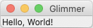

# [](https://rubygems.org/gems/glimmer) Glimmer 2.7.4
## DSL Framework for Ruby GUI and More
[](http://badge.fury.io/rb/glimmer)
[](https://github.com/AndyObtiva/glimmer/actions?query=workflow%3Arspec)
[](https://coveralls.io/github/AndyObtiva/glimmer?branch=master)
[](https://codeclimate.com/github/AndyObtiva/glimmer/maintainability)
[](https://gitter.im/AndyObtiva/glimmer?utm_source=badge&utm_medium=badge&utm_campaign=pr-badge&utm_content=badge)

**[If You Liked Shoes, You'll Love Glimmer!](#faq)**

**(Original Glimmer Library Handling World’s Ruby GUI Needs Since 2007. Beware of Imitators!)**

(**[Glimmer DSL for LibUI Won a Fukuoka Ruby 2022 Special Award](https://andymaleh.blogspot.com/2022/02/glimmer-dsl-for-libui-wins-fukuoka-ruby.html)** [[Announcement]](http://www.digitalfukuoka.jp/topics/187?locale=ja))

(**[***RubyConf 2023 Workshop - How To Build Desktop Applications in Ruby***](https://github.com/AndyObtiva/how-to-build-desktop-applications-in-ruby)**)

(**[***RubyConf 2022 Talk - Building Native GUI Apps in Ruby***](https://andymaleh.blogspot.com/2023/02/rubyconf-2022-talk-video-for-building.html)**)

[**(Ruby Rogues Podcast Interview - Desktop Apps in Ruby ft. Andy)**](https://andymaleh.blogspot.com/2022/05/ruby-rogues-podcast-interview-desktop.html)

[GLIMMER VIDEO TUTORIAL CHANNEL](https://www.youtube.com/channel/UC5hzDE23HZXsZLAxYk2UJEw)


[**Glimmer**](https://rubygems.org/gems/glimmer) started out as a [GUI Library](https://github.com/AndyObtiva/glimmer-dsl-swt) and grew into a full-fledged [DSL Framework](#dsl-engine) with support for [multiple GUI DSLs](https://github.com/AndyObtiva/glimmer#glimmer-dsl-comparison-table). Glimmer's namesake is referring to the Glimmer of Ruby in Graphical User Interfaces (contrary to [popular myth](http://blog.headius.com/2007/11/tab-sweep.html) perpetrated by [Charles Nutter](http://blog.headius.com/2007/11/tab-sweep.html), Glimmer has nothing to do with the ill-fated Whitney Houston movie, which does not in fact share the same name)

[<br />
Featured in JRuby Cookbook](http://shop.oreilly.com/product/9780596519650.do) and [Chalmers/Gothenburg University Software Engineering Master's Lecture Material](http://www.cse.chalmers.se/~bergert/slides/guest_lecture_DSLs.pdf)

[**Glimmer**](https://rubygems.org/gems/glimmer) is a DSL (Domain-Specific Language) Framework that consists of two things:
- [DSL Engine](#dsl-engine): enables building internal DSLs embedded in Ruby (e.g. for GUI, XML, or CSS).
- [Data-Binding Library](#data-binding-library): enables synchronizing GUI with Model Attributes bidirectionally **(now with [Shine](#shine-data-binding-syntax) syntax support in v2, which was [originally conceived back in 2007](https://andymaleh.blogspot.com/2007/12/data-shining-in-glimmer.html))**.

[**Glimmer**](https://rubygems.org/gems/glimmer) is ***the cream of the crop*** when it comes to building DSLs in Ruby:
- Supports building the tersest most concise domain specific language syntax in Ruby.
- Maximum readability and maintainability.
- No extra unnecessary block variables when not needed.
- DSL Blocks are true Ruby closures that can conveniently leverage variables from the outside and utilize standard Ruby code in and around. Just code in Ruby as usual without any hinderances! No surprising restrictions or strange uses of `instance_exec`/`eval`.
- DSL syntax is limited to classes that mixin the `Glimmer` module, so the rest of the code is fully safe from namespace pollution.
- Multiple DSLs may be [mixed](#multi-dsl-support) together safely to achieve maximum expressability, composability, and productivity.
- DSLs are fully configurable, so you may activate and deactivate DSLs as per your current needs only.

Start by checking out: 
- [Glimmer DSL for SWT](https://github.com/AndyObtiva/glimmer-dsl-swt), Glimmer's original GUI DSL (for [JRuby](https://www.jruby.org/)), which got extracted into its own [Ruby gem](https://rubygems.org/gems/glimmer-dsl-swt).
- [Glimmer DSL for LibUI](https://github.com/AndyObtiva/glimmer-dsl-libui), Glimmer's GUI DSL for standard [Ruby](https://www.ruby-lang.org/) (aka MRI Ruby or CRuby), which has no prerequisites beyond installing the [Ruby gem](https://rubygems.org/gems/glimmer-dsl-libui), and has won a [Fukuoka Ruby 2022 Special Award](https://andymaleh.blogspot.com/2022/02/glimmer-dsl-for-libui-wins-fukuoka-ruby.html).

## [Glimmer](https://rubygems.org/gems/glimmer) DSL Comparison Table:
DSL | Platforms | Native? | Vector Graphics? | Pros | Cons | Prereqs
----|-----------|---------|------------------|------|------|--------
[Glimmer DSL for SWT (JRuby Desktop Development GUI Framework)](https://github.com/AndyObtiva/glimmer-dsl-swt) | Mac / Windows / Linux | Yes | Yes (Canvas Shape DSL) | Very Mature / Scaffolding / Native Executable Packaging / Custom Widgets | Slow JRuby Startup Time / Heavy Memory Footprint | Java / JRuby
[Glimmer DSL for Opal (Pure Ruby Web GUI and Auto-Webifier of Desktop Apps)](https://github.com/AndyObtiva/glimmer-dsl-opal) | All Web Browsers | No | Yes (Canvas Shape DSL) | Simpler than All JavaScript Technologies / Auto-Webify Desktop Apps | Setup Process / Incomplete Alpha | Rails
[Glimmer DSL for LibUI (Prerequisite-Free Ruby Desktop Development GUI Library)](https://github.com/AndyObtiva/glimmer-dsl-libui) | Mac / Windows / Linux | Yes | Yes (Area API) | Very Simple Setup / Fast Startup Time / Light Memory Footprint | LibUI is an Incomplete Mid-Alpha Only | None Other Than MRI Ruby
[Glimmer DSL for Tk (Ruby Tk Desktop Development GUI Library)](https://github.com/AndyObtiva/glimmer-dsl-tk) | Mac / Windows / Linux | Some Native-Themed Widgets (Not Truly Native) | Yes (Canvas) | Fast Startup Time / Light Memory Footprint | Complicated setup / Widgets Do Not Look Truly Native, Espcially on Linux | ActiveTcl / MRI Ruby
[Glimmer DSL for GTK (Ruby-GNOME Desktop Development GUI Library)](https://github.com/AndyObtiva/glimmer-dsl-gtk) | Mac / Windows / Linux | Only on Linux | Yes (Cairo) | Complete Access to GNOME Features on Linux (Forte) | Not Native on Mac and Windows | None Other Than MRI Ruby on Linux / Brew Packages on Mac / MSYS & MING Toolchains on Windows / MRI Ruby
[Glimmer DSL for FX (FOX Toolkit Ruby Desktop Development GUI Library)](https://github.com/AndyObtiva/glimmer-dsl-fx) | Mac (requires XQuartz) / Windows / Linux | No | Yes (Canvas) | No Prerequisites on Windows (Forte Since Binaries Are Included Out of The Box) | Widgets Do Not Look Native / Mac Usage Obtrusively Starts XQuartz | None Other Than MRI Ruby on Windows / XQuarts on Mac / MRI Ruby
[Glimmer DSL for WX (wxWidgets Ruby Desktop Development GUI Library)](https://github.com/AndyObtiva/glimmer-dsl-wx) | Mac / Windows / Linux | Yes | Yes | Fast Startup Time / Light Memory Footprint | wxruby3 is still beta and does not support Mac yet | wxWidgets, Doxygen, SWIG, GNU g++ 4.8 on Linux or RubyInstaller+DevKit on Windows
[Glimmer DSL for JFX (JRuby JavaFX Desktop Development GUI Library)](https://github.com/AndyObtiva/glimmer-dsl-jfx) | Mac / Windows / Linux | No | Yes (javafx.scene.shape and javafx.scene.canvas) | Rich in Custom Widgets | Slow JRuby Startup Time / Heavy Memory Footprint / Widgets Do Not Look Native | Java / JRuby / JavaFX SDK
[Glimmer DSL for Swing (JRuby Swing Desktop Development GUI Library)](https://github.com/AndyObtiva/glimmer-dsl-swing) | Mac / Windows / Linux | No | Yes (Java2D) | Very Mature | Slow JRuby Startup Time / Heavy Memory Footprint / Widgets Do Not Look Native | Java / JRuby
[Glimmer DSL for XML (& HTML)](https://github.com/AndyObtiva/glimmer-dsl-xml) | All Web Browsers | No | Yes (SVG) | Programmable / Lighter-weight Than Actual XML | XML Elements Are Sometimes Not Well-Named (Many Types of Input) | None
[Glimmer DSL for CSS](https://github.com/AndyObtiva/glimmer-dsl-css) | All Web Browsers | No | Yes | Programmable | CSS Is Over-Engineered / Too Many Features To Learn | None

## Table of Contents

- [Glimmer](#-glimmer---dsl-framework-for-ruby-gui-and-more)
  - [DSL Engine](#dsl-engine)
    - [Setup](#setup)
    - [Configuration](#configuration)
    - [Multi-DSL Support](#multi-dsl-support)
    - [Official DSLs](#official-dsls)
      - [Glimmer DSL for SWT (JRuby Desktop Development GUI Framework)](#glimmer-dsl-for-swt-jruby-desktop-development-gui-framework)
      - [Glimmer DSL for Opal (Pure Ruby Web GUI and Auto-Webifier of Desktop Apps)](#glimmer-dsl-for-opal-pure-ruby-web-gui-and-auto-webifier-of-desktop-apps)
      - [Glimmer DSL for LibUI (Prerequisite-Free Ruby Desktop Development GUI Library)](#glimmer-dsl-for-libui-prerequisite-free-ruby-desktop-development-gui-library)
      - [Glimmer DSL for Tk (MRI Ruby Desktop Development GUI Library)](#glimmer-dsl-for-tk-mri-ruby-desktop-development-gui-library)
      - [Glimmer DSL for XML (& HTML)](#glimmer-dsl-for-xml--html)
      - [Glimmer DSL for CSS](#glimmer-dsl-for-css)
      - [Glimmer DSL for GTK (Ruby-GNOME Desktop Development GUI Library)](https://github.com/AndyObtiva/glimmer-dsl-gtk)
      - [Glimmer DSL for FX (FOX Toolkit Ruby Desktop Development GUI Library)](https://github.com/AndyObtiva/glimmer-dsl-fx)
      - [Glimmer DSL for WX (wXwidgets Ruby Desktop Development GUI Library)](https://github.com/AndyObtiva/glimmer-dsl-wx)
      - [Glimmer DSL for JFX (JRuby JavaFX Desktop Development GUI Library)](https://github.com/AndyObtiva/glimmer-dsl-jfx)
      - [Glimmer DSL for Swing (JRuby Swing Desktop Development GUI Library)](https://github.com/AndyObtiva/glimmer-dsl-swing)
  - [Data-Binding Library](#data-binding-library)
  - [FAQ](#faq)
  - [Glimmer Process](#glimmer-process)
  - [Resources](#resources)
  - [Help](#help)
    - [Issues](#issues)
    - [Chat](#chat)
  - [Feature Suggestions](#feature-suggestions)
  - [Change Log](#change-log)
  - [Contributing](#contributing)
  - [Contributors](#contributors)
  - [Hire Me](#hire-me)
  - [License](#license)

## DSL Engine

Glimmer is fundamentally a DSL Engine that can support any number of DSLs like the official Glimmer DSLs (gems starting with the `glimmer-dsl-` prefix like `glimmer-dsl-swt`) or any DSLs for that matter.

Glimmer DSL syntax consists mainly of:
- **keywords** (e.g. `table` for a table widget)
- **style/args** (e.g. :multi as in `table(:multi)` for a multi-line selection table widget)
- **content (nested properties/keywords/listeners)** (e.g. `{ table_column { text 'Name'} }` as in `table(:multi) { table_column { text 'Name'} }` for a multi-line selection table widget with a table column having header text property `'Name'` as content)
- **methods** (e.g. `shell.show` opens a window)

Here is a Hello, World! example from [Glimmer DSL for SWT](https://github.com/AndyObtiva/glimmer-dsl-swt):

```ruby
include Glimmer

shell(:no_resize) { # keyword + style arg
  text "Glimmer" # attribute content
  
  label { # keyword content
    text "Hello, World!" # attribute content
  }
}.open
```

That code renders the following GUI (Graphical User Interface):



The Glimmer DSL Engine's architecture is based on the following Design Patterns and Data Structures:
- **Interpreter Design Pattern**: to define interpretable expressions of DSL keywords
- **Chain of Responsibility Design Pattern / Queue Data Structure**: to chain expression handlers in order of importance for processing DSL keywords
- **Adapter Design Pattern**: to adapt expressions into handlers in a chain of responsibility
- **Stack Data Structure**: to handle processing parent/child nesting of DSL keyword expressions in the correct order
- **Proxy Design Pattern**: to shield consumers of GUI libraries built with Glimmer from low-level GUI widget details

Glimmer's use of the **Interpreter Design Pattern** in processing DSLs is also known as the **Virtual Machine Architectural Style**. After all, DSL expressions are virtual machine opcodes that process nested keywords stored in a stack. I built Glimmer's original DSL back in 2007 without knowing the **Virtual Machine Architectural Style** (except perhaps as an esoteric technology powering Java), but stumbled upon it anyways through following the Gang of Four Design Patterns mentioned above, chiefly the **Interpreter Design Pattern** and the **Chain of Responsibility Design Pattern**.

Every keyword in a Glimmer DSL is represented by a DSL expression that is processed by an `Expression` subclass selected from a chain of expressions (interpreters) pre-configured in a DSL chain of responsibility via `Glimmer::DSL::Engine.add_dynamic_expressions(DSLNameModule, expression_names_array)`.

Expressions are either:
- **Static** (subclass of `StaticExpression`, which is a subclass of `Expression`): if they represent a single pre-identified keyword (e.g. `color` or `display`)
- **Dynamic** (subclass of `Expression`): if they represent keywords calculated on the fly during processing (e.g. an SWT widget like `label` or a random XML element called `folder` representing `<folder></folder>`)

Optionally, expressions can be parent expressions that contain other expressions, and must include the `ParentExpression` mixin module as such.

Additionally, every expression that serves as a top-level entry point into the DSL must mixin `TopLevelExpression`

Static expressions are optimized in performance since they pre-define methods on the `Glimmer` module matching the static keywords they represent (e.g. `color` causes creating a `Glimmer#color` method for processing `color` expressions) and completely bypass as a result the Glimmer DSL Engine Chain of Responsibility. That said, they must be avoided if the same keyword might occur multiple times, but with different requirements for arguments, block, and parenthood type.

Every `Expression` sublcass must specify two methods at least:
- `can_interpret?(parent, keyword, *args, &block)`: to quickly test if the keyword and arg/block/parent combination qualifies for interpretation by the current `Expression` or to otherwise delegate to the next expression in the chain of responsibility.
- `interpret(parent, keyword, *args, &block)`: to go ahead and interpret a DSL expression that qualified for interpretation

`StaticExpression` sublcasses may skip the `can_interpret?` method since they include a default implementation for it that matches the name of the keyword from the class name by convention. For example, a `color` keyword would have a `ColorExpression` class, so `color` is inferred automatically from class name and used in deciding whether the class can handle a `color` keyword or not.
`StaticExpression` may declare the following class method options (if any other than `downcased` (default) is set, then `downcased` must be set explicitly if needed):
- `downcased true` (default): indicates that the StaticExpression expects downcased keywords (e.g. `COLOR {}`)
- `upcased true`: indicates that the StaticExpression expects upcased keywords (e.g. `COLOR {}`). Note that upcased static expressions always expect either argument parentheses or block curly braces to be invoked as a static expression method instead of a constant.
- `capitalized true`: indicates that the StaticExpression expects capitalized keywords (e.g. `Color {}`). Note that capitalized static expressions always expect either argument parentheses or block curly braces to be invoked as a static expression method instead of a constant.
- `case_insensitive true`: indicates that the StaticExpression supports downcased, upcased, and capitalized keywords (e.g. `color {}`, `COLOR {}`, and `Color {}`). Note that upcased/capitalized static expressions always expect either argument parentheses or block curly braces to be invoked as a static expression method instead of a constant.

`ParentExpression` subclasses can optionally override this extra method, which is included by default and simply invokes the parent's passed block to process its children:
- `add_content(parent, keyword, *args, &block)`

For example, some parent widgets use their block for other reasons or process their children at very specific times, so they may override that method and disable it, or otherwise call `super` and do additional work.

Otherwise, all expressions support the `around` hook method:
- `around(parent, keyword, args, block, &interpret_and_add_content)`: a hook for executing code around both `interpret` and `add_content`. Clients may invoke `interpret_and_add_content.call` or `yield` when ready for interpretation. `parent`, `keyword`, `args`, and `block` are supplied in case they are needed in the `around` logic.

Example of a dynamic expression:

```ruby
module Glimmer
  module DSL
    module SWT
      class WidgetExpression < Expression
        include ParentExpression

        EXCLUDED_KEYWORDS = %w[shell display tab_item]

        def can_interpret?(parent, keyword, *args, &block)
          !EXCLUDED_KEYWORDS.include?(keyword) and
            parent.respond_to?(:swt_widget) and
            Glimmer::SWT::WidgetProxy.widget_exists?(keyword)
        end

        def interpret(parent, keyword, *args, &block)
          Glimmer::SWT::WidgetProxy.create(keyword, parent, args)
        end

        def add_content(parent, keyword, *args, &block)
          super
          parent.post_add_content
        end

      end
    end
  end
end
```

Example of a static expression (does not need `can_interpret?`):

```ruby
module Glimmer
  module DSL
    module Opal
      class ColorExpression < StaticExpression
        include TopLevelExpression
  
        def interpret(parent, keyword, *args, &block)
          Glimmer::SWT::ColorProxy.new(*args)
        end
      end
    end
  end
end
```

Extra convenience expression mixins/superclasses for use via inclusion/subclassing in Glimmer GUI libraries:
- `Glimmer::DSL::BindExpression`: enables usage of `bind` data-binding keyword to build a `Glimmer::DataBinding::ModelBinding` object for [data-binding](#data-binding) purposes.
- `Glimmer::DSL::ShineDataBindingExpression`: enables [Shine data-binding syntax](#shine-data-binding-syntax) via `Glimmer::DataBinding::Shine`, a facade for the `bind` keyword, hiding it with the `<=>` operator for bidirectional (two-way) data-binding and the `<=` operator for unidirectional (one-way) data-binding.
- `Glimmer::DSL::ObserveExpression`: enables a one-way `observe` operation.
You may learn more about them by looking at how [Glimmer DSL for SWT](https://github.com/AndyObtiva/glimmer-dsl-swt) uses them.

DSL expressions go into the `glimmer/dsl/{dsl_name}` namespace directory.

Also, every DSL requires a `glimmer/dsl/{dsl_name}/dsl.rb` file, which configures the DSL into Glimmer via a call to:
```ruby
Glimmer::DSL::Engine.add_dynamic_expressions(DSLNameModule, expression_names_array)
```

Expression names are underscored verions of `Expression` subclass names minus the `_expression` suffix.

For example, here is an SWT DSL configuration:

```ruby
require 'glimmer/launcher'
require Glimmer::Launcher.swt_jar_file
require 'glimmer/dsl/engine'
Dir[File.expand_path('../*_expression.rb', __FILE__)].each {|f| require f}

module Glimmer
  module DSL
    module SWT
      Engine.add_dynamic_expressions(
        SWT,
        %w[
          layout
          widget_listener
          combo_selection_data_binding
          checkbox_group_selection_data_binding
          radio_group_selection_data_binding
          list_selection_data_binding
          tree_items_data_binding
          table_items_data_binding
          data_binding
          cursor
          font
          image
          property
          block_property
          widget
          custom_widget
        ]
      )
    end
  end
end
```

### Setup

Follow these steps to author a [Glimmer](https://rubygems.org/gems/glimmer) DSL:
- Add `gem 'glimmer', '~> 2.7.4'` to `Gemfile` and run `bundle` or run `gem install glimmer -v2.7.4` and add `require 'glimmer'`
- Create `glimmer/dsl/[dsl_name]/dsl.rb`, which requires and adds all dynamic expressions for the [dsl_name] Glimmer DSL module as per the code shown in the previous section (or [Official DSLs](#official-dsls) as examples)
- Create `glimmer/dsl/[dsl_name]/[expresion_name]_expresion.rb` for every [expresion_name] expression needed, whether dynamic or static

### Configuration

Glimmer configuration may be done via the [`Glimmer::Config`](https://github.com/AndyObtiva/glimmer/blob/master/lib/glimmer/config.rb) module.

#### logger

The Glimmer DSL engine supports logging via a standard `STDOUT` Ruby `Logger` configured in the `Glimmer::Config.logger` config option.
It is set to level Logger::ERROR by default.
Log level may be adjusted via `Glimmer::Config.logger.level` just like any other Ruby Logger.

Example:

```ruby
Glimmer::Config.logger.level = :debug
```
This results in more verbose debug loggging to `STDOUT`, which is very helpful in troubleshooting Glimmer DSL syntax when needed.

Example log:
```
D, [2017-07-21T19:23:12.587870 #35707] DEBUG -- : method: shell and args: []
D, [2017-07-21T19:23:12.594405 #35707] DEBUG -- : ShellCommandHandler will handle command: shell with arguments []
D, [2017-07-21T19:23:12.844775 #35707] DEBUG -- : method: composite and args: []
D, [2017-07-21T19:23:12.845388 #35707] DEBUG -- : parent is a widget: true
D, [2017-07-21T19:23:12.845833 #35707] DEBUG -- : on listener?: false
D, [2017-07-21T19:23:12.864395 #35707] DEBUG -- : WidgetCommandHandler will handle command: composite with arguments []
D, [2017-07-21T19:23:12.864893 #35707] DEBUG -- : widget styles are: []
D, [2017-07-21T19:23:12.874296 #35707] DEBUG -- : method: list and args: [:multi]
D, [2017-07-21T19:23:12.874969 #35707] DEBUG -- : parent is a widget: true
D, [2017-07-21T19:23:12.875452 #35707] DEBUG -- : on listener?: false
D, [2017-07-21T19:23:12.878434 #35707] DEBUG -- : WidgetCommandHandler will handle command: list with arguments [:multi]
D, [2017-07-21T19:23:12.878798 #35707] DEBUG -- : widget styles are: [:multi]
```

The `logger` instance may be replaced with a custom logger via `Glimmer::Config.logger = custom_logger`

To reset `logger` to the default instance, you may call `Glimmer::Config.reset_logger!`

All logging is done lazily via blocks (e.g. `logger.debug {message}`) to avoid affecting app performance with logging when below the configured logging level threshold.

[Glimmer DSL for SWT](https://github.com/AndyObtiva/glimmer-dsl-swt) enhances Glimmer default logging support via the Ruby [`logging`](https://github.com/TwP/logging) gem, enabling buffered asynchronous logging in a separate thread, thus completely unhindering normal desktop app performance.

#### loop_max_count

Glimmer has infinite loop detection support.
It can detect when an infinite loop is about to occur in method_missing and stops it.
It detects potential infinite loops when the same keyword and args repeat more than 100 times, which is unusual in a GUI app.

The max limit can be changed via the `Glimmer::Config::loop_max_count=(count)` config option.

Infinite loop detection may be disabled altogether if needed by setting `Glimmer::Config::loop_max_count` to `-1`

#### excluded_keyword_checkers

Glimmer permits consumers to exclude keywords from DSL processing by its engine via the `excluded_keyword_checkers` config option.

To do so, add a proc to it that returns a boolean indicating if a keyword is excluded or not.

Note that this proc runs within the context of the Glimmer object (as in the object mixing in the Glimmer module), so checker can can pretend to run there with its `self` object assumption.

Example of keywords excluded by [glimmer-dsl-swt](https://github.com/AndyObtiva/glimmer-dsl-swt):

```ruby
Glimmer::Config.excluded_keyword_checkers << lambda do |method_symbol, *args|
  method = method_symbol.to_s
  result = false
  result ||= method.start_with?('on_swt_') && is_a?(Glimmer::UI::CustomWidget) && respond_to?(method)
  result ||= method == 'dispose' && is_a?(Glimmer::UI::CustomWidget) && respond_to?(method)
  result ||= ['drag_source_proxy', 'drop_target_proxy'].include?(method) && is_a?(Glimmer::UI::CustomWidget)
  result ||= method == 'post_initialize_child'
  result ||= method.end_with?('=')
  result ||= ['finish_edit!', 'search', 'all_tree_items', 'depth_first_search'].include?(method) && is_a?(Glimmer::UI::CustomWidget) && body_root.respond_to?(method)
end
```

#### log_excluded_keywords

(default = false)

This just tells Glimmer whether to log excluded keywords or not (at the debug level). It is off by default.


### Multi-DSL Support

The Glimmer [DSL Engine](#dsl-engine) allows mixing DSLs, which comes in handy when doing things like rendering a desktop GUI DSL `browser` widget additionally leveraging the HTML DSL and CSS DSL for its content.

DSLs are activated by top-level keywords (expressions denoted as `TopLevelExpression`). For example, the `html` keyword activates the [Glimmer DSL for XML](https://github.com/AndyObtiva/glimmer-dsl-xml) and the `css` keyword activates the [Glimmer DSL for CSS](https://github.com/AndyObtiva/glimmer-dsl-css). Glimmer automatically recognizes top-level keywords in each DSL and activates the DSL accordingly. Once done processing a nested DSL top-level keyword, Glimmer switches back to the prior DSL automatically.

By default, all loaded DSLs (required glimmer DSL gems) are enabled.

For example, this shows "Hello, World!" inside a [Glimmer DSL for SWT](https://github.com/AndyObtiva/glimmer-dsl-swt) desktop app `browser` widget using `html` and `css` from [Glimmer DSL for XML](https://github.com/AndyObtiva/glimmer-dsl-xml) and [Glimmer DSL for CSS](https://github.com/AndyObtiva/glimmer-dsl-css):

```ruby
require 'glimmer-dsl-swt'
require 'glimmer-dsl-xml'
require 'glimmer-dsl-css'

include Glimmer

shell {
  minimum_size 130, 130
  @browser = browser {
    text html {
      head {
        meta(name: "viewport", content: "width=device-width, initial-scale=2.0")
        style {
          css {
            h1 {
              background 'yellow'
            }
          }
        }
      }
      body {
        h1 { "Hello, World!" }
      }
    }
  }
}.open
```

**API methods to enable/disable DSLs:**

`Glimmer::DSL::Engine.disable_dsl(dsl)`: disables a particular DSL

Example: `Glimmer::DSL::Engine.disable_dsl(:swt)`

`Glimmer::DSL::Engine.enable_dsl(dsl)`: enables a particular DSL

Example: `Glimmer::DSL::Engine.disable_dsl(:swt)`

`Glimmer::DSL::Engine.enabled_dsls=(dsls)`: enables only the specified DSLs, disabling all other loaded DSLs

Example: `Glimmer::DSL::Engine.enabled_dsls = [:xml, :css]`

### Official DSLs

Here, we showcase official Glimmer DSLs; that is [gems starting with the `glimmer-dsl-` prefix](https://rubygems.org/search?query=glimmer-dsl-).

(you can skip ahead if you prefer to learn more about the Glimmer [DSL Engine](#dsl-engine) or [Data-Binding Library](#data-binding-library) first)

#### Glimmer DSL for SWT (JRuby Desktop Development GUI Framework)

[Glimmer DSL for SWT](https://github.com/AndyObtiva/glimmer-dsl-swt) is a native-GUI cross-platform desktop development library written in [JRuby](https://www.jruby.org/), an OS-threaded faster version of [Ruby](https://www.ruby-lang.org/en/). [Glimmer](https://rubygems.org/gems/glimmer)'s main innovation is a declarative [Ruby DSL](https://github.com/AndyObtiva/glimmer-dsl-swt#glimmer-dsl-syntax) that enables productive and efficient authoring of desktop application user-interfaces while relying on the robust [Eclipse SWT library](https://www.eclipse.org/swt/). [Glimmer DSL for SWT](https://github.com/AndyObtiva/glimmer-dsl-swt) additionally innovates by having built-in [data-binding](https://github.com/AndyObtiva/glimmer-dsl-swt#data-binding) support, which greatly facilitates synchronizing the GUI with domain models, thus achieving true decoupling of object oriented components and enabling developers to solve business problems (test-first) without worrying about GUI concerns, or alternatively drive development GUI-first, and then write clean business models (test-first) afterwards. To get started quickly, [Glimmer DSL for SWT](https://github.com/AndyObtiva/glimmer-dsl-swt) offers [scaffolding](https://github.com/AndyObtiva/glimmer-dsl-swt#scaffolding) options for [Apps](https://github.com/AndyObtiva/glimmer-dsl-swt#in-production), [Gems](https://github.com/AndyObtiva/glimmer-dsl-swt#custom-shell-gem), and [Custom Widgets](https://github.com/AndyObtiva/glimmer-dsl-swt#custom-widgets). [Glimmer DSL for SWT](https://github.com/AndyObtiva/glimmer-dsl-swt) also includes native-executable [packaging](https://github.com/AndyObtiva/glimmer-dsl-swt#packaging--distribution) support, sorely lacking in other libraries, thus enabling the delivery of desktop apps written in [Ruby](https://www.ruby-lang.org/en/) as truly native DMG/PKG/APP files on the [Mac](https://www.apple.com/ca/macos) + [App Store](https://developer.apple.com/macos/distribution/) and MSI/EXE files on [Windows](https://www.microsoft.com/en-ca/windows).

To get started, visit the [Glimmer DSL for SWT project page](https://github.com/AndyObtiva/glimmer-dsl-swt#pre-requisites) for instructions on installing the [glimmer-dsl-swt gem](https://rubygems.org/gems/glimmer-dsl-swt).

##### Glimmer DSL for SWT Samples

###### Hello, World!


Glimmer GUI code (from [samples/hello/hello_world.rb](https://github.com/AndyObtiva/glimmer-dsl-swt/blob/master/samples/hello/hello_world.rb)):
```ruby
include Glimmer

shell {
  text "Glimmer"
  label {
    text "Hello, World!"
  }
}.open
```

###### Glimmer Tetris


Glimmer GUI code (from [samples/elaborate/tetris.rb](https://github.com/AndyObtiva/glimmer-dsl-swt/blob/v4.18.3.1/samples/elaborate/tetris.rb)):

```ruby
# ...
    shell(:no_resize) {
      grid_layout {
        num_columns 2
        make_columns_equal_width false
        margin_width 0
        margin_height 0
        horizontal_spacing 0
      }
      
      text 'Glimmer Tetris'
      minimum_size 475, 500
      background :gray
      
      tetris_menu_bar(game: game)
            
      playfield(game_playfield: game.playfield, playfield_width: playfield_width, playfield_height: playfield_height, block_size: BLOCK_SIZE)
      
      score_lane(game: game, block_size: BLOCK_SIZE) {
        layout_data(:fill, :fill, true, true)
      }
    }
# ...
```

###### Hello, Table!


Glimmer GUI code (from [samples/hello/hello_table.rb](https://github.com/AndyObtiva/glimmer-dsl-swt/blob/master/samples/hello/hello_table.rb)):

```ruby
# ...
    shell {
      grid_layout
      
      text 'Hello, Table!'
      
      label {
        layout_data :center, :center, true, false
        
        text 'Baseball Playoff Schedule'
        font height: 30, style: :bold
      }
      
      combo(:read_only) {
        layout_data :center, :center, true, false
        selection bind(BaseballGame, :playoff_type)
        font height: 16
      }
      
      table(:editable) { |table_proxy|
        layout_data :fill, :fill, true, true
      
        table_column {
          text 'Game Date'
          width 150
          sort_property :date # ensure sorting by real date value (not `game_date` string specified in items below)
          editor :date_drop_down, property: :date_time
        }
        table_column {
          text 'Game Time'
          width 150
          sort_property :time # ensure sorting by real time value (not `game_time` string specified in items below)
          editor :time, property: :date_time
        }
        table_column {
          text 'Ballpark'
          width 180
          editor :none
        }
        table_column {
          text 'Home Team'
          width 150
          editor :combo, :read_only # read_only is simply an SWT style passed to combo widget
        }
        table_column {
          text 'Away Team'
          width 150
          editor :combo, :read_only # read_only is simply an SWT style passed to combo widget
        }
        table_column {
          text 'Promotion'
          width 150
          # default text editor is used here
        }
        
        # Data-bind table items (rows) to a model collection property, specifying column properties ordering per nested model
        items bind(BaseballGame, :schedule), column_properties(:game_date, :game_time, :ballpark, :home_team, :away_team, :promotion)
        
        # Data-bind table selection
        selection bind(BaseballGame, :selected_game)
        
        # Default initial sort property
        sort_property :date
        
        # Sort by these additional properties after handling sort by the column the user clicked
        additional_sort_properties :date, :time, :home_team, :away_team, :ballpark, :promotion
        
        menu {
          menu_item {
            text 'Book'
            
            on_widget_selected {
              book_selected_game
            }
          }
        }
      }
      
      button {
        text 'Book Selected Game'
        layout_data :center, :center, true, false
        font height: 16
        enabled bind(BaseballGame, :selected_game)
        
        on_widget_selected {
          book_selected_game
        }
      }
    }.open
# ...
```

##### Production Desktop Apps Built with Glimmer DSL for SWT

[Are We There Yet?](https://github.com/AndyObtiva/are-we-there-yet) - Small Project Tracking App (leveraging ActiveRecord and SQLite)

[](https://github.com/AndyObtiva/are-we-there-yet)

[Math Bowling](https://github.com/AndyObtiva/MathBowling) - Elementary Level Math Game Featuring Bowling Rules

[](https://github.com/AndyObtiva/MathBowling)

[Garderie Rainbow Daily Agenda](https://github.com/AndyObtiva/garderie_rainbow_daily_agenda) -  A child nursery daily agenda reporting desktop app (communicates to a Rails Server and stores data using ActiveRecord/PostgreSQL [in its rails_server branch])

[](https://github.com/AndyObtiva/garderie_rainbow_daily_agenda)

#### Glimmer DSL for Opal (Pure Ruby Web GUI and Auto-Webifier of Desktop Apps)

[Glimmer DSL for Opal](https://github.com/AndyObtiva/glimmer-dsl-opal) is an experimental proof-of-concept web GUI adapter for [Glimmer](https://github.com/AndyObtiva/glimmer) desktop apps (i.e. apps built with [Glimmer DSL for SWT](https://github.com/AndyObtiva/glimmer-dsl-swt)). It webifies them via [Rails](https://rubyonrails.org/), allowing Ruby desktop apps to run on the web via [Opal Ruby](https://opalrb.com/) without changing a line of code. Apps may then be custom-styled for the web with standard CSS.

Glimmer DSL for Opal webifier successfully reuses the entire [Glimmer](https://github.com/AndyObtiva/glimmer) core DSL engine in [Opal Ruby](https://opalrb.com/) inside a web browser, and as such inherits the full range of Glimmer desktop [data-binding](https://github.com/AndyObtiva/glimmer#data-binding) capabilities for the web.

To get started, visit the [Glimmer DSL for Opal project page](https://github.com/AndyObtiva/glimmer-dsl-opal) for instructions on installing the [glimmer-dsl-opal gem](https://rubygems.org/gems/glimmer-dsl-opal).

##### Glimmer DSL for Opal Samples

###### Hello, Computed!

Add the following require statement to `app/assets/javascripts/application.rb`


```ruby
require 'samples/hello/hello_computed'
```

Or add the Glimmer code directly if you prefer to play around with it:

```ruby
class HelloComputed
  class Contact
    attr_accessor :first_name, :last_name, :year_of_birth
  
    def initialize(attribute_map)
      @first_name = attribute_map[:first_name]
      @last_name = attribute_map[:last_name]
      @year_of_birth = attribute_map[:year_of_birth]
    end
  
    def name
      "#{last_name}, #{first_name}"
    end
  
    def age
      Time.now.year - year_of_birth.to_i
    rescue
      0
    end
  end
end

class HelloComputed
  include Glimmer

  def initialize
    @contact = Contact.new(
      first_name: 'Barry',
      last_name: 'McKibbin',
      year_of_birth: 1985
    )
  end

  def launch
    shell {
      text 'Hello, Computed!'
      composite {
        grid_layout {
          num_columns 2
          make_columns_equal_width true
          horizontal_spacing 20
          vertical_spacing 10
        }
        label {text 'First &Name: '}
        text {
          text bind(@contact, :first_name)
          layout_data {
            horizontal_alignment :fill
            grab_excess_horizontal_space true
          }
        }
        label {text '&Last Name: '}
        text {
          text bind(@contact, :last_name)
          layout_data {
            horizontal_alignment :fill
            grab_excess_horizontal_space true
          }
        }
        label {text '&Year of Birth: '}
        text {
          text bind(@contact, :year_of_birth)
          layout_data {
            horizontal_alignment :fill
            grab_excess_horizontal_space true
          }
        }
        label {text 'Name: '}
        label {
          text bind(@contact, :name, computed_by: [:first_name, :last_name])
          layout_data {
            horizontal_alignment :fill
            grab_excess_horizontal_space true
          }
        }
        label {text 'Age: '}
        label {
          text bind(@contact, :age, on_write: :to_i, computed_by: [:year_of_birth])
          layout_data {
            horizontal_alignment :fill
            grab_excess_horizontal_space true
          }
        }
      }
    }.open
  end
end

HelloComputed.new.launch
```
Glimmer app on the desktop (using [`glimmer-dsl-swt`](https://github.com/AndyObtiva/glimmer-dsl-swt) gem):


Glimmer app on the web (using `glimmer-dsl-opal` gem):

Start the Rails server:
```
rails s
```

Visit `http://localhost:3000`

You should see "Hello, Computed!"


###### Glimmer Calculator

Add the [glimmer-cs-calculator](https://github.com/AndyObtiva/glimmer-cs-calculator) gem to `Gemfile` (without requiring):

```
gem 'glimmer-cs-calculator', require: false
```

Add the following require statement to `app/assets/javascripts/application.rb`

```ruby
require 'glimmer-cs-calculator/launch'
```

Sample GUI code (relies on custom widgets `command_button`, `operation_button`, and `number_button`):

```ruby
# ...
shell {
  minimum_size (OS.mac? ? 320 : (OS.windows? ? 390 : 520)), 240
  image File.join(APP_ROOT, 'package', 'windows', "Glimmer Calculator.ico") if OS.windows?
  text "Glimmer - Calculator"
  grid_layout 4, true
  # Setting styled_text to multi in order for alignment options to activate
  styled_text(:multi, :wrap, :border) {
    text bind(@presenter, :result)
    alignment swt(:right)
    right_margin 5
    font height: 40
    layout_data(:fill, :fill, true, true) {
      horizontal_span 4
    }
    editable false
    caret nil
  }
  command_button('AC')
  operation_button('÷')
  operation_button('×')
  operation_button('−')
  (7..9).each { |number|
    number_button(number)
  }
  operation_button('+', font: @button_font_big, vertical_span: 2)
  (4..6).each { |number|
    number_button(number)
  }
  (1..3).each { |number|
    number_button(number)
  }
  command_button('=', font: @button_font_big, vertical_span: 2)
  number_button(0, horizontal_span: 2)
  operation_button('.')
}
# ...
```

Glimmer app on the desktop (using the [`glimmer-dsl-swt`](https://github.com/AndyObtiva/glimmer-dsl-swt) gem):


Glimmer app on the web (using `glimmer-dsl-opal` gem):

Start the Rails server:
```
rails s
```

Visit `http://localhost:3000`
(or visit: http://glimmer-cs-calculator-server.herokuapp.com)

You should see "Glimmer Calculator"

[](http://glimmer-cs-calculator-server.herokuapp.com)

Here is an Apple Calculator CSS themed version (with [CSS only](https://github.com/AndyObtiva/glimmer-cs-calculator/blob/master/server/glimmer-cs-calculator-server/app/assets/stylesheets/welcomes_apple.scss), no app code changes):

Visit http://glimmer-cs-calculator-server.herokuapp.com/welcomes/apple

You should see "Apple Calculator Theme"

[](http://glimmer-cs-calculator-server.herokuapp.com/welcomes/apple)

#### Glimmer DSL for LibUI (Prerequisite-Free Ruby Desktop Development GUI Library)

[Glimmer DSL for LibUI](https://github.com/AndyObtiva/glimmer-dsl-libui) is a prerequisite-free Ruby desktop development GUI library. No need to pre-install any prerequisites. Just install the gem and have platform-independent native GUI that just works!

[LibUI](https://github.com/kojix2/LibUI) is a thin [Ruby](https://www.ruby-lang.org/en/) wrapper around [libui](https://github.com/andlabs/libui), a relatively new C GUI library that renders native controls on every platform (similar to [SWT](https://www.eclipse.org/swt/), but without the heavy weight of the [Java Virtual Machine](https://www.java.com/en/)).

The main trade-off in using [Glimmer DSL for LibUI](https://rubygems.org/gems/glimmer-dsl-libui) as opposed to [Glimmer DSL for SWT](https://github.com/AndyObtiva/glimmer-dsl-swt) or [Glimmer DSL for Tk](https://github.com/AndyObtiva/glimmer-dsl-tk) is the fact that [SWT](https://www.eclipse.org/swt/) and [Tk](https://www.tcl.tk/) are more mature than mid-alpha [libui](https://github.com/andlabs/libui) as GUI toolkits. Still, if there is only a need to build a small simple application, [Glimmer DSL for LibUI](https://rubygems.org/gems/glimmer-dsl-libui) could be a good convenient choice due to having zero prerequisites beyond the dependencies included in the [Ruby gem](https://rubygems.org/gems/glimmer-dsl-libui). Also, just like [Glimmer DSL for Tk](https://github.com/AndyObtiva/glimmer-dsl-tk), its apps start instantly and have a small memory footprint. [LibUI](https://github.com/kojix2/LibUI) is a promising new GUI toolkit that might prove quite worthy in the future.

[Glimmer DSL for LibUI](https://github.com/AndyObtiva/glimmer-dsl-libui) aims to provide a DSL similar to the [Glimmer DSL for SWT](https://github.com/AndyObtiva/glimmer-dsl-swt) to enable more productive desktop development in Ruby with:
- Declarative DSL syntax that visually maps to the GUI widget hierarchy
- Convention over configuration via smart defaults and automation of low-level details
- Requiring the least amount of syntax possible to build GUI
- Bidirectional Data-Binding to declaratively wire and automatically synchronize GUI with Business Models
- Custom Widget support
- Scaffolding for new custom widgets, apps, and gems
- Native-Executable packaging on Mac, Windows, and Linux

##### Glimmer DSL for LibUI Samples

###### Hello, World!

```ruby
require 'glimmer-dsl-libui'

include Glimmer

window('hello world').show
```

Mac


Windows


Linux


###### Basic Table Progress Bar

```ruby
require 'glimmer-dsl-libui'

include Glimmer

data = [
  ['task 1', 0],
  ['task 2', 15],
  ['task 3', 100],
  ['task 4', 75],
  ['task 5', -1],
]

window('Task Progress', 300, 200) {
  vertical_box {
    table {
      text_column('Task')
      progress_bar_column('Progress')

      cell_rows data # implicit data-binding
    }
    
    button('Mark All As Done') {
      stretchy false
      
      on_clicked do
        data.each_with_index do |row_data, row|
          data[row] = [row_data[0], 100] # automatically updates table due to implicit data-binding
        end
      end
    }
  }
}.show
```

Mac


Windows


Linux


###### Area Gallery

```ruby
require 'glimmer-dsl-libui'

include Glimmer

window('Area Gallery', 400, 400) {
  area {
    path { # declarative stable path
      square(0, 0, 100)
      square(100, 100, 400)
      
      fill r: 102, g: 102, b: 204
    }
    path { # declarative stable path
      rectangle(0, 100, 100, 400)
      rectangle(100, 0, 400, 100)
      
      fill r: 204, g: 102, b: 204
    }
    path { # declarative stable path
      figure(100, 100) {
        line(100, 400)
        line(400, 100)
        line(400, 400)

        closed true
      }

      fill r: 202, g: 102, b: 104, a: 0.5
      stroke r: 0, g: 0, b: 0
    }
    path { # declarative stable path
      figure(0, 0) {
        bezier(200, 100, 100, 200, 400, 100)
        bezier(300, 100, 100, 300, 100, 400)
        bezier(100, 300, 300, 100, 400, 400)

        closed true
      }

      fill r: 202, g: 102, b: 204, a: 0.5
      stroke r: 0, g: 0, b: 0, thickness: 2, dashes: [50, 10, 10, 10], dash_phase: -50.0
    }
    path { # declarative stable path
      arc(200, 200, 90, 0, 360, false)

      fill r: 202, g: 102, b: 204, a: 0.5
      stroke r: 0, g: 0, b: 0, thickness: 2
    }
    
    on_mouse_event do |area_mouse_event|
      p area_mouse_event
    end
    
    on_mouse_moved do |area_mouse_event|
      puts 'moved'
    end
    
    on_mouse_down do |area_mouse_event|
      puts 'mouse down'
    end
    
    on_mouse_up do |area_mouse_event|
      puts 'mouse up'
    end
    
    on_mouse_drag_started do |area_mouse_event|
      puts 'drag started'
    end
    
    on_mouse_dragged do |area_mouse_event|
      puts 'dragged'
    end
    
    on_mouse_dropped do |area_mouse_event|
      puts 'dropped'
    end
    
    on_mouse_entered do
      puts 'entered'
    end
    
    on_mouse_exited do
      puts 'exited'
    end
    
    on_key_event do |area_key_event|
      p area_key_event
    end
    
    on_key_up do |area_key_event|
      puts 'key up'
    end
    
    on_key_down do |area_key_event|
      puts 'key down'
    end
  }
}.show
```

Mac


Windows


Linux


#### Glimmer DSL for Tk (MRI Ruby Desktop Development GUI Library)

[Tcl/Tk](https://www.tcl.tk/) has recently improved by gaining native looking themed widgets on Mac, Windows, and Linux in [Tk version 8.5](https://www.tcl.tk/software/tcltk/8.5.html#:~:text=Highlights%20of%20Tk%208.5&text=Font%20rendering%3A%20Now%20uses%20anti,and%20window%20layout%2C%20and%20more.). Additionally, [Ruby](https://www.ruby-lang.org/en/) 3.0 Ractor (formerly known as [Guilds](https://olivierlacan.com/posts/concurrency-in-ruby-3-with-guilds/)) supports truly parallel multi-threading, making both [MRI](https://github.com/ruby/ruby) and [Tk](https://www.tcl.tk/) finally viable for support in [Glimmer](https://github.com/AndyObtiva/glimmer) (Ruby Desktop Development GUI Library) as an alternative to [JRuby on SWT](https://github.com/AndyObtiva/glimmer-dsl-swt).

The trade-off is that while [SWT](https://www.eclipse.org/swt/) provides a plethora of high quality reusable widgets for the Enterprise (such as [Nebula](https://www.eclipse.org/nebula/)), [Tk](https://www.tcl.tk/) enables very fast app startup time and a small memory footprint via [MRI Ruby](https://www.ruby-lang.org/en/).

[Glimmer DSL for Tk](https://github.com/AndyObtiva/glimmer-dsl-tk) aims to provide a DSL similar to the [Glimmer DSL for SWT](https://github.com/AndyObtiva/glimmer-dsl-swt) to enable more productive desktop development in Ruby with:
- Declarative DSL syntax that visually maps to the GUI widget hierarchy
- Convention over configuration via smart defaults and automation of low-level details
- Requiring the least amount of syntax possible to build GUI
- Bidirectional Data-Binding to declaratively wire and automatically synchronize GUI with Business Models
- Custom Widget support
- Scaffolding for new custom widgets, apps, and gems
- Native-Executable packaging on Mac, Windows, and Linux

To get started, visit the [Glimmer DSL for Tk project page](https://github.com/AndyObtiva/glimmer-dsl-tk#pre-requisites) for instructions on installing the [glimmer-dsl-tk gem](https://rubygems.org/gems/glimmer-dsl-tk).

##### Glimmer DSL for Tk Samples

###### Hello, World!

Glimmer code (from [samples/hello/hello_world.rb](https://github.com/AndyObtiva/glimmer-dsl-tk/blob/master/samples/hello/hello_world.rb)):

```ruby
include Glimmer

root {
  label {
    text 'Hello, World!'
  }
}.open
```

Run (with the [glimmer-dsl-tk](https://rubygems.org/gems/glimmer-dsl-tk) gem installed):

```
ruby -r glimmer-dsl-tk -e "require '../samples/hello/hello_world.rb'"
```

Glimmer app:


###### Hello, Notebook!

Glimmer code (from [samples/hello/hello_tab.rb](https://github.com/AndyObtiva/glimmer-dsl-tk/blob/master/samples/hello/hello_tab.rb)):

```ruby
include Glimmer

root {
  title 'Hello, Notebook!'
   
  notebook {
    frame(text: 'English') {
      label {
        text 'Hello, World!'
      }
    }
     
    frame(text: 'French') {
      label {
        text 'Bonjour, Univers!'
      }
    }
  }
}.open
```

Run (with the [glimmer-dsl-tk](https://rubygems.org/gems/glimmer-dsl-tk) gem installed):

```
ruby -r glimmer-dsl-tk -e "require '../samples/hello/hello_notebook.rb'"
```

Glimmer app:


###### Hello, Combobox!

Glimmer code (from [samples/hello/hello_combobox.rb](https://github.com/AndyObtiva/glimmer-dsl-tk/blob/master/samples/hello/hello_combobox.rb)):

```ruby
require 'glimmer-dsl-tk'

class Person
  attr_accessor :country, :country_options

  def initialize
    self.country_options=["", "Canada", "US", "Mexico"]
    self.country = "Canada"
  end

  def reset_country
    self.country = "Canada"
  end
end

class HelloCombobox
  include Glimmer
  
  def launch
    person = Person.new
    
    root {
      title 'Hello, Combobox!'
      
      combobox {
        readonly true # this applies to text editing only (item selection still triggers a write to model)
        text <=> [person, :country]
      }
      
      button {
        text "Reset Selection"
        command {
          person.reset_country
        }
      }
    }.open
  end
end

HelloCombobox.new.launch
```

Run (with the [glimmer-dsl-tk](https://rubygems.org/gems/glimmer-dsl-tk) gem installed):

```
ruby -r glimmer-dsl-tk -e "require '../samples/hello/hello_combobox.rb'"
```

Glimmer app:


#### Glimmer DSL for XML (& HTML)

[Glimmer DSL for XML](https://github.com/AndyObtiva/glimmer-dsl-xml) provides Ruby syntax for building XML (eXtensible Markup Language) documents.

Within the context of desktop development, Glimmer DSL for XML is useful in providing XML data for the [SWT Browser widget](https://github.com/AndyObtiva/glimmer/tree/master#browser-widget).

##### XML DSL

Simply start with `html` keyword and add HTML inside its block using Glimmer DSL syntax.
Once done, you may call `to_s`, `to_xml`, or `to_html` to get the formatted HTML output.

Here are all the Glimmer XML DSL top-level keywords:
- `html`
- `tag`: enables custom tag creation for exceptional cases by passing tag name as '_name' attribute
- `name_space`: enables namespacing html tags

Element properties are typically passed as a key/value hash (e.g. `section(id: 'main', class: 'accordion')`) . However, for properties like "selected" or "checked", you must leave value `nil` or otherwise pass in front of the hash (e.g. `input(:checked, type: 'checkbox')` )

Example (basic HTML):

```ruby
@xml = html {
  head {
    meta(name: "viewport", content: "width=device-width, initial-scale=2.0")
  }
  body {
    h1 { "Hello, World!" }
  }
}
puts @xml
```

Output:

```
<html><head><meta name="viewport" content="width=device-width, initial-scale=2.0" /></head><body><h1>Hello, World!</h1></body></html>
```

#### Glimmer DSL for CSS

[Glimmer DSL for CSS](https://github.com/AndyObtiva/glimmer-dsl-css) provides Ruby syntax for building CSS (Cascading Style Sheets).

Within the context of [Glimmer](https://github.com/AndyObtiva/glimmer) app development, Glimmer DSL for CSS is useful in providing CSS for the [SWT Browser widget](https://github.com/AndyObtiva/glimmer/tree/master#browser-widget).

##### CSS DSL

Simply start with `css` keyword and add stylesheet rule sets inside its block using Glimmer DSL syntax.
Once done, you may call `to_s` or `to_css` to get the formatted CSS output.

`css` is the only top-level keyword in the Glimmer CSS DSL

Selectors may be specified by `s` keyword or HTML element keyword directly (e.g. `body`)
Rule property values may be specified by `pv` keyword or underscored property name directly (e.g. `font_size`)

Example:

```ruby
@css = css {
  body {
    font_size '1.1em'
    pv 'background', 'white'
  }
  
  s('body > h1') {
    background_color :red
    pv 'font-size', '2em'
  }
}
puts @css
```

Output:

```
body{font-size:1.1em;background:white}body > h1{background-color:red;font-size:2em}
```

## Data-Binding Library

Data-Binding enables mapping GUI properties (like text and color) to Model attributes (like name and age) for bidirectional or unidirectional synchronization and conversion as needed.

Data-binding supports utilizing the [MVP (Model View Presenter)](https://en.wikipedia.org/wiki/Model%E2%80%93view%E2%80%93presenter) flavor of [MVC](https://en.wikipedia.org/wiki/Model%E2%80%93view%E2%80%93controller) by observing both the View and a Presenter for changes and updating the opposite side upon encountering them. This enables writing more decoupled cleaner code that keeps View code and Model code disentangled and highly maintainable.


Glimmer enhances observed models automatically (including array operations like `<<`, `delete`, and `reject!`) on first observation. As such, you get automatic observable support, including nested and computed observations. No need to change your model code to data-bind it to the view or add repetitive boilerplate modules. View data-binding is truly decoupled from model logic by being able to observe any model attribute (Ruby attribute reader/writer combo or Ruby attribute reader alone for read-only data-binding when needed)

This relies mainly on the Observer Design Pattern and the MVP (Model-View-Presenter) Architectural Pattern (a variation on MVC)

These are the main classes concerning data-binding:
- `Glimmer::DataBinding::Observer`: Provides general observer support including unique registration and deregistration for cleanup and prevention of memory leaks. Main methods concerned are: `call`, `register` (alias: `observe`), and `unregister` (alias: `unobserve` or `deregister`). Passing the option `ignore_frozen: true` at the end of the args of `register` (alias: `observe`) method results in silently ignoring any passed frozen observable without raising an error (it raises an error otherwise for frozen/immutable objects).
- `Glimmer::DataBinding::Observable`: General super-module for all observables. Main methods concerned are: `add_observer` and `remove_observer`
- `Glimmer::DataBinding::ObservableModel`: Mixin module for any observable model (`Object`, `Struct` or `OpenStruct`) with observable attributes (observes attribute writers and `Struct`/`OpenStruct` `:[]=` method). In addition to `Observable` methods, it has a `notify_observers` method to be called when changes occur. It automatically enhances all attribute setters (ending with `=`) to notify observers on changes. Also, it automatically handles observing array attributes using `ObservableArray` appropriately so they would notify observers upon array mutation changes. `:attribute_writer_type` option can be specified (default: `:attribute=`) to observe different attribute styles (e.g. `attribute_writer_type: [:attribute=, :set_attribute]`).
- `Glimmer::DataBinding::ObservableArray`: Mixin module for any observable array collection that automatically handles notifying observers upon performing array mutation operations (e.g. `push`, `select!`, or `delete`) recursively (meaning if an array contained arrays and they changed, observers are notified). Accepts `recursive: true` option in `add_observer` method to recursively observe nested arrays all the way down. Alternatively, pass `recursive: [integer]` to limit recursion in `Array` observation to a specific number of levels beyond the first level (which is always included).
- `Glimmer::DataBinding::ObservableHash`: Mixin module for any observable hash that automatically handles notifying observers upon performing hash mutation operations (e.g. `hash[key]=value`, `select!`, `merge!`).  Also, it automatically handles observing array values using `ObservableArray` appropriately so they would notify observers upon array mutation changes.
- `Glimmer::DataBinding::ModelBinding`: a higher-level abstraction that relies on all the other observer/observable classes to support basic data-binding, nested data-binding, and computed data-binding
- `Glimmer::DataBinding::Shine`: enables [highly intuitive and visually expressive syntax](#shine-data-binding-syntax) to perform bidirectional (two-way) data-binding with `<=>` and unidirectional (one-way) data-binding with `<=`

To do simple observation of models, arrays, or hashes, you can use the `Glimmer::DataBinding::Observer::proc` method, which builds an observer from a block. When invoking the `#observe` method on it, it automatically enhances the object argument being observed into an `Observable` (whether `ObservableModel`, `ObservableArray`, or `ObervableHash`).

Example of observing a model attribute:

```ruby
Glimmer::DataBinding::Observer.proc do |new_value|
  # Do some work with new value for model attribute
end.observe(model, attribute)
```

Example of observing an array recursively (avoid recursion unless really needed since it fires on all fine-grained nested array changes):

```ruby
Glimmer::DataBinding::Observer.proc do |new_value|
  # Do some work with new array value
end.observe(array, recursive: true)
```

Example of observing a hash key:

```ruby
Glimmer::DataBinding::Observer.proc do |new_value|
  # Do some work with new value for hash key
end.observe(hash, :price)
```

Example of observing a hash for all key changes:

```ruby
Glimmer::DataBinding::Observer.proc do |new_value, changed_key|
  # Do some work with new value and changed key for hash
end.observe(hash)
```

If you would like to observe nested model attribute changes, you can use the more advanced `Glimmer::DataBinding::ModelBinding` class instead.

Example of observing nested model attributes:

```ruby
ModelBinding.new(model, "address1.street").add_observer do |new_address1_street_value|
  # Do some work with new address 1 street value
end
```

Example of observing indexed array changes (specifying an array index) (combined with a nested model attribute):

```ruby
ModelBinding.new(model, "employees[5].name").add_observer do |new_employee_6_name|
  # Do some work with new employee 6 (index 5)'s name
end
```

Example of observing double-indexed nested array changes:

```ruby
ModelBinding.new(model, "grid[5][7]").add_observer do |new_grid_cell_value|
  # Do some work with new grid cell value for row index 5 and column index 7
end
```

Example of observing keyed hash changes (specifying a hash key as `Symbol` or single/double-quoted `String`) (combined with a nested model attribute):

```ruby
ModelBinding.new(model, "employees[:manager].name").add_observer do |new_employee_6_name|
  # Do some work with new manager employee's name
end
```

Data-bound `ModelBinding` attribute can be:
- **Direct:** `Symbol` representing attribute reader/writer (e.g. `[person, :name`])
- **Nested:** `String` representing nested attribute path (e.g. `[company, 'address.street']`). That results in "nested data-binding"
- **Indexed:** `String` containing array attribute index (e.g. `[customer, 'addresses[0].street']`). That results in "indexed data-binding"
- **Keyed:** `String` containing hash attribute key (e.g. `[customer, 'addresses[:main].street']`). That results in "keyed data-binding"

Data-binding options include:
- `before_read {|value| ...}`: performs an operation before reading data from Model to update View.
- `on_read {|value| ...}`: converts value read from Model to update the View.
- `after_read {|converted_value| ...}`: performs an operation after read from Model to update View.
- `before_write {|value| ...}`: performs an operation before writing data to Model from View.
- `on_write {|value| ...}`: converts value read from View to update the Model.
- `after_write {|converted_value| ...}`: performs an operation after writing to Model from View.
- `computed_by attribute` or `computed_by [attribute1, attribute2, ...]`: indicates model attribute is computed from specified attribute(s), thus updated when they are updated. That is known as "computed data-binding".

Note that if an observed model attribute or hash key is an `Array`, it is automatically observed for `Array` changes (e.g. via mutation methods `<<`, `delete`, `map!`), not just attribute/key-value changes.

All of the features above make Glimmer's data-binding library one of the most sophisticated and advanced in the industry since it automates everything instead of requiring endless manual configuration, thus resulting in some of the tersest most declarative syntax for using observers and data-binding.

You may learn more by looking into [data-binding specs](/Users/andy/code/glimmer/spec/lib/glimmer/data_binding) as well as [Data-Binding](https://github.com/AndyObtiva/glimmer-dsl-swt/blob/master/docs/reference/GLIMMER_GUI_DSL_SYNTAX.md#data-binding) and [Observer](https://github.com/AndyObtiva/glimmer-dsl-swt/blob/master/docs/reference/GLIMMER_GUI_DSL_SYNTAX.md#observer) usage in [Glimmer DSL for SWT](https://github.com/AndyObtiva/glimmer-dsl-swt)

### Shine Data-Binding Syntax

The Shine data-binding syntax is a highly intuitive and visually expressive way of data-binding that enables performing bidirectional (two-way) data-binding with the `<=>` operator and unidirectional (one-way) data-binding with the `<=` operator.

It is facilitated by the combination of the `Glimmer::DSL::ShineDataBindingExpression` and `Glimmer::DataBinding::Shine` classes, which depend on `Glimmer::DSL::BindExpression` and `Glimmer::DataBinding::ModelBinding`.

Below are some examples of Shine usage in GUI DSLs:

`text <=> [contact, :first_name]`

This example bidirectionally binds the text property of a widget like label to the first name of a contact model.

`text <=> [contact, 'address.street']`

This example binds the text property of a widget like label to the nested street of the address of a contact. This is called nested property data binding.

`text <=> [contact, 'address.street', on_read: :upcase, on_write: :downcase]`

This example adds on the one above it by specifying converters on read and write of the model property, like in the case of a text widget. The text widget will then displays the street upper case and the model will store it lower case. When specifying converters, read and write operations must be symmetric.

`enabled <= [user, :logged_in]`

This example unidirectionally binds the enabled property of a widget like button to the logged in status of a user.

`enabled <= [user, :logged_in, on_read: :!]`

This example unidirectionally binds the enabled property of a widget like entry to the negated logged in status of a user. Note that when using a single on read converter with unidirectional data-binding, there is no need for a symmetric on_write converter as well since writing is never done with unidirectional (one-way) data-binding.

[Learn more about Shine data-binding syntax from its usage in Glimmer DSL for SWT](https://github.com/AndyObtiva/glimmer-dsl-swt/blob/master/docs/reference/GLIMMER_GUI_DSL_SYNTAX.md#shine)

## Glimmer Process

[Glimmer Process](PROCESS.md) is the lightweight software development process used for building Glimmer libraries and Glimmer apps, which goes beyond Agile, rendering all Agile processes obsolete. [Glimmer Process](PROCESS.md) is simply made up of 7 guidelines to pick and choose as necessary until software development needs are satisfied.

Learn more by reading the [GPG](PROCESS.md) (Glimmer Process Guidelines)

## FAQ

(Frequently Asked Questions)

**How do Glimmer GUI DSLs compare to Shoes?**

If you liked Shoes, you'll love Glimmer!

That is because Glimmer does everything that Shoes did, but with a lighter and better GUI DSL (Graphical User Interface Domain Specific Language) that addresses all the issues that Shoes suffered from, such as:
- Shoes does not allow code in Shoes blocks to use variables defined outside of Shoes blocks in a straightforward manner as it changes `self` inside Shoes blocks, breaking Ruby expectations and producing confusing behavior. On the other hand, Glimmer DSL blocks are 100% standard Ruby blocks that represent real closures, so they enable usage of variables defined outside the blocks in a 100% standard Ruby way.
- Shoes lacks support for high-quality business widget controls (View components) like table and tree. Glimmer GUI DSLs that are feature complete like Glimmer DSL for SWT do support table and tree widgets. Some non-final Glimmer GUI DSLs like Glimmer DSL for LibUI support the table control too.
- Shoes does not encourage proper separation of concerns with a correct MVC architecture (Model-View-Controller), resulting in a lot of non-presentation logic mixed with View code. Glimmer GUI DSLs do support proper separation of concerns 100% following the MVC or MVP (Model-View-Presenter) architecture by default.
- Shoes does not provide a simple way for connecting View components to Model data. Glimmer GUI DSLs provide full bidirectional/unidirectional data-binding support out of the box that provides the terest code syntax for connecting Views to Models and keeping them in sync.
- Shoes does not support a native mechanism for building custom View components. Glimmer GUI DSLs do support the ability to build custom widgets (aka controls or View components), custom windows (aka shells), and custom shapes (canvas graphics), enabling software engineers to expand a Glimmer DSL’s vocabulary with new keywords representing brand new visual concepts. That results in much higher productivity by enabling the reuse of higher visual concepts as their own self-encapsulated components.
- Shoes does not expose native features of its wrapped GUI toolkit. Glimmer GUI DSLs do expose all native features of their wrapped GUI toolkits, thus enabling developers to use a GUI toolkit like SWT directly when needed on top of using Glimmer DSL for SWT (a widget initialized via SWT directly could be passed to Glimmer DSL for SWT to wrap as a Glimmer `WidgetProxy` object and integrate with other Glimmer initialized `WidgetProxy` objects). That facilitates the 80/20 rule of having Glimmer GUI DSLs automate 80% of the work while still enabling software engineers to reach down to the low-level GUI toolkit API in 20% of the cases when needed (though in practice, it's probably more like 1% of the cases).

It is great that Shoes paved the way for creating desktop GUI DSLs in Ruby. Glimmer took that approach to its maximum and produced the ultimate evolution of Shoes.

**What is the difference between Glimmer and Glimmer DSL for SWT?**

Glimmer DSL for SWT was the first GUI DSL created as part of the Glimmer project to enable building desktop applications, and it was originally just called Glimmer. It relied on the Eclipse SWT library to render native GUI (Graphical User Interface) widget controls (View components) on every platform (Mac, Windows, and Linux). Eventually, the idea of a Glimmer DSL proved itself so successful and viable for building desktop apps with a fraction of the effort needed in other programming languages/technologies that it was expanded to support other GUI toolkits. So, Glimmer got renamed to Glimmer DSL for SWT, and the core Glimmer DSL engine got extracted to Glimmer (becoming a DSL framework), which then got reused to build other Glimmer GUI DSLs such as Glimmer DSL for LibUI and Glimmer DSL for GTK, among many others.

**What is the difference between Glimmer DSL for SWT and Glimmer DSL for LibUI?**

Both Glimmer DSL for SWT and Glimmer DSL for LibUI support rendering platform native widgets/controls, which enable building native desktop apps that look 100% native on every platform (Mac, Windows, and Linux). 

However, Glimmer DSL for SWT runs in JRuby (Ruby running in the JVM [Java Virtual Machine]) whereas Glimmer DSL for LibUI runs in standard Ruby (aka MRI Ruby or CRuby).

Glimmer DSL for SWT is 100% feature-complete and has a final release. Glimmer DSL for LibUI is 100% complete as far as covering the LibUI features, but LibUI itself is still a mid-alpha library, so it is missing a few features that will get added eventually.

**What is the difference between Glimmer DSL for LibUI, Glimmer DSL for GTK, Glimmer DSL for Tk, Glimmer DSL for FX, and Glimmer DSL for WX?**

All of Glimmer DSL for LibUI, Glimmer DSL for GTK, Glimmer DSL for Tk, Glimmer DSL for FX, and Glimmer DSL for WX run in standard Ruby (aka MRI Ruby or CRuby).

However, only Glimmer DSL for LibUI and Glimmer DSL for WX render native controls on every platform. The other libraries do not render native controls on every platform, albeit Glimmer DSL for GTK renders native controls on Linux distributions utilizing Gnome.

Also, Glimmer DSL for LibUI does not require any prerequisites beyond installing the Ruby gem, so you can install it and get instant GUI with very little effort, whereas Glimmer DSL for GTK, Glimmer DSL for Tk, Glimmer DSL for FX, and Glimmer DSL for WX do require extra dependencies in general, albeit Glimmer DSL for GTK has everything it needs in Linux Gnome flavors and both Glimmer DSL for FX and Glimmer DSL for WX have everything they need on Windows by including pre-built binaries.

You may learn more about the differences between various Glimmer DSLs by checking out the [Glimmer DSL Comparison Table](#glimmer-dsl-comparison-table).

**What is the difference between Glimmer DSL for SWT, Glimmer DSL for Swing, and Glimmer DSL for JFX?**

Glimmer DSL for SWT relies on the Eclipse SWT library, which renders native widgets on every platform (Mac, Windows, and Linux) to build desktop apps that look 100% native on every platform (Mac, Windows, and Linux). 

Glimmer DSL for Swing relies on Swing, which does not render native widgets on every platform. Glimmer DSL for JFX relies on JavaFX, which also does not render native widgets on every platform.

Also, SWT initializes native widgets in memory using non-Java code (e.g. C/C++), thus ensuring native OS high performance for rendering native widgets without being prone to Java garbage collection pauses. On the other hand, Swing and JavaFX initialize non-native widgets in memory using Java code, thus depend on the performance of the Java Virtual Machine while being prone to Java garbage collection pauses. As a result, SWT provides a better user experience than Swing and JavaFX.

You may learn more about the differences between various Glimmer DSLs by checking out the [Glimmer DSL Comparison Table](#glimmer-dsl-comparison-table).

**Why not just use SWT, LibUI, GTK, Tk, FOX Toolkit, wxWidgets, Swing, or JavaFX from Ruby directly?**

GUI Toolkits implement low-level GUI rendering concerns. And, while some of them do offer object-oriented APIs, their APIs are very verbose and imperative by design due to being low-level APIs. As such, they require software engineers to write a lot more low-level code that does not map intuitively to the structure of the GUI visually, slowing down productivity and making maintainability more expensive.

Glimmer GUI DSLs on the other hand are fully declarative and follow Rails' Convention Over Configuration maxim by including smart defaults and automation of low-level details, so they enable software engineers to write the simplest most minimalistic code that maps to the actual visual GUI concepts, maximizing productivity and resulting in code that is very maintainable and intuitive to reason about.

Furthermore, Glimmer GUI DSLs offer advanced Bidirectional/Unidirectional Data-Binding Support, which enables syncing View data with Model attributes with the tersest code syntax possible to greatly simplify reasoning about the code while supporting proper separation of concerns through correct adherence to MVC (Model-View-Controller) and MVP (Model-View-Presenter). 

That's in addition to scaffolding and native executable packaging in some Glimmer GUI DSLs. As a result, productivity increases even further and maintainability becomes even less expensive, thus enabling software engineers to deliver pieces of software in a matter of minutes or hours for desktop application MVPs (Minimal Viable Products). As such, Glimmer GUI DSLs significantly shorten the feedback cycle and enable incrementally releasing features at a very fast pace, not possible with GUI toolkit low-level APIs.

## Resources

* [Glimmer DSL for SWT Video Tutorials](https://andymaleh.blogspot.com/search/label/Tutorial+SWT)
* [Code Master Blog](http://andymaleh.blogspot.com/search/label/Glimmer)
* [JRuby Cookbook by Justin Edelson & Henry Liu](http://shop.oreilly.com/product/9780596519650.do)
* [MountainWest RubyConf 2011 Video](https://confreaks.tv/videos/mwrc2011-whatever-happened-to-desktop-development-in-ruby)
* [RubyConf 2008 Video](https://confreaks.tv/videos/rubyconf2008-desktop-development-with-glimmer)
* [InfoQ Article](http://www.infoq.com/news/2008/02/glimmer-jruby-swt)
* [DZone Tutorial](https://dzone.com/articles/an-introduction-glimmer)

## Help

### Issues

You may submit [issues](https://github.com/AndyObtiva/glimmer/issues) on [GitHub](https://github.com/AndyObtiva/glimmer/issues).

[Click here to submit an issue.](https://github.com/AndyObtiva/glimmer/issues)

### Chat

If you need live help, try to [](https://gitter.im/AndyObtiva/glimmer?utm_source=badge&utm_medium=badge&utm_campaign=pr-badge&utm_content=badge)

## Feature Suggestions

These features have been suggested. You might see them in a future version of Glimmer. You are welcome to contribute more feature suggestions.

[glimmer-dsl-swt/TODO.md](https://github.com/AndyObtiva/glimmer-dsl-swt/blob/master/TODO.md)

Glimmer DSL Engine specific tasks are at:

[TODO.md](TODO.md)

## Change Log

[glimmer-dsl-swt/CHANGELOG.md](https://github.com/AndyObtiva/glimmer-dsl-swt/blob/master/CHANGELOG.md)

[CHANGELOG.md](CHANGELOG.md)

## Contributing

**Contributors Wanted!**

If you would like to contribute to Glimmer, please study up on Glimmer and [SWT](https://github.com/AndyObtiva/glimmer-dsl-swt#swt-reference), run all Glimmer [samples](https://github.com/AndyObtiva/glimmer-dsl-swt#samples), and build a small sample app (perhaps from [this TODO list](https://github.com/AndyObtiva/glimmer-dsl-swt/blob/master/TODO.md#samples)) to add to [glimmer-dsl-swt](https://github.com/AndyObtiva/glimmer-dsl-swt) Hello or Elaborate samples via a Pull Request. Once done, contact me on [Chat](#chat).

You may apply for contributing to any of these Glimmer DSL gems whether you prefer to focus on the desktop or web:
- [glimmer-dsl-swt](https://github.com/AndyObtiva/glimmer-dsl-swt): Glimmer DSL for SWT (JRuby Desktop Development GUI Framework)
- [glimmer-dsl-opal](https://github.com/AndyObtiva/glimmer-dsl-opal): Glimmer DSL for Opal (Pure Ruby Web GUI and Auto-Webifier of Desktop Apps)
- [glimmer-dsl-tk](https://github.com/AndyObtiva/glimmer-dsl-tk): Glimmer DSL for Tk (MRI Ruby Desktop Development GUI Library)
- [glimmer-dsl-libui](https://github.com/AndyObtiva/glimmer-dsl-libui): Glimmer DSL for LibUI (Prerequisite-Free Ruby Desktop Development GUI Library)
- [glimmer-dsl-xml](https://github.com/AndyObtiva/glimmer-dsl-xml): Glimmer DSL for XML (& HTML)
- [glimmer-dsl-css](https://github.com/AndyObtiva/glimmer-dsl-css): Glimmer DSL for CSS

[CONTRIBUTING.md](CONTRIBUTING.md)

## Contributors

* [Andy Maleh](https://github.com/AndyObtiva) (Founder)
* [Dennis Theisen](https://github.com/Soleone) (Contributor)

[Click here to view contributor commits.](https://github.com/AndyObtiva/glimmer/graphs/contributors)

## Hire Me

If your company would like to invest fulltime in further development of the Glimmer open-source project, [hire me](https://www.linkedin.com/in/andymaleh/).

## License

[MIT](LICENSE.txt)

Copyright (c) 2007-2022 - Andy Maleh.

--

Glimmer logo was made by <a href="https://www.flaticon.com/authors/freepik" title="Freepik">Freepik</a> from <a href="https://www.flaticon.com/" title="Flaticon"> www.flaticon.com</a>
